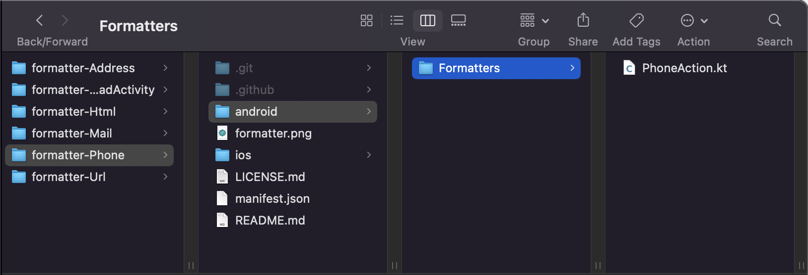

> **OBJECTIVES**
> 
> Create your first Kotlin data formatters.

A formatter can be composed of both Kotlin and [Swift](create-swift-formatter.md) code.

## Object attribute Kotlin formatter

If you want a formatter that will enable you to dial a phone number value on click, we need a **manifest.json file** containing a `name`, a `binding`, a `type` and a `target` value as follows:

```4d
{
    "name": "phone",
    "binding": "phoneAction",
    "type": "text" 
    "target" : ["ios", "android"]
}

```

Note that the binding value "phoneAction" will be used in the Kotlin file and that the `BindingAdapter` will interact with a specific field in an Android XML layout.

Here is the `PhoneAction.kt` file to dial a phone number value on click on Android:

```4d
package ___PACKAGE___

import android.content.Intent
import android.net.Uri
import android.widget.TextView
import androidx.databinding.BindingAdapter

@BindingAdapter("phoneAction")
fun phoneAction(view: TextView, phoneAction: String?) {
    if (phoneAction.isNullOrEmpty()) return
    view.text = phoneAction
    view.setOnClickListener {
        val dialIntent = Intent(Intent.ACTION_DIAL)
        dialIntent.data = Uri.parse("tel:$phoneAction")
        view.context.startActivity(dialIntent)
    }
}
```
Putting all that together, you can save this formatter as a **.kt** file in the formatter folder and use it in your mobile project.



Check out the final result:


