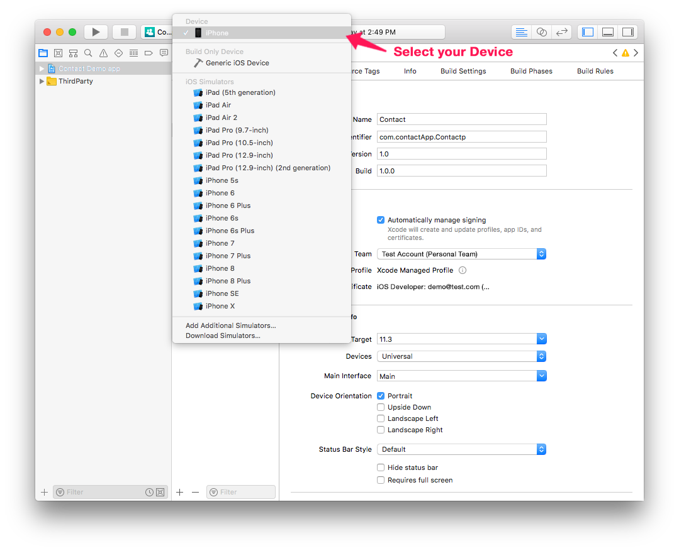
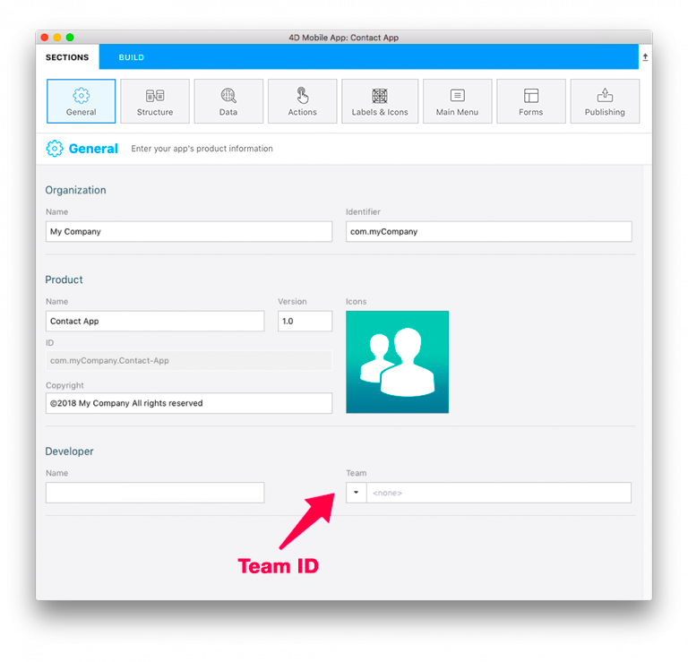

You can install and test your mobile application on a connected device.

## 要件

You need to subscribe to an Apple Developer Program. Depending on your objectives and preferences, you can choose to enroll in one of the following:

* Free Apple Developer Program: For testing only
* [Apple Developer Program for organization or individual](https://developer.apple.com/programs/enroll/): For an App Store Deployment
* [Apple Enterprise Developer Program](https://developer.apple.com/programs/enterprise/): To deploy your app in-house

:::note

You need [Apple configurator 2](https://itunes.apple.com/us/app/apple-configurator-2/id1037126344) installed on your Mac to automate app installation (optional).

:::

## ⒈ ⒈ ⒈ ⒈ Account creation

* **Apple ID**: Create your Apple ID. まだアカウントを持っていない場合，[ここ](https://appleid.apple.com/account#!&page=create)をクリックしてください。

* **Developer Account**: Choose an Apple Developer Program (for organizations or individuals) for App Store deployment or the Apple Developer Enterprise Program (for in-house deployment).

## ⒉ ⒈ ⒈ ⒈ Xcode configuration

* **Developer Account**: In Xcode > Preferences > Accounts, add your Apple ID. 

## ⒊ ⒉ ⒉ ⒉ Get your Team ID

* If your are using a Free Apple Developer Program, go to [step 4](#step-4-team-id-for-free-account).
* If your are using an [Apple Developer Program for organization](../tutorials/developer-program/register-apple-developer-program-organization), [individual](../tutorials/developer-program/register-apple-developer-program-individual) or an [Apple Enterprise Developer Program](../tutorials/developer-program/register-apple-developer-enterprise-program) go to [step 5](#step-5-team-id-for-paid-subscription-account).

## ⒋ ⒋ ⒋ ⒋ Team ID for Free account

### Provisioning Profileおよび証明書は，Xcodeが自動的に生成します。

* プロジェクトエディターの画面を「ビルド」タブに切り替えて，「プロジェクトをXcodeで開く…」メニューを選択します。

* Verify that the **Automatically manage signing** option is checked and select the account you added, from the Team dropdown list.

* iOSデバイスをUSBケーブルでコンピューターに接続し，XcodeのメニューバーにあるSchemeのメニュー（図を参照）をクリックして，接続中のデバイスを選択します。

* Xcodeは，アプリをビルドするために必要なProvisioning Profileと証明書を自動的に生成します。

### 無料のアカウントを使用してXcodeでプロジェクトをビルドする

* あとは，Xcodeの実行ボタン（図を参照）をクリックするだけです！

## ⒌ ⒌ ⒌ ⒌ Team ID for paid subscription account

* **Team ID**: Go to Developer Account > Membership and get your Team ID. 

* **4D for iOS**: Launch 4D for iOS in Sections > General and enter your Team ID. 

* ⒍に進んでプロジェクトのアプリをデバイスにインストールします。

## ⒍ ⒍ Installation

### Apple Configurator 2で自動的にインストールする

* アプリが出来がったら，プロジェクトエディターの画面を「ビルド」タブに切り替えます。
* iOSデバイスをUSBケーブルでコンピューターに接続します。
* From the BUILD tab, click on **Install**.

* デバイス上にアプリのインストールが開始するはずです！

### Xcodeでインストールする

* アプリが出来がったら，プロジェクトエディターの画面を「ビルド」タブに切り替えます。
* iOSデバイスをUSBケーブルでコンピューターに接続します。
* From the BUILD tab, click on **Install**.

* プロジェクトのアーカイブが作成されます。

* アーカイブの作成に成功してダイアログが表示されたら「OK」をクリックし，アーカイブの場所をFinderで開きます。

* Open Xcode and go to Menu > Window > Devices and Simulator and drag and drop the generated ipa file in the Installed Apps section.

* The app is now being installed on your device.

