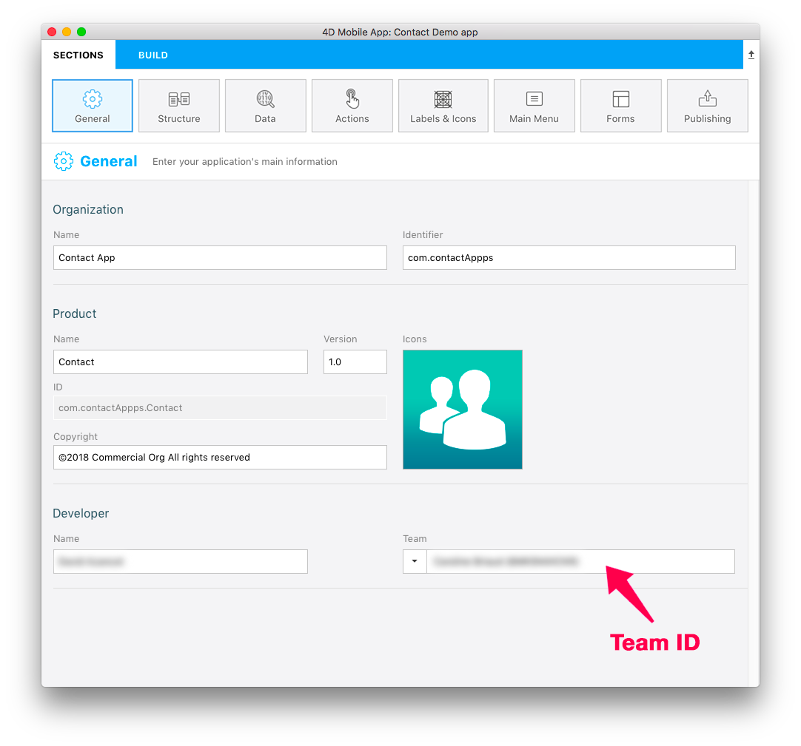
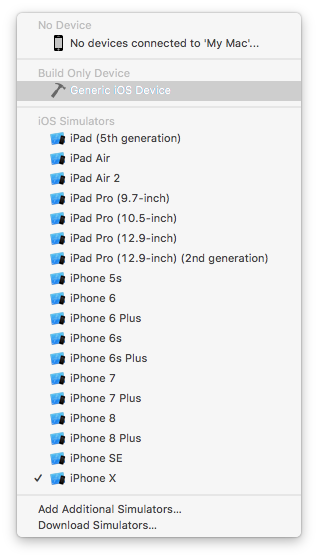
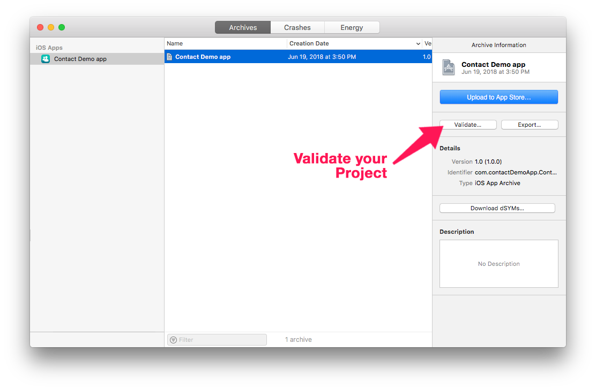
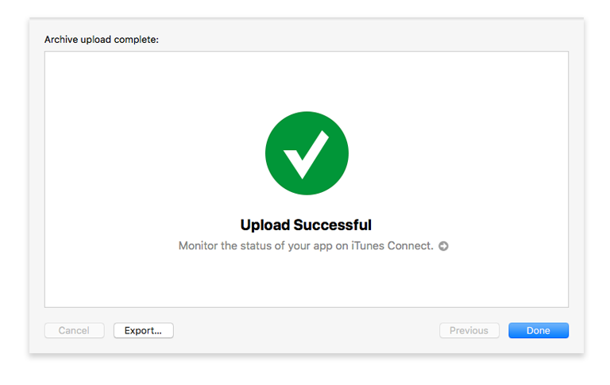
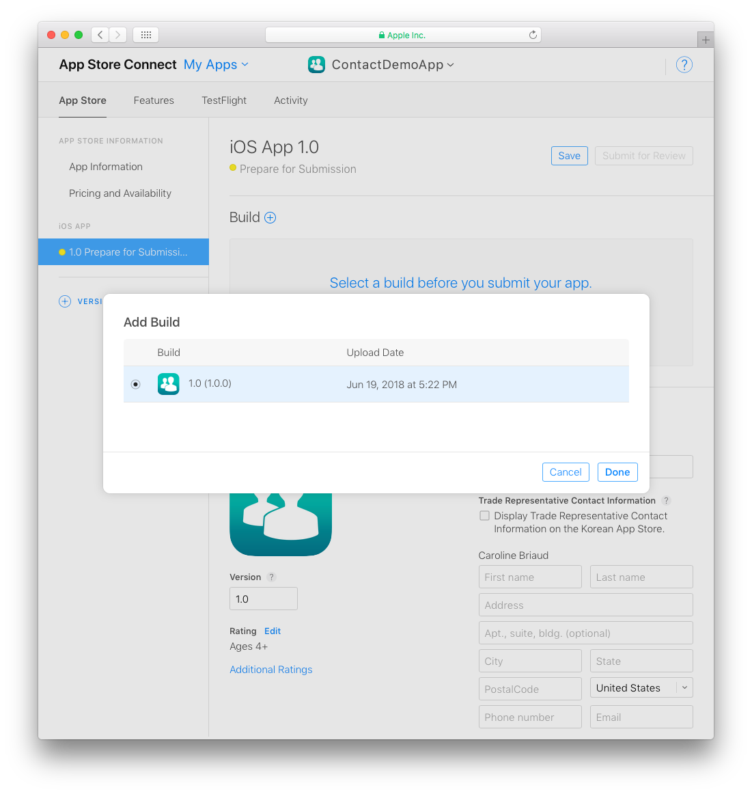

> **目標**
> 
> プロジェクトをアーカイブし、App Store Connect にアップロードします。

## ⒈ Xcode の設定
* 個人向けの Apple Developer アカウントを選択した場合、アカウントはすぐに利用できます。
* 組織向けの Apple Developer アカウントを選択した場合、Apple の承認を待つ必要があります。
* アカウントにアクセスできるようになったら、Xcode で Preferences > Accounts に追加します。
* Xcode は、必要な Provisioning Profile と証明書を自動的にインストールします。

## ⒉ Team ID を取得する

* Apple Developer アカウントにログインします。 Team ID は Membership にて確認できます。

## ⒊ 4D for iOS の設定

* 4D for iOS を起動します。
* セクションタブにて:

**一般: Team ID を入力します**

**公開: プロダクションURL を入力します**

(運用環境では HTTPS が必須です)

* ビルドタブにて:

**ビルドして実行: プロジェクトをビルドします**

## ⒋ プロジェクトを Xcode で開く

* 4D for iOS プロジェクトエディターのビルドタブで、プロジェクト > プロジェクトをXcodeで開く... をクリックします。

## ⒌ Xcode でプロジェクトをアーカイブする

* Xcode でツールバーのシミュレーター選択メニューを開き、**Generic iOS Device** を選択します。

* 次に、上部メニューから Product をクリックし、**Archive** を選択します。

## ⒍ プロジェクトを検証する

* アーカイブ処理の最後に、作成したアーカイブを表示する Organizer ウィンドウが表示されます。

* Click on the **Validate** button to start the validation process.

* The first step is selecting the App Store distribution options.

* Then you need to re-sign your app. Let Xcode manage this by  checking the **Automatically manage signing** option.

* Review your app's content.

* If your project passes the validation process, you should see this message:

If an error occurs a message will be displayed. These errors must be resolved before attempting the validation process again.

* Click **Done**. This will return you to the Organizer window.

## ⒎ ⒎ ⒎ ⒎ Upload to App Store

Once the validation process has been completed, you're ready to add your app to the App Store.

* Click the **Upload to App Store** button.

* When your project has been successfully uploaded, you'll see this window:

## ⒏ ⒏ ⒏ ⒏ Select the build for the App Store

* From App Store Connect > App Store > iOS App, select your app and click the **+** button that appears in the Build section

* Select the build you want to submit and click **Done**.

* Finally, click on the **Submit for Review** button.

## ⒐ ⒐ Submit for Review

* The final step to submitting your app for review is answering a few quick questions about your app.

* When you've finished with the questions, click **Submit**.

* The average App Store review time is around two days!
