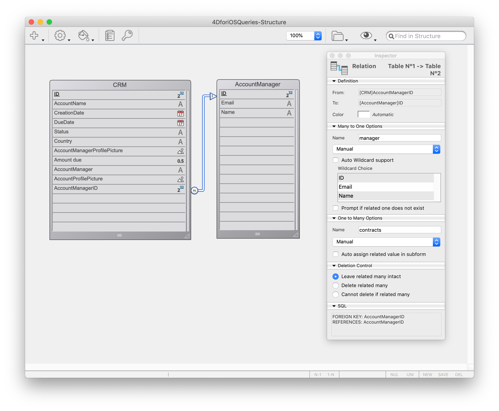

このチュートリアルでは、[**フィルタークエリ**](../../project-definition/data.md#フィルタークエリ) を作成し、モバイルアプリに特定の情報だけが表示されるようにします。

目標は、営業担当者がアプリにログインすれば、担当顧客のうち商談ステータスが *進行中* の案件だけが表示されるようにすることです。

はじめに、*進行中 (In Progress)* の商談だけが表示されるよう、データセクションで **基本的なフィルタークエリ** を設定します。 その後、営業担当者のメールアドレスも条件に含まれるよう、**ユーザー情報に基づくフィルタークエリ** を設定します。

## スタータープロジェクトをダウンロード

はじめに、**スタータープロジェクト** をダウンロードします。**4DforiOSQueries.4dbase** サンプルデータベースには、すぐに使えるモバイルアプリプロジェクトが含まれています。

<div className="center-button">
<a className="button button--primary"
href="https://github.com/4d-go-mobile/tutorial-RestrictedQueries/releases/latest/download/tutorial-RestrictedQueries.zip">スタータープロジェクト</a>
</div>

データベースに含まれているもの:

* **CRM** テーブル: iOSアプリに表示させたいデータが登録されています。
* **AccountManager** テーブル: 営業担当者たちの基本情報 (氏名やメールアドレス) が登録されています。




早速、最初のフィルタークエリを設定してみましょう！

ファイルメニューから **開く** ＞ **モバイルプロジェクト...** を選択し、**CRM app** プロジェクトを開きます。


## フィルタークエリの定義

はじめに、スタータープロジェクトをそのままビルドして実行してみましょう。ログイン画面には営業担当者のメールアドレス "michelle.simpson@mail.com" を入力します。**営業担当者全員の商談がステータスに関係なく** (*済 (Closed)* と *進行中 (In Progress)* の両方が) 表示されることに注目してください。


前述のように、モバイルアプリにメールアドレスでログインすれば、自分が担当している商談でステータスが *進行中* のものだけを表示するよう、データをフィルターしたいと考えています。 下記の要領で実現することができます。

* **データ** セクションに移動します。
* **フィルタークエリ** 欄をクリックすると、**フィールド・比較演算子・演算子ボタン** が表示されます。
* **フィールド** ボタンをクリックし、**Status** フィールドを選択します。
* **比較演算子** ボタンをクリックし、**等しい** を選択します。
* *進行中* の商談を表示したいので、**&apos;In progress&apos;**と入力します。
* **検証** ボタンをクリックし、フィルターを確定します。これを忘れてしまうと、アプリがビルドできません。

下図のようになっていることを確認してください。


> **注記**
> 
> * A **filter** icon is displayed at the right of each table when a basic filter is applied to it.
> * For these kinds of filter queries, you can choose to embed data into the app or to load the data after login by checking the **Embed data into the built application** checkbox.
> * Size will be calculated at the first build for you to visualize the **size of your data**.

If you build your app and enter "michelle.simpson@mail.com" as the login email, you'll see that all contracts *In Progress* are displayed in the Simulator!


残念！ What we want now is for each account manager to visualize only their own *In Progress* contracts, so let's complete our query.


## ユーザー情報に基づくクエリ

Now let's filter our app content [depending on a user information](../../project-definition/data.md#filter-queries-with-user-information), in this case, the account manager's login email address.

* Go to the **Data section**.
* Right-click in the **Filter query** field to make **Field, Comparators and Operators buttons** appear.
* Click on the **Operators** button and select **AND**.
* Now define the user information you want to get from the database method, **:email**.
* Remember to validate the query by clicking on the **Validate** button. これを忘れてしまうと，アプリがビルドできません。


```4d
Status = 'In Progress' & manager.Email = :email 
```

The query will filter data depending on the **In Progress** status AND the **Account manager's email address** (accessible from the AccountManager table thanks to the *Many-to-One* relation on the manager's name).

> **注記**
> 
> * A **user icon** is displayed on the right of each table when a user information filter is applied to it.
> * As soon as a query is based on user information and validated, you need to edit the [`On Mobile app authentication method`](../../4d/on-mobile-app-authentication.md). To do so, right-click on the **Edit authentication method** button to open the database method edition window.

データベースメソッドに下記のコードを追加します。

```4d
$response.userInfo:=New object("email";$request.email)
```

表示できるデータを判定するための条件として，営業担当者のログインメールアドレスが参照できるようになります。


Now if you build your app and enter "michelle.simpson@mail.com" as login email, you'll find all of Michelle Simpson's *"In progress"* contracts.


