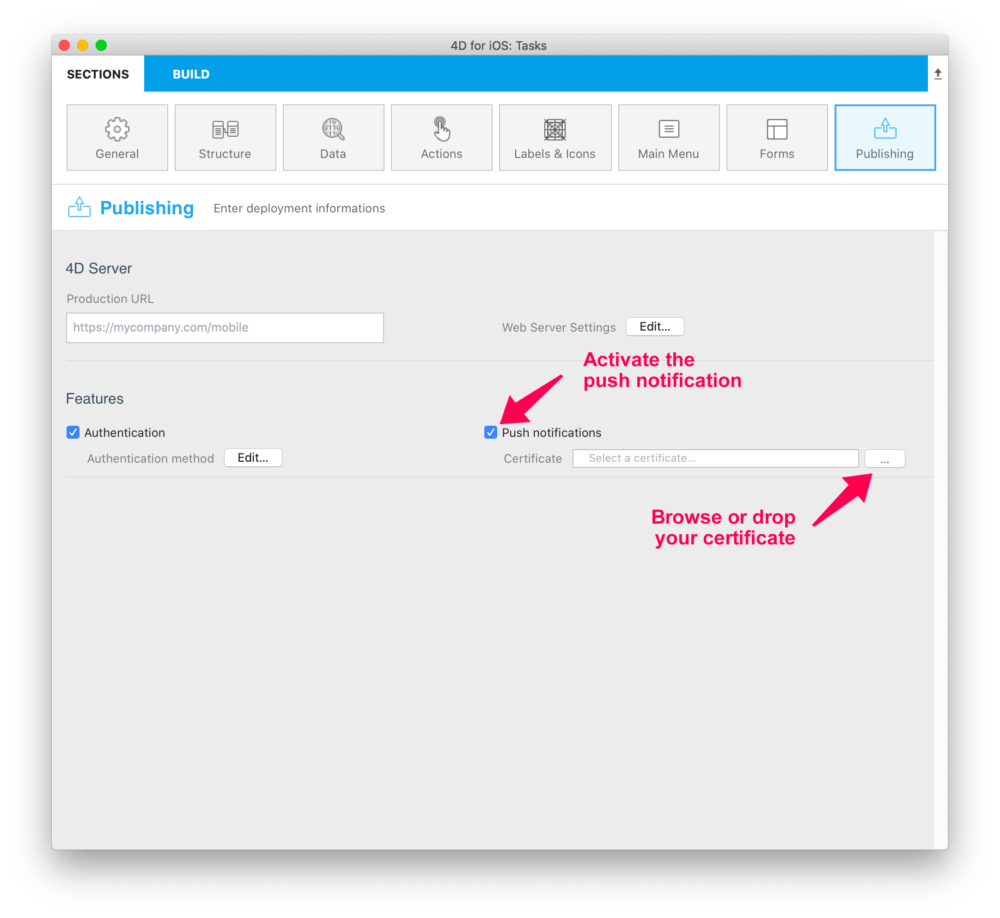

:::info 4D for Android

このセクションで触れている内容は、4D for Android では現在ご利用いただけません。

:::

## プッシュ通知とは

On a mobile phone, a push notification is an alert message, received via an application, that you can open, delete, allow or block. It can be very useful for example to notify your app users that a new version is available.

But what about the architecture to implement, in order to integrate this functionality into a mobile application? And what is the process of a push notification, from creation to display on the user's mobile?

## 技術的アーキテクチャー

ここでは、モバイルプッシュ通知の作成・送信・受信に必要な各要素について説明します。


## システム要件

プッシュ通知を送信するには、Apple社から提供される `AuthKey_XXXYYY.p8` 認証ファイルが必要です。

1. [このドキュメント](https://github.com/4d-for-ios/4D-Mobile-App-Server/blob/master/Documentation/Generate_p8.md) で説明されているように、.p8 キーファイルを生成してダウンロードします。

2. モバイルプロジェクトの [公開](../project-definition/publishing.md) ページで、**プッシュ通知** オプションにチェックを入れ、証明書を選択します。




## プッシュ通知の基本的な例

[4D Mobile App Server](https://github.com/4d-for-ios/4D-Mobile-App-Server/tree/master) コンポーネントは、1人以上の受信者にプッシュ通知するためのメソッドを提供しています。 詳細については、[プッシュ通知コンポーネントのドキュメント](https://github.com/4d-for-ios/4D-Mobile-App-Server/blob/master/Documentation/Classes/PushNotification.md) を参照ください。

Here is a simple example of push notification sent to `test@4d.com`:

```4d

$pushNotification:=MobileAppServer.PushNotification.new() 
$notification:=New object 
$notification.title:="ここがタイトルです" 
$notification.body:="ここが通知の内容です" 
$response:=$pushNotification.send($notification;"test@4d.com")

```

It's as simple as that!

:::tip

[**4D Mobile App Server** コンポーネント](https://github.com/4d-for-ios/4D-Mobile-App-Server/blob/master/Documentation/Classes/PushNotification.md) を使用すると、プッシュ通知を簡単にニーズに合わせることができます。 Feel free to use it and to pick the most relevant aspects for your app. And of course, all contributors are welcome to this project, through feedback, bug reports and even better: pull requests.

:::

## プッシュ通知とデータの同期

With a push notification, you can also launch a synchronization to update your data.

For example, if your application has a delivery tracking option, the delivery information will be updated in the database thanks to a notification sent to the customer. This notification, containing a request to synchronize the data, will enable the customer to get the modified data on their smartphone.

To do so using the `4D Mobile App Server` component, you need to specify whether or not you want to force data synchronization in your push notification. Therefore, simply provide the `dataSynchro` boolean value in the `userInfo` object.

### Data synchronization with a notification opening a record

By default, a notification opening a record automatically triggers a data synchronization.

For example, in a Contact app, if a contact’s specific information (*i.e.* a contact’s record, such as the address or the phone number) has been modified, the user receives a notification that automatically opens the relevant record and synchronizes the data contained in the record. When the user opens the notification, the contact’s information is fully updated.

Here's an example of the default behaviour, a `dataSynchro` request with the `open()` method:

:::note

For `open()` method exclusively, this is the default behaviour. As a result, if you don't specify the `dataSynchro` boolean value, it is `true` by default.

:::

```4d

$pushNotification:=MobileAppServer.PushNotification.new()

$notification:=New object
$notification.title:="ここがタイトルです" 
$notification.body:="ここが通知の内容です" 

$entity:=ds.Employees.get("456456")
$response:=$pushNotification.open($entity; $notification; $recipients)

```

However, you can also choose not to force a data synchronization, by preventing `dataSynchro`:

```4d

$pushNotification:=MobileAppServer.PushNotification.new()

$notification:=New object
$notification.title:="ここがタイトルです" 
$notification.body:="ここが通知の内容です" 
$notification.userInfo:=New object("dataSynchro"; False)

$entity:=ds.Employees.get("456456")
$response:=$pushNotification.open($entity; $notification; $recipients)

```

### Data synchronization with a simple notification

You can also request a synchronization for a simple notification without opening a specific record. For example, some new entries have been added. You can then inform your user and update the data with no manipulation on their part.

Here is a code example that you can also use with other methods, as long as you fill the `userInfo` object with `dataSynchro` value.

```4d

$pushNotification:=MobileAppServer.PushNotification.new()

$notification:=New object
$notification.title:="ここがタイトルです" 
$notification.body:="ここが通知の内容です" 
$notification.userInfo:=New object("dataSynchro"; True)

$response:=$pushNotification.send($notification; $recipients)

```


## Windows の設定

Windows users need to download the [last CURL version](https://curl.se/download.html) to work on the variables of the environment of their machine. Or they can insert curl.exe in the Resources folder of their production database.

## MobileApps フォルダー

Whether you're working on Windows or on macOS, you need to copy the following files from your development project to your production project:

- `4DBASE/MobileApps/ID.BundleID/AuthKey_XXXX.P8`
- `4DBASE/MobileApps/ID.BundleID/manifest.json`


