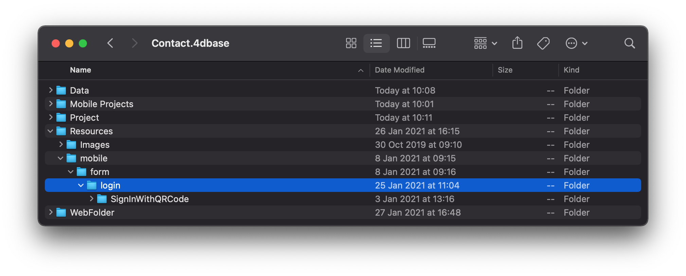
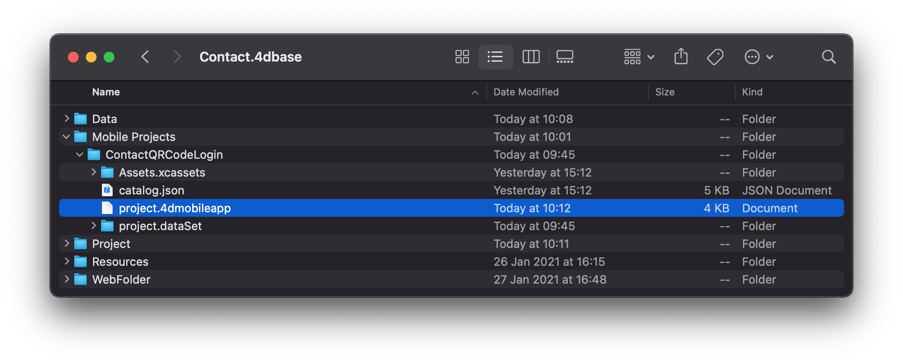
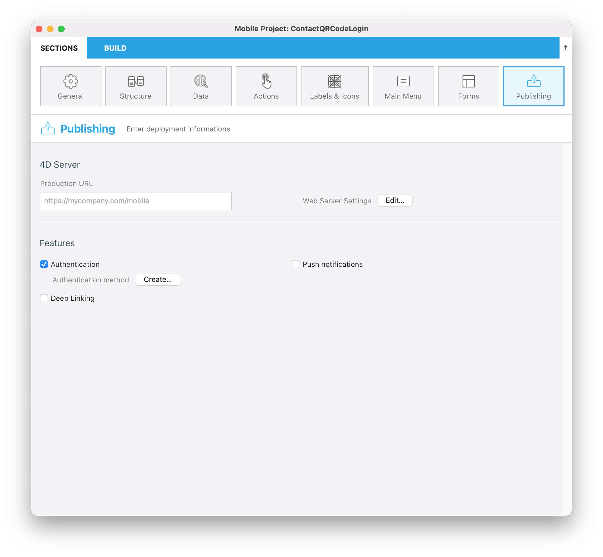
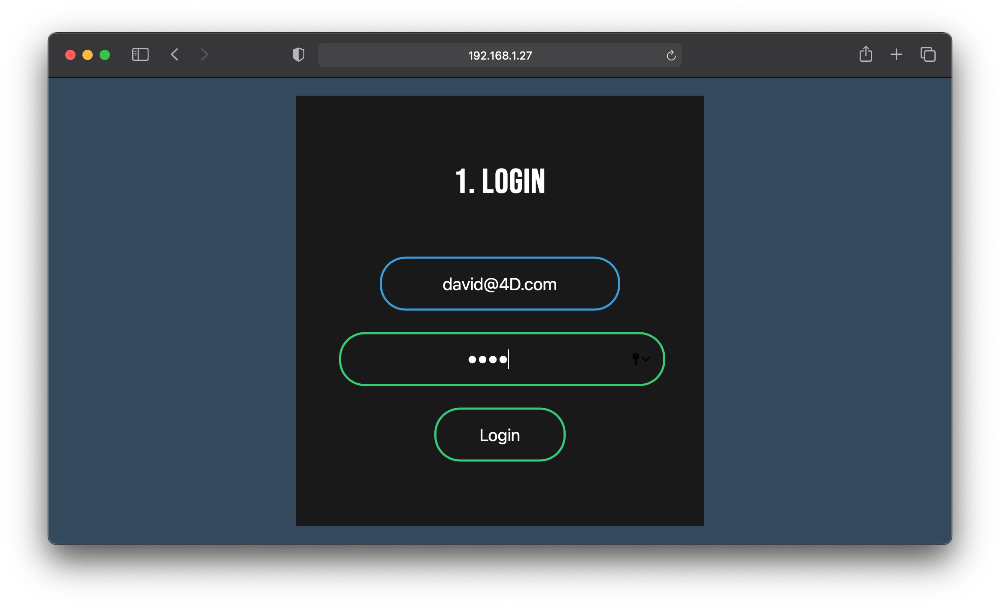
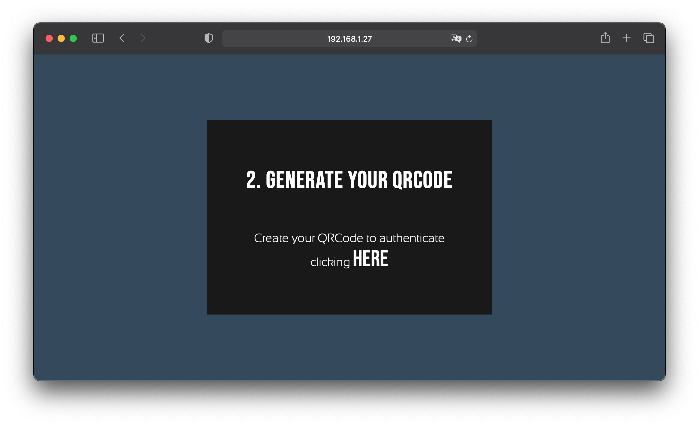
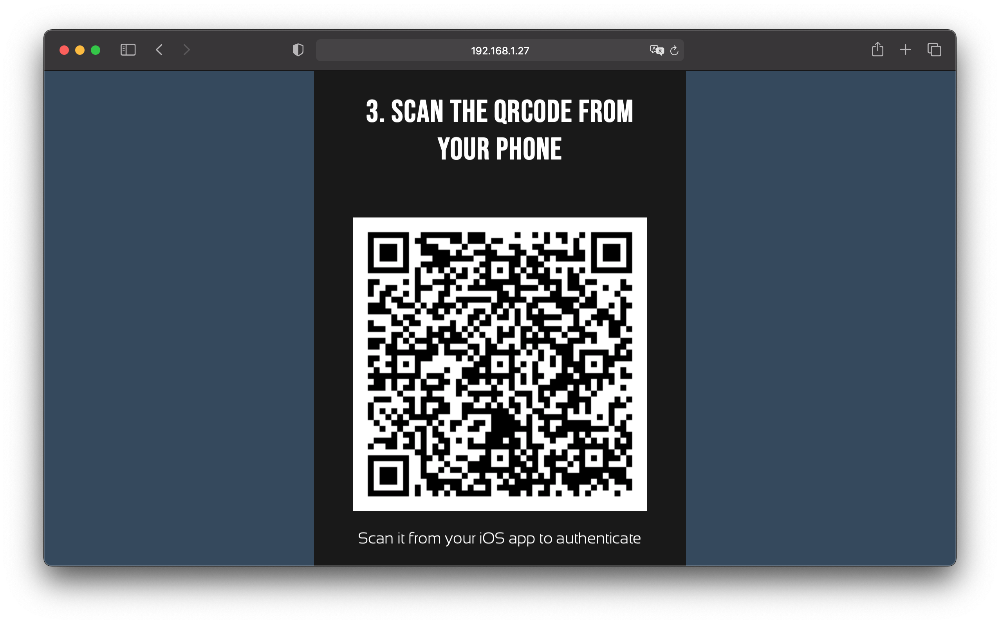
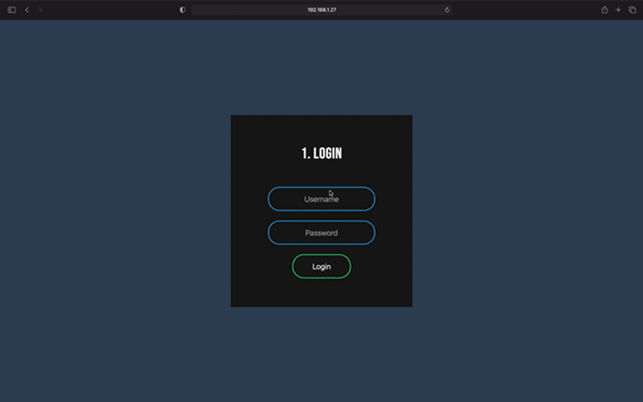

このチュートリアルでは、次のことを紹介します:

- カスタム [ログインフォーム](https://4d-for-ios.github.io/gallery/#/type/form-login) の作成と使用
- QRコードのスキャンによる認証済みユーザーのログイン
> **用意するもの**
> 
> 認証済みユーザーをもつ Webサイト
> 
> 4D v18R6 以上
> 
> iOSモバイルデバイスの実機 (シミュレーターはカメラをシミュレートしないため)


*シナリオ: 認証済みユーザーをもつ Webサイトがすでにあり、QRコードをスキャンするだけでそれらのユーザーがアプリにログインできるようにする。*

:::note

プロジェクトエディターからカスタムログインフォームを選択する機能はまだ実装されていませんが、手動でおこなう方法を説明します。

:::

## ⒈ はじめに

このチュートリアルでは、次のことをおこないます:

* カスタムログインフォームを追加する
* QRコードをスキャンするだけで、アプリユーザーがログインできる機能を実装する

まず、スタータープロジェクトをダウンロードします。このプロジェクトには、データベースファイルのほかに、すぐに使える Webページが WebFolderフォルダーに格納されています:

<div className="center-button">
<a className="button button--primary"
href="https://github.com/4d-go-mobile/tutorial-CustomLoginForm/archive/main.zip">スタータープロジェクト</a>
</div>

:::info

このプロジェクトには、各認証済みユーザーについてログインID とパスワードを格納した Users テーブルがあらかじめ含まれています。

:::

## ⒉ カスタムログインフォームを追加する

カスタムログインフォームを追加するには、まず *YourDatabase.4dbase/Resources/Mobile/form/login* フォルダーを作成します。

[QRコードログインフォーム](https://github.com/mesopelagique/form-login-SignInWithQRCode/archive/master.zip) をダウンロードし、先ほど作成した login フォルダーにドロップします。



次に、*YourDatabase.4dbase/Mobile Projects/ContactQRCodeLogin/project.4dmobileapp* ファイルを開きます。



プロジェクトを閉じた状態で、以下の行を追加します: *"login":"/SignInWithQRCode",*

```
{
    "info": {
        "version": 5,
        "target": "iOS",
        "ideVersion": "1870",
        "ideBuildVersion": "261295",
        "componentBuild": ""
    },
    "login": "/SignInWithQRCode",
    ...

```

これにより、カスタムテンプレートを初期化し、ビルドプロセス中に使用することができます。

これで、カスタムテンプレートの追加は完了です。 簡単でしたね!


## ⒊ On Mobile App Authentication データベースメソッド

プロジェクトを開き、ContactQRCodeLogin モバイルプロジェクトを開いて、公開セクションに移動します。

ここで、認証機能にチェックを入れ、作成ボタンをクリックしてデータベースメソッドを作成します (すでに作成されている場合は編集ボタンに変化します)。




ユーザー認証のため、以下のように記述します:

```4d
var $0 : Object
var $1 : Object

var $request; $response : Object

$request:=$1  // モバイルアプリから提供される情報
$response:=New object  // モバイルアプリに返される情報

$entity:=ds.User.query("login = :1"; $request.email)
If ($entity.length>0)
    $password:=$entity.first().password  // テーブルからパスワードを取得します

    If (Verify password hash($password; $request.parameters.token))
        // リクエストから受け取ったパスワードと比較します

        $response.success:=True
    Else 
        $response.success:=False
    End if 
Else 
    $response.success:=False
End if 

// モバイルアプリに表示する任意のメッセージ
If ($response.success)
    $response.statusText:="認証に成功しました"
Else 
    $response.statusText:="このアプリを使用する権限がありません"
End if 

$0:=$response
```


## ⒋ プロジェクトメソッド

### Authentication メソッド

ここでは、フォームから変数を取得し、それらの値が Userテーブルに存在するかどうかを確認します:

```4d
// フォームの変数をすべて取得します
C_TEXT($1)
ARRAY TEXT($arrNames; 0)
ARRAY TEXT($arrVals; 0)

// 認証 Webページの変数のうち、ログインID およびパスワードを取得します
WEB GET VARIABLES($arrNames; $arrVals)
$VLOGIN:=Find in array($arrNames; "VLOGIN")
$VPASS:=Find in array($arrNames; "VPASS")

// コードからアクセスできるよう、共有変数を作成します
Use (Storage)
    Storage.session:=New shared object("login"; ""; "password"; "")
End use 

// ユーザーを認証してよいか確認するため、ログイン情報が存在するか検索します
$entity:=ds.User.query("login = :1 and password = :2"; $arrVals{$VLOGIN}; $arrVals{$VPASS})

// 見つかった場合は、ログイン情報を共有変数に代入します
If ($entity.length>0)
    Use (Storage.session)
        Storage.session.login:=$arrVals{$VLOGIN}
        Storage.session.password:=$arrVals{$VPASS}
        Storage.session.success:=True
    End use 

    // Webページにリダイレクトします
    WEB SEND HTTP REDIRECT("/createQRCode.html")

Else 
    // ホームページに戻ります
    Use (Storage.session)
        Storage.session.success:=False
    End use 
    WEB SEND HTTP REDIRECT("/")
End if 
```

### GenerateQRCODE メソッド

ここで、vqrCodeData を生成します。これは、ユーザーのメールアドレスと暗号化されたパスワードを含む json で、QRコードに埋め込まれることになるデータです。

```4d
// Storage 変数を使います
$currentUserEmail:=Storage.session.login
$token:=Storage.session.password
$options:=New object("algorithm"; "bcrypt"; "cost"; 4)
$hash:=Generate password hash($token; $options)

// vqrCodeData 変数を生成します (メールアドレスと暗号化されたパスワードの json 値)
vqrCodeData:=JSON Stringify(New object("email"; $currentUserEmail; "token"; $hash))

// QRコード Webページにリダイレクトします
WEB SEND HTTP REDIRECT("/generatedQRCode.shtml")
```


## ⒌ Webサイト

このチュートリアルでは、WebFolder フォルダーに 3つの htmlページが用意されています:

* 認証ページ (index.html)
* QRコード生成ページ (createQRCode.html)
* ユーザーがモバイルデバイスでスキャンする最終ページ (generatedQRCode.shtml)

これら 3つのページを見ていきましょう:

### index.html

ここでは 4DACTION を使って、ステップ4 で確認した *Authentication プロジェクトメソッド* で使用するログインとパスワードを POST します:

```html
  <form class="box" ACTION="/4DACTION/Authentication" METHOD=post>
  <h1>1. Login</h1>
  <input type="text" id="login" placeholder="Username" name=VLOGIN >
  <input type="password" id="login" placeholder="Password" name=VPASS>
  <input type="submit" name="" value="Login">
  </form>
```

### createQRCode.html

ここでは 4DACTION を使用して、*GenerateQRCODE プロジェクトメソッド* を呼び出しています:

```html
<h1>2. GENERATE YOUR QRCODE</h1>
    <div>
        <p>Create your QRCode to authenticate clicking <a href="/4DACTION/GenerateQRCODE">Here</a></p>
    </div>
```

### generatedQRCode.shtml

In this last page, we use [4D tags](https://developer.4d.com/docs/Tags/tags.html) to get the *data* value:

```html
<h1>3. SCAN THE QRCODE FROM YOUR PHONE</h1>
  <div id="canvas"></div>

  <script type="text/javascript">

    const qrCode = new QRCodeStyling({
      width: 300,
      height: 300,
      data: '<!--#4DEVAL vqrCodeData-->',
      dotsOptions: {
        color: "#000",
        type: "square"
      },
      backgroundOptions: {
        color: "#FFFFFF",
      }
    });
    qrCode.append(document.getElementById("canvas"));
  </script>

```

## ⒍ テストしましょう

### Webサイトのトップページにログインする

実行メニューから "Web サーバーテスト" を選択して Webサイトのホームページを開き、Username 欄に **david@4D.com**、Password フィールドに **TEST** と入力し、Login をクリックします (これは User テーブルに存在するレコードです)。




### QRコードを生成する

**HERE** ボタンをクリックし、QRコードを生成します。



最後の QRコードのページにリダイレクトされます。



### 実機でアプリをビルドする

プロジェクトエディターから、モバイルアプリを実機にインストールします。

すると、カスタムログインフォームが表示されます。ここで、さきほど生成した QRコードをスキャンすることで、モバイルアプリにログインできます。

このような結果になります:



## ⒎ これからどうする？

ステップ2 では、モバイルアプリに任意のログインフォームを簡単に追加する方法を説明しています。 同様に、作成した独自のログインフォームをモバイルアプリに追加して、使用することができます。

また、その後の手順では、Sign In With QRCode ログインの実装方法を説明しています。これを使うと、認証済みユーザーが QRコードをスキャンしてモバイルアプリにログインできるようになります。
