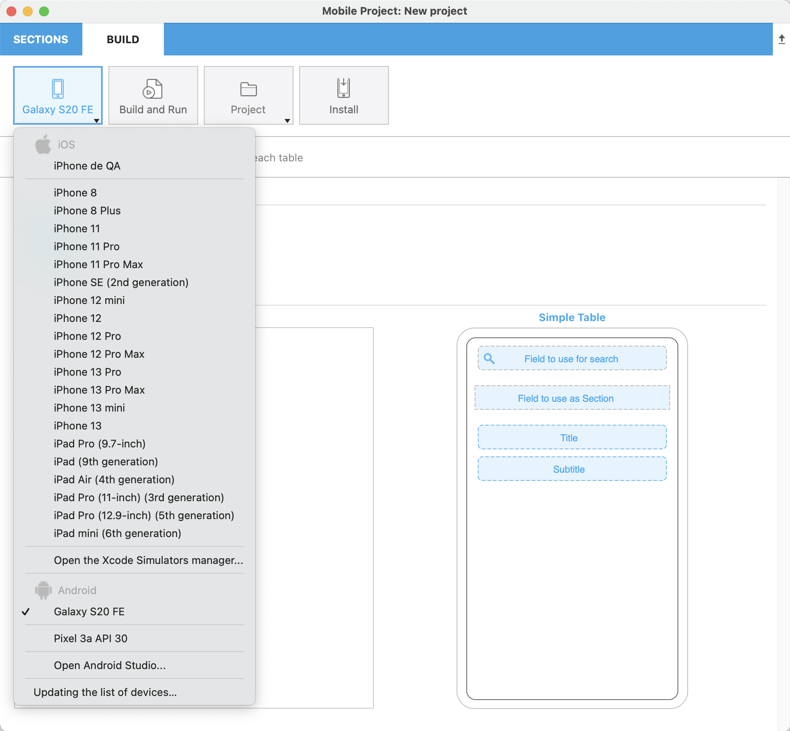

4Dモバイルプロジェクトエディターや、iOS / Androidアプリを使用していて、問題が発生することがあります。 このような場合、ログファイルから有用な情報が得られることがあります。

ログファイルにアクセスするには、プロジェクトエディターのビルドタブで、**Alt** キーを押しながら **プロジェクト** をクリックします:

すると、[現在選択されているシミュレーター](../project-definition/build-panel#シミュレーターを使用する) について、追加のデバッグメニューが表示されます:

* **カレントシミュレーターログフォルダを表示**: `CrashReporter` と`MobileInstallation` フォルダーが置かれています。

* **"Diagnostic Reports" フォルダを開く**

* **カレントシミュレーターフォルダを表示**

* **アプリのシミュレーターフォルダを表示**: 各アプリのサブメニューが表示されます。

## アプリをデバッグする

アプリが完成し、シミュレーターの結果が満足なものであれば、4D for iOS / 4D for Android を問わず、スマートフォンでのテストに移れます。

そのためには、まずスマートフォンを接続し、プロジェクトエディターで物理デバイスをリストから選択して、"ビルドして実行" ボタンをクリックします。

:::note

**デバイスの一覧の更新** ボタンを押すと、利用可能なデバイスの一覧を更新できます。

:::

4D はアプリケーションをビルドし、接続されたデバイスにインストールします。

:::note

Android の場合は、デバッグに 1手順追加する必要があります。 詳細は [こちら](from-your-android-device-and-android-studio) を参照ください。

:::
