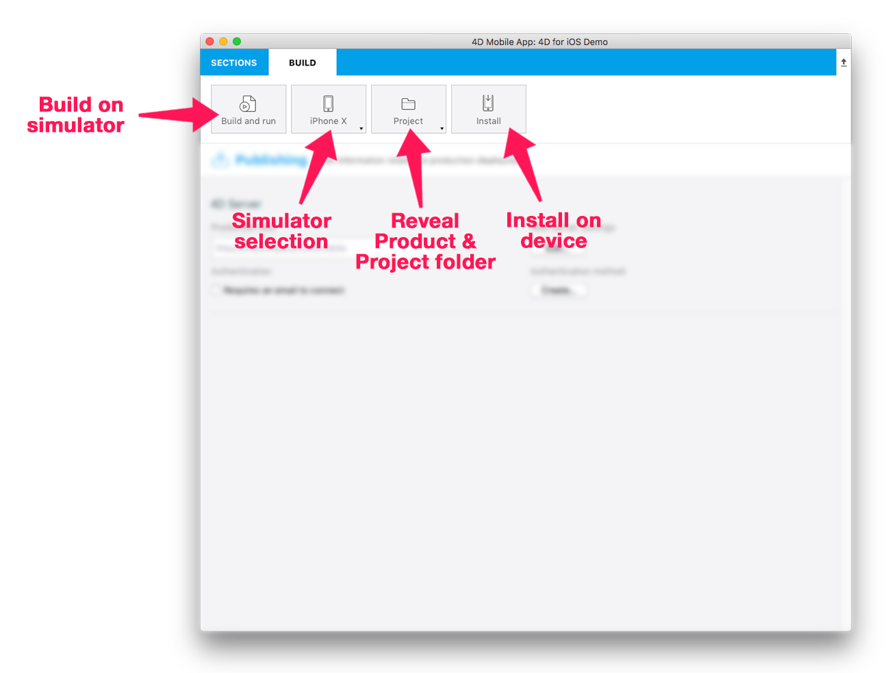

開発中のアプリは、シミュレーターを使用していつでもテストすることができます。 シミュレーターは、プロジェクトエディターのビルドタブにあります。

ビルドタブのオプションについて説明していきます:

* **ビルドして実行:** シミュレーターでアプリを起動します。

* **iPhone X:** デフォルトのシミュレーターです。 ここをクリックすると、利用可能なシミュレーターの一覧がドロップダウンに表示されます。

* **プロジェクト:** ドロップダウンリストが表示され、**プロジェクトフォルダを表示** あるいは **プロダクトフォルダを表示**、または **プロジェクトを Xcode / Android Studio で開く** ことができます。 このドロップダウンリストは [デバッグ用途](../debug/from-project-editor) に非常に有用です。

* **インストール:** 接続されているデバイスにアプリをインストールします ([iOSデバイスへのインストール](../tutorials/deploying-in-house/testing-on-your-device.md) を参照ください)。

## シミュレーターを使用する

シミュレーターは、以下の手順で使用します。

1. デバイスを選択する

プロジェクトエディターのビルドタブで、アプリの実行に使う iOS または Android デバイスを選択します。

2. **ビルドして実行** ボタンをクリックする

3. アプリをテストする

アプリのリストフォームと詳細フォームを切り替えるなどしてテストします。

 
