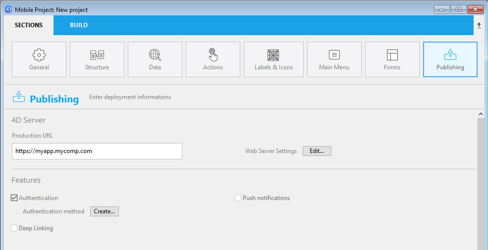
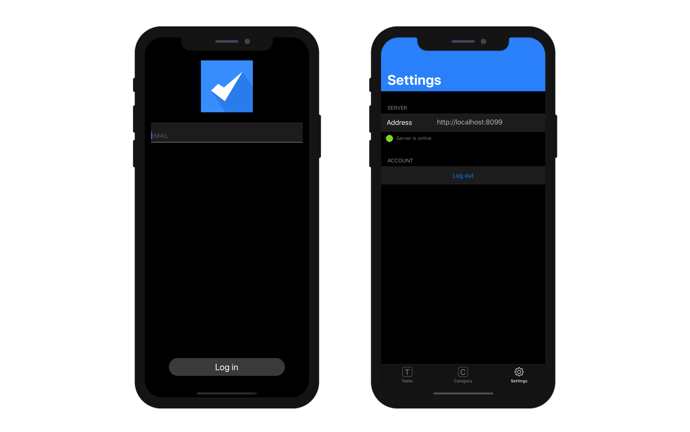

このページでは、アプリの公開設定および特殊なモバイル機能にアクセスできます:





## プロダクションURL

本番環境においてモバイルアプリが接続し、データの読み書きをおこなう Webサーバーの URL です。 任意の有効なアドレスが入力できます。例:

```
https://my.wesbsite.com
http://my.website.com:9200
www.website.com/mobile
```

開発フェーズではこのエリアを空にし、[データソース](data.md) を **カレントデータファイル** に設定することができます。

:::tip

ユーザーは、モバイルデバイスから [サーバーの URL を変更する](#リモートURLを変更する) ことが可能です。

:::


## Webサーバー設定

**編集...** ボタンをクリックすると 4Dストラクチャー設定の **Web** ページが開きます。 このページでは、モバイルアプリに埋め込む以下の設定を定義します:

- **HTTPを有効化** オプションおよび **HTTPポート**
- **HTTPSを有効化** オプションおよび **HTTPSポート**

:::note

HTTP と HTTPS の両方が有効化されていた場合、HTTP が使用されます。

:::

HTTPSポートを有効化するには、有効な [TLS 証明書](https://developer.4d.com/docs/ja/Admin/tls/) をインストールする必要があります。 4D でテスト用証明書を作成することもできます。

これらの設定は、[プロダクションURL](#プロダクションURL) が定義されている場合にのみ使用されます。 それ以外の場合には、ローカルIDアドレスが使用されます。

:::note

シミュレーターは必ずローカルに動作します (127.0.0.1 または localhost)。

:::

## デバイスでの見た目

### 設定画面

設定画面はタブバーから利用可能です。 また、アプリ内にテーブルが 5つ以上ある場合には、"..." からアクセスできます。

設定画面では、次のことができます:

* リモートURL とその状態を確認する
* ログアウトする (認証ユーザーとしてログインしていた場合)




### リモートURLを変更する

リモートURL は iPhone の設定から簡単に更新できます:

* iPhone の設定を開きます
* リモートURL を更新したいアプリを選択します
* "サーバーアドレスをリセット" オプションをタッチします


* その後、アプリを再起動してサーバーアドレスをリセットします
* 最後に新しいリモートURL 定義します


## 認証

モバイルアプリは、ユーザー認証を要求できます。

- 認証が有効化されていない場合、モバイルユーザーはゲストモードでアプリを使用します。
- 認証が有効化されていると、モバイルユーザーはアプリ接続前に **ログイン** を求められます。

:::info

いずれの場合も、モバイルユーザーがサーバーに接続すると、[ユーザーセッション](session-management.md) が作成されます。

:::

### 認証オプション

認証を有効化するには、**認証** オプションをチェックします:


このオプションが選択されている場合、アプリ起動時にログインフォームがユーザーに提示されます。 ログインフォームのメニューでは、デフォルトのログインフォームが自動で選択されています (下記参照)。


### Authentication メソッド


**作成...** / **編集...** ボタンをクリックすると、4Dメソッドエディターで [`On Mobile App Authentication`](../4d/on-mobile-app-authentication) データベースメソッドを開きます (以下参照)。 全ユーザーのゲストログインを許可するデフォルトのテンプレートコードが用意されています。

```4d
#DECLARE($request : Object)->$response : Object

/*
        $request = モバイルアプリから提供される情報
        $response = モバイルアプリに返される情報
*/

$response:=New object

// ユーザーのメールをチェックします
If ($request.email=Null)
    // メールなしの場合はゲストモードで接続を許可します
    $response.success:=True
Else 
    // 認証モードでは、メールやデバイスに応じて接続を許可/拒否します
    $response.success:=True
End if 

// モバイルアプリに表示する任意のメッセージ
If ($response.success)
    $response.statusText:="認証に成功しました"
Else 
    $response.statusText:="このアプリを使用する権限がありません"
End if 

```

このメソッドは、モバイルアプリから送信されるリクエストをすべて処理し、接続の可否を決定します。 このメソッドの詳細については、[Mobile App Authentication](../4d/on-mobile-app-authentication) データベースメソッドのページを参照ください。

モバイルユーザーを認証する最も一般的な方法は、メール認証を使用することです。 電子メールを使った二重認証の詳細な例については、[このチュートリアル](../tutorials/login-forms/email) を参照してください。

### ログインフォーム

ログインフォームのメニューは、プロジェクトで利用可能なログインフォームがすべて提案されます。実際に使用するフォームをその中から選択します。  **デフォルト** は、モバイルエディターが提供するベーシックなログインフォームです。 これは、ユーザーのメールアドレスを識別子として使用します。

また、[カスタムログインフォーム](../tutorials/login-forms/custom-login-form) を使用することもできます。 インストールが完了したカスタムログインフォームは、ログインフォームのポップアップメニューに表示されます。 カスタムログインフォームは、作成またはダウンロードすることができます。 カスタムログインフォームをダウンロードする場合は、[**Login form Github gallery**](https://4d-go-mobile.github.io/gallery//#/type/form-login) が利用できます。

カスタムログインフォームは、`manifest.json` ファイルと、(任意で) Swift または Kotlin のソースコードと紐付けられます。 カスタムログインフォームのファイルは、以下の場所のサブフォルダーに格納する必要があります:

```
myProject/Resources/Mobile/Form/Login/
```

`manifest.json` ファイルには、以下の属性が含まれています:

| プロパティ                   | タイプ                 | 詳細                      |
| ----------------------- | ------------------- | ----------------------- |
| "**name**"              | テキスト                | ログインフォーム名               |
| "**type**"              | テキスト                | "login" に設定             |
| "**capabilities**" (任意) | object              | 必要に応じて情報やオプションを追加します    |
| "**target**"            | text または collection | ログインフォームがサポートするプラットフォーム |


## プッシュ通知

この機能は、[プッシュ通知](../special-features/push-notification) の章で説明されています。


## ディープリンク

この機能は、[ディープリンク](../special-features/deep-linking) の章で説明されています。 


