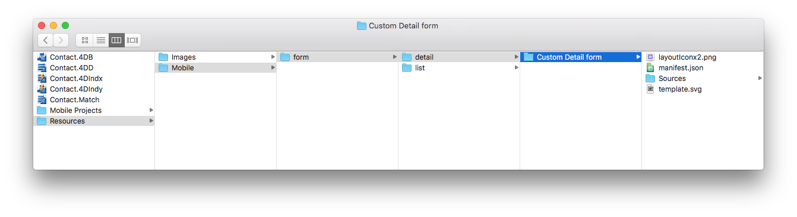

このチュートリアルでは、詳細フォームのテンプレートを作成する方法を説明します。 この詳細フォームは、**画像ヘッダー** と **タイトルおよびコンテンツフィールド** をアプリに表示します。

## ⒈ スタータープロジェクトをダウンロード

**スタータープロジェクト** をダウンロードします。

* **Custom Detail form** フォルダー (カスタム詳細フォームのテンプレートフォルダー)
* すぐに使えるモバイルアプリの付いたデモ4Dプロジェクト ("Contact")。

<a className="button button--primary"
href="https://github.com/4d-go-mobile/tutorial-CustomDetailFormStarter/archive/refs/heads/main.zip">スタータープロジェクト</a>

## プロジェクトに詳細フォームのテンプレートを追加する

まず、*Contact.4dbase/Resources/Mobile/form/detail* フォルダーを作成し、**Custom Detail form** フォルダーをその中にドラッグ＆ドロップします。

4Dアプリケーションを起動し、ダウンロードした "Contact" 4Dプロジェクトを開きます。 これには **ファイル > 開く > モバイルプロジェクト... > Contact Demo app** と選択していきます。

モバイルプロジェクトエディターの **フォーム** セクションで、詳細フォームテンプレート選択画面に追加した "Custom Detail form" テンプレートが表示されていれば成功です:

それでは、**Custom Detail form** フォルダーの中身を見ていきましょう。

## 詳細フォームテンプレートフォルダーの中身

フォルダーには、次のものが格納されています:

* **layoutIconx2.png**: 160x160pxサイズのアイコンファイルです。 プロジェクトエディターのテンプレート選択画面に表示されます。
* **manifest.json**: テンプレートの基本的な説明が記述されています。
* **template.svg**: フィールドをドラッグ＆ドロップして詳細フォームのレイアウトを決定する画面に表示されるテンプレートのプレビューです。
* ストーリーボード (グラフィカルインターフェース) と **Swift** ファイル (フォームのコード) を `Source/Forms/Tables/___TABLE___` フォルダー内に格納する **ios フォルダー**
* layout.xml ファイル (グラフィカルインターフェース) を `app/src/main/res/layout` フォルダー内に格納する **android フォルダー**

これらのファイルやフォルダーについては、次のセクションで説明していきます。