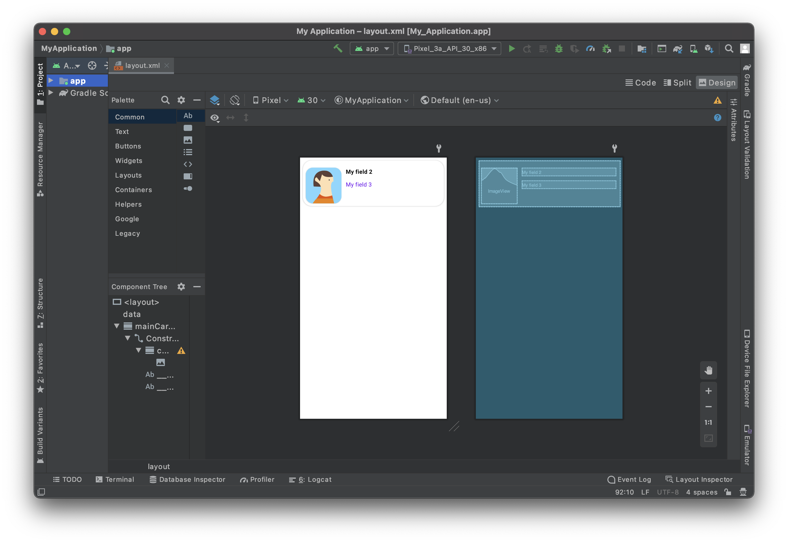
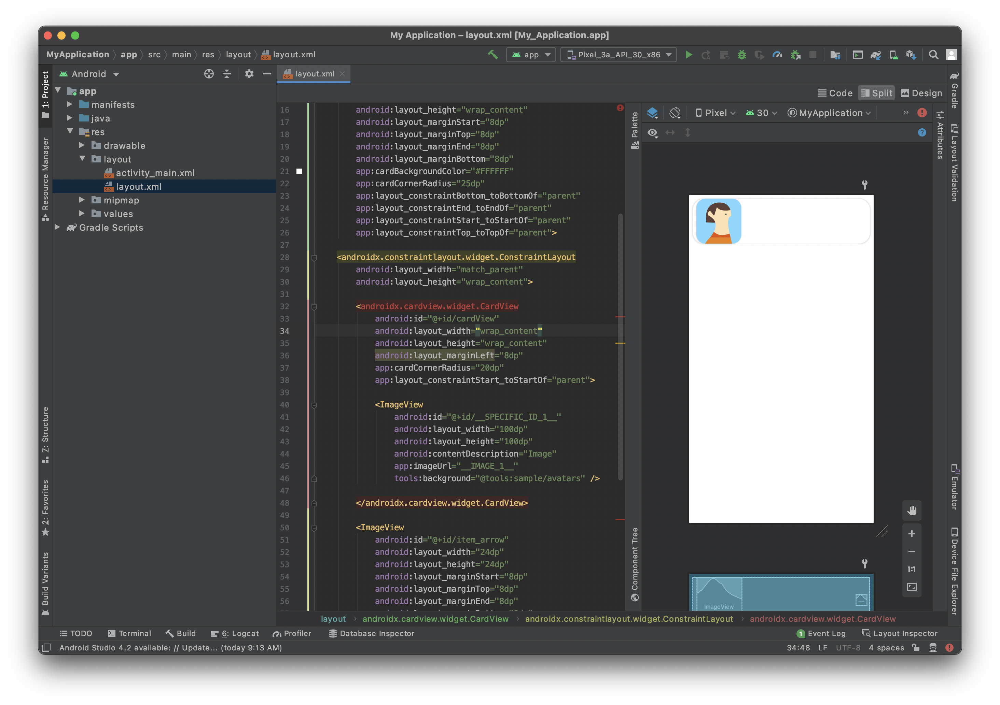
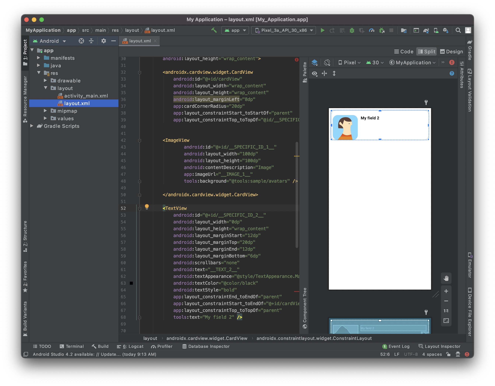

ここでは、Android Studio を使用してカスタムリストフォームのインターフェースを作成する方法を説明します。

完成イメージ



テンプレートに表示する次のフィールドのレイアウトをデザインします:

* アイコン
* タイトル
* サブタイトル

## レイアウトファイルを Android Studio で開く

テンプレートの編集・作成にあたって最適な方法は次のとおりです:

* Android Studio を開き、File > New > New Project... をクリックして、空のモバイルプロジェクトを新規に作成します。

* Empty Activity テンプレートを選択します。


* プロジェクトの設定をおこない、**Finish** をクリックします。


* app > res > layout にある layout.xml ファイルを、Android Studio の新規プロジェクトの layout フォルダーに、altキーを押しながら直接ドロップすることでコピーします。


* 下図のようになっていることを確認してください:


* 右上の **Split** オプションをクリックすると、テンプレートのプレビューと同時に xml コードも表示されます。

ほとんど白紙の状態です。早速、中身を追加しましょう！


## CardView コンテナーを追加する

セルのレンダリングをより良くするため、[CardView](https://developer.android.com/guide/topics/ui/layout/cardview) を追加します。

CardView コンテナーを追加すると、リストフォームのセルをカードとして見た目よく表示することができ、影・高さ・角の丸み・背景色などを追加することができます。

では、さっそくレイアウトファイルに追加してみましょう。 `</layout>` の直前に `</androidx.cardview.widget.CardView>` を追加してコンテナーを閉じることを忘れないでください。

```xml
   <androidx.cardview.widget.CardView
        android:id="@+id/mainCardview" 
        android:layout_width="match_parent" 
        android:layout_height="wrap_content"
        android:layout_marginStart="8dp"
        android:layout_marginTop="8dp"
        android:layout_marginEnd="8dp"
        android:layout_marginBottom="8dp"
        app:cardBackgroundColor="#FFFFFF"
        app:cardCornerRadius="25dp"
        app:layout_constraintBottom_toBottomOf="parent"
        app:layout_constraintEnd_toEndOf="parent"
        app:layout_constraintStart_toStartOf="parent"
        app:layout_constraintTop_toTopOf="parent">

        ...

        </androidx.cardview.widget.CardView>

```

**レイアウト要素に id を付与する** ことは、後で参照するため、また、要素間の位置決めのために非常に重要です。

コンテナーの **width** と **height** 、**margins** を定義し、コンテンツが親スペースをすべて (マージンを残して) 占めるようにしたいので、**constraints** も追加します。


現時点でのレイアウトのコードの全容は以下の通りです:

```xml
<?xml version="1.0" encoding="utf-8"?>

<layout xmlns:android="http://schemas.android.com/apk/res/android"
    xmlns:app="http://schemas.android.com/apk/res-auto"
    xmlns:tools="http://schemas.android.com/tools"
    tools:ignore="HardcodedText">

    <data>
        <!--ENTITY_VARIABLE-->
    </data>

    <androidx.cardview.widget.CardView
        android:id="@+id/mainCardview"
        android:layout_width="match_parent"
        android:layout_height="wrap_content"
        android:layout_marginStart="8dp"
        android:layout_marginTop="8dp"
        android:layout_marginEnd="8dp"
        android:layout_marginBottom="8dp"
        app:cardBackgroundColor="#FFFFFF"
        app:cardCornerRadius="25dp"
        app:layout_constraintBottom_toBottomOf="parent"
        app:layout_constraintEnd_toEndOf="parent"
        app:layout_constraintStart_toStartOf="parent"
        app:layout_constraintTop_toTopOf="parent">

        <androidx.constraintlayout.widget.ConstraintLayout
        android:layout_width="match_parent"
            android:layout_height="wrap_content">

        </androidx.constraintlayout.widget.ConstraintLayout>

    </androidx.cardview.widget.CardView>


</layout>

```

プレビューはこのような結果になっているはずです:


## Image View を追加する

ImageView に角の丸みをつけて見栄えのするデザインで表示するため、CardView コンテナを再度使用します。

```xml
            <androidx.cardview.widget.CardView
                android:id="@+id/cardView"
                android:layout_width="wrap_content"
                android:layout_height="wrap_content"
                android:layout_marginStart="8dp"
                app:cardCornerRadius="20dp"
                app:layout_constraintStart_toStartOf="parent"

            <ImageView
                android:id="@+id/__SPECIFIC_ID_1__"
                android:layout_width="100dp"
                android:layout_height="100dp"
                android:contentDescription="Image"
                app:imageUrl="__IMAGE_1__"
                tools:background="@tools:sample/avatars" /> 

            </androidx.cardview.widget.CardView>
```

上のとおり、ImageView は CardView に埋め込まれています。 これにより、角の丸みを追加することができます。

`app:imageUrl="__IMAGE_1__"` の行は、先に定義した svgファイルの 1番目の位置にあるピクチャー値をバインドするためのものです。


`tools:background="@tools:sample/avatars"` の行は、単に ImageView のプレースホルダーを表示します。





## タイトルを追加する

ImageView を格納している CardView の右側にタイトルを追加しましょう。

これには、TextView を追加します:

```xml
 <TextView
                android:id="@+id/__SPECIFIC_ID_2__"
                android:layout_width="0dp"
                android:layout_height="wrap_content"
                android:layout_marginStart="12dp"
                android:layout_marginTop="20dp"
                android:layout_marginEnd="12dp"
                android:layout_marginBottom="6dp"
                android:scrollbars="none"
                android:text="__TEXT_2__"
                android:textAppearance="@style/TextAppearance.MaterialComponents.Body1"
                android:textColor="@color/black"
                android:textStyle="bold"
                app:layout_constraintEnd_toEndOf="parent"
                app:layout_constraintStart_toEndOf="@+id/cardView"
                app:layout_constraintTop_toTopOf="parent"
                tools:text="My field 2" />

```

`app:text="__TEXT_2__"` の行は、先に定義した svgファイルの 2番目の位置にあるテキスト値をバインドするためのものです。

次に、ImageView と TextView の位置を上辺で揃えましょう。 これには、TextView の id を使用します。 具体的には、プロフィール画像を格納する CardView に、以下の行を追加します:

```xml
app:layout_constraintTop_toTopOf="@id/__SPECIFIC_ID_2__"
```




## サブタイトルを追加する


このセルにサブタイトルを追加します。 これには、タイトルの追加に使ったのと同じブロックを追加します:


```xml

<TextView
                android:id="@+id/__SPECIFIC_ID_3__"
                android:layout_width="0dp"
                android:layout_height="wrap_content"
                android:layout_marginStart="12dp"
                android:layout_marginTop="8dp"
                android:layout_marginEnd="12dp"
                android:layout_marginBottom="50dp"
                android:scrollbars="none"
                android:text="__TEXT_3__"
                android:textAppearance="@style/TextAppearance.MaterialComponents.Body1"
                   android:textColor="?colorPrimary"
                app:layout_constraintBottom_toBottomOf="parent"
                app:layout_constraintEnd_toEndOf="parent"
                app:layout_constraintStart_toEndOf="@+id/cardView"
                app:layout_constraintTop_toBottomOf="@+id/__SPECIFIC_ID_2__"
                tools:text="My field 3" />
```


`app:text="__TEXT_3__"` の行は、先に定義した svgファイルの 3番目の位置にあるテキスト値をバインドするためのものです。

サブタイトルはタイトルの下にくるように表示させましょう。 これには、タイトルの TextView の id を使用します。 具体的には、タイトルの TextView に、以下の行を追加します:

```xml
app:layout_constraintBottom_toTopOf="@+id/__SPECIFIC_ID_3__"
```


リストフォームのテンプレートができました:


現時点でのレイアウトのコードの全容は以下の通りです:

```xml
<?xml version="1.0" encoding="utf-8"?>

<layout xmlns:android="http://schemas.android.com/apk/res/android"
    xmlns:app="http://schemas.android.com/apk/res-auto"
    xmlns:tools="http://schemas.android.com/tools"
    tools:ignore="HardcodedText">

    <data>

        <!--ENTITY_VARIABLE-->
    </data>

    <androidx.cardview.widget.CardView
        android:id="@+id/mainCardview"
        android:layout_width="match_parent"
        android:layout_height="wrap_content"
        android:layout_marginStart="8dp"
        android:layout_marginTop="8dp"
        android:layout_marginEnd="8dp"
        android:layout_marginBottom="8dp"
        app:cardBackgroundColor="#FFFFFF"
        app:cardCornerRadius="25dp"
        app:layout_constraintBottom_toBottomOf="parent"
        app:layout_constraintEnd_toEndOf="parent"
        app:layout_constraintStart_toStartOf="parent"
        app:layout_constraintTop_toTopOf="parent">

    <androidx.constraintlayout.widget.ConstraintLayout
        android:layout_width="match_parent"
        android:layout_height="wrap_content">

        <androidx.cardview.widget.CardView
            android:id="@+id/cardView"
            android:layout_width="wrap_content"
            android:layout_height="wrap_content"
            android:layout_marginLeft="8dp"
            app:cardCornerRadius="20dp"
            app:layout_constraintStart_toStartOf="parent"
            app:layout_constraintTop_toTopOf="@id/__SPECIFIC_ID_2__">

        <ImageView
                android:id="@+id/__SPECIFIC_ID_1__"
                android:layout_width="100dp"
                android:layout_height="100dp"
                android:contentDescription="Image"
                app:imageUrl="__IMAGE_1__"
                tools:background="@tools:sample/avatars" />

        </androidx.cardview.widget.CardView>

        <TextView
            android:id="@+id/__SPECIFIC_ID_2__"
            android:layout_width="0dp"
            android:layout_height="wrap_content"
            android:layout_marginStart="12dp"
            android:layout_marginTop="20dp"
            android:layout_marginEnd="12dp"
            android:layout_marginBottom="6dp"
            android:scrollbars="none"
            android:text="__TEXT_2__"
            android:textAppearance="@style/TextAppearance.MaterialComponents.Body1"
            android:textColor="@color/black"
            android:textStyle="bold"
            app:layout_constraintEnd_toEndOf="parent"
            app:layout_constraintStart_toEndOf="@+id/cardView"
            app:layout_constraintTop_toTopOf="parent"
            app:layout_constraintBottom_toTopOf="@+id/__SPECIFIC_ID_3__"
            tools:text="My field 2" />

        <TextView
            android:id="@+id/__SPECIFIC_ID_3__"
            android:layout_width="0dp"
            android:layout_height="wrap_content"
            android:layout_marginStart="12dp"
            android:layout_marginTop="8dp"
            android:layout_marginEnd="12dp"
            android:layout_marginBottom="50dp"
            android:scrollbars="none"
            android:text="__TEXT_3__"
            android:textAppearance="@style/TextAppearance.MaterialComponents.Body1"
            android:textColor="?colorPrimary"
            app:layout_constraintBottom_toBottomOf="parent"
            app:layout_constraintEnd_toEndOf="parent"
            app:layout_constraintStart_toEndOf="@+id/cardView"
            app:layout_constraintTop_toBottomOf="@+id/__SPECIFIC_ID_2__"
            tools:text="My field 3" />

    </androidx.constraintlayout.widget.ConstraintLayout>

    </androidx.cardview.widget.CardView>

</layout>

```

## ラベルのカスタマイズ

ラベルのカスタマイズをしてみましょう:

* カラー => android:textColor

* スタイル => android:textStyle で、とり得る値は **normal**, **bold** または **italic**

* フォントの見た目 => android:textAppearance

レイアウトの文字サイズと見た目の整合性を保つようにしましょう。 [Material Design の type システム](https://material.io/design/typography/the-type-system.html#type-scale) を参考にするのがベストです。


たとえば、基本的な TextView は `@Body1@` の大きさであるべきです。

```xml
android:textAppearance="@style/TextAppearance.MaterialComponents.Body1"
```

## セルとフィールドを関連付ける

### Image View

リストフォームのテンプレートでは、`app:imageUrl="__IMAGE_1__"` を使用しました。

ここでは、ImageView が svg の最初のビューであり、そのビューID が `__SPECIFIC_ID_1__` であると仮定しています。 3番目のビューであれば、`__IMAGE_3__` 、対応するビューID は `__SPECIFIC_ID_3__` となります。

### ラベル

このリストフォームのテンプレートでは、`android:text="__TEXT_2__"` をタイトルに使用しました。

ここでは、タイトルが svg の二つ目のビューであり、そのビューID が `__SPECIFIC_ID_2__` であると仮定しています。


## これからどうする？

このチュートリアルでは、Android のリストフォームのカスタムテンプレートを作成する方法を紹介しました。 スタータープロジェクトを参考に、シンプルなカスタムテンプレートが簡単に自作できる、という手応えが得られたのではないでしょうか。 しかし、これだけではありません！ 次のチュートリアルでは、Android の詳細フォームのカスタムテンプレートを作成する方法を取り上げます。

完成したリストフォームのテンプレート入りプロジェクト:

<div className="center-button">
<a className="button button--primary"
href="https://github.com/4d-go-mobile/tutorial-CustomListForm/releases/latest/download/tutorial-CustomListForm.zip">ダウンロード</a>
</div>


