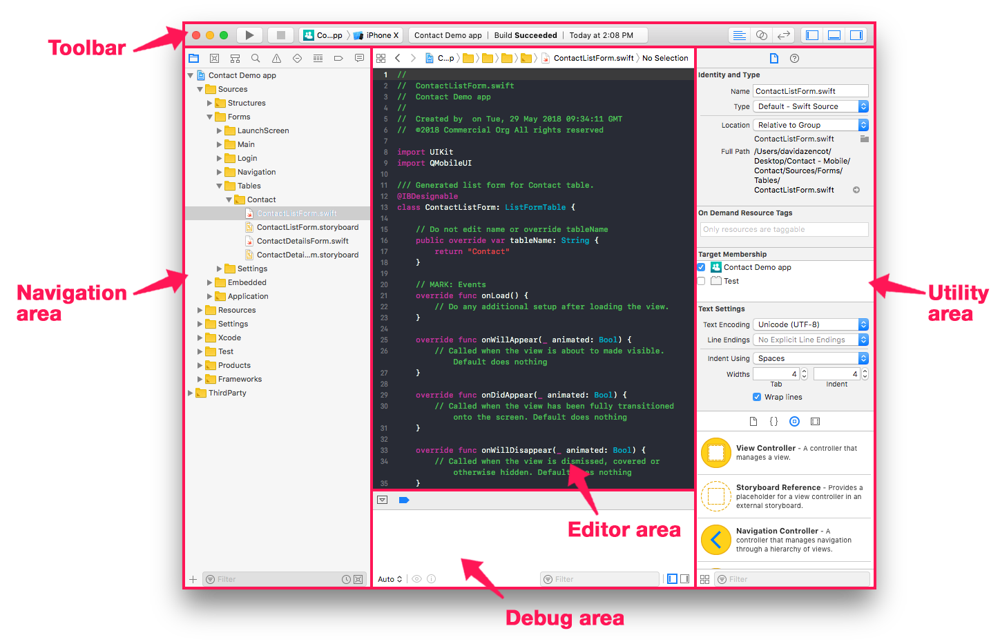
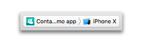
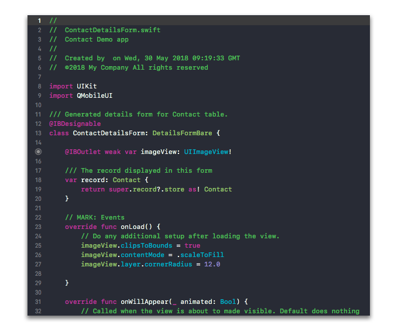
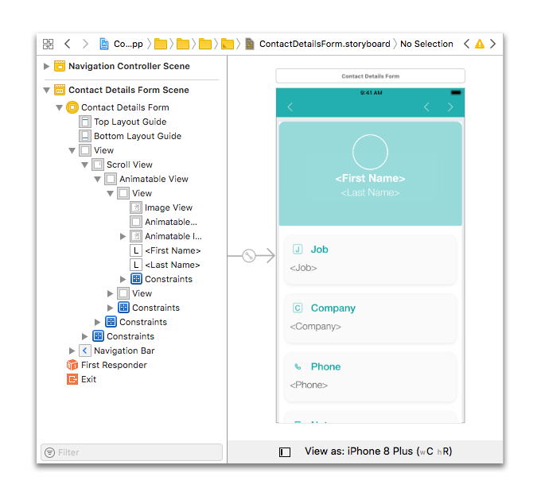
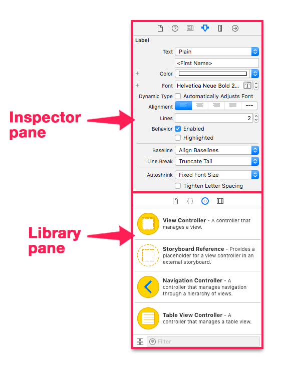
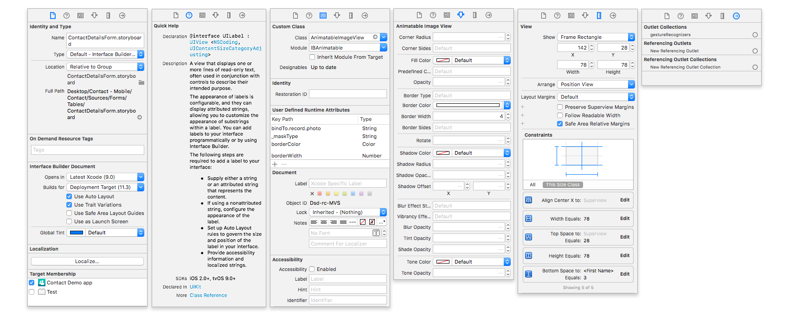
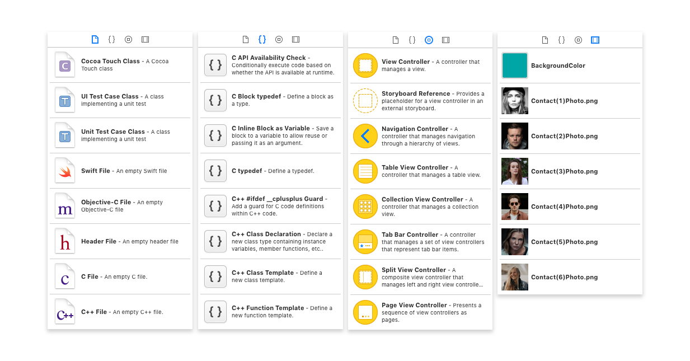
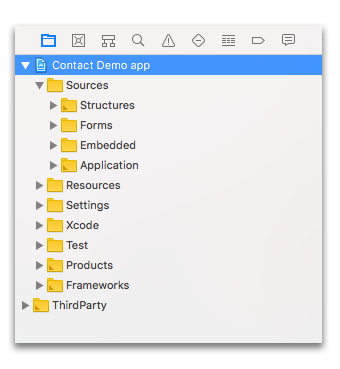
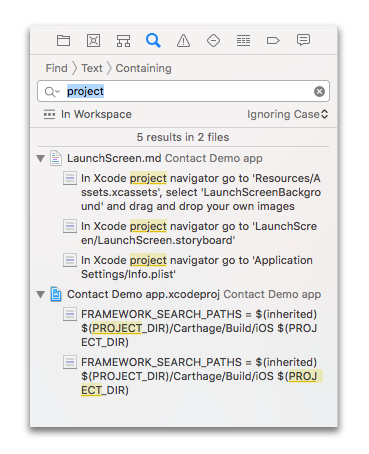
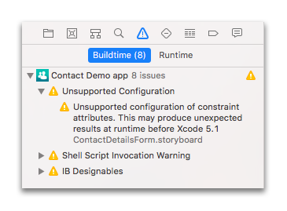

> **目標**
> 
> Xcode の基本的な操作を習得します。

Xcode の各部の名称と役割に慣れ親しみましょう:

## ツールバー

* ツールバーの左側には、**実行** および **停止** ボタンがあります。 **実行** ボタンは、アプリをビルドして、指定した iOS シミュレーターで起動するために使用します。

* **停止** ボタンの隣にあるドロップダウンメニューは、ビルドと実行のターゲットプラットフォームおよびシミュレーターの選択に使用します。

* ツールバーの右側には、表示形式を切り替えるためのボタンがあります。

## エディターエリア

選択した Swift ファイルをコーディングするエリアです。 Storyboard ファイルが選択された場合には、インターフェースビルダーに表示が切り替わります。

## インターフェースビルダー

Storyboard または XIB ファイルを開いて編集するためのグラフィカル・ユーザー・インタフェースです。 ファイル内の各シーンは左のリストで切り替えます。

## ユーティリティーエリア

Xcode のユーティリティエリアは、インスペクターおよびライブラリという 2つのペイン (枠) で構成されています。

### インスペクターペイン

プロパティセクションには、6つのインスペクタータブがあります:

各タブの役割は、左から右に向かって下記のとおりです:

* **File inspector**: ファイル名・タイプ・パスなど、ファイルのメタデータを管理するために使用します。

* **Quick Help**: エディターで選択されているものに関する情報が表示されます。

* **Identity inspector**: オブジェクトのクラス・ランタイム属性・ラベルなど、オブジェクトのメタデータが表示されます。

* **Attributes inspector**: 選択されているインターフェースオブジェクト固有の属性を設定するのに使用します。 たとえばテキストフィールドには、文字の整列・フォントカラー・ボーダータイプ・入力の可否といった属性があります。

* **Size inspector**: インターフェースオブジェクトのサイズや位置を設定するために使用します。

* **Connections inspector**: インターフェースオブジェクトのアウトレットやアクションを表示し、コネクションを作成または削除するために使用します。

### ライブラリペイン

プロパティセクションには、4つのライブラリタブがあります:

各タブの役割は、左から右に向かって下記のとおりです:

* **File Templates**: ファイルメニュー ＞ New で作成できる代表的なファイルタイプのテンプレートです。

* **Code snippets**: アプリ内で使用できるソースコードの例題です。 これらはソースコードに直接ドラッグ＆ドロップできます。

* **Objects**: このライブラリには、ユーザーインターフェースの部品となるようなインターフェースオブジェクトが収録されています。 これらはインターフェースビルダーに表示されているストーリーボードに直接ドラッグ＆ドロップできます。

* **Media files**: このライブラリには、画像・アイコン・音声ファイルが収録されています。 これらはインターフェースビルダーに表示されているストーリーボードに直接ドラッグ＆ドロップできます。

## デバッグエリア

アプリ実行中のさまざまな変数の出力値や状態はこのエリアに表示されます。

## ナビゲーションエリア

いくつかのタブが存在しますが、特に重要なのは以下のタブです:

* **Navigation tab**: アプリケーションが正しく動作するために必要なファイルがリストアップされており、アクセスできるようになっています。

* **Search navigator tab**: プロジェクト内のファイルを検索するために使用します。

* **Issue navigator tab**: iOSプロジェクト内で発生したエラーはここに出力されます。

    - 赤のメッセージは無視できない問題であり、アプリをビルドするためには解消する必要があることを示しています。
    - 黄のメッセージは警告であり、不具合を引き起こす可能性があるものの、アプリのビルドを阻止する問題ではないことを示しています。

問題や警告をクリックすると、プロジェクト内の発生箇所にジャンプします。

次は Project navigation tab に切り替えて、4D for iOS アプリを構成するファイル群に注目しましょう。
