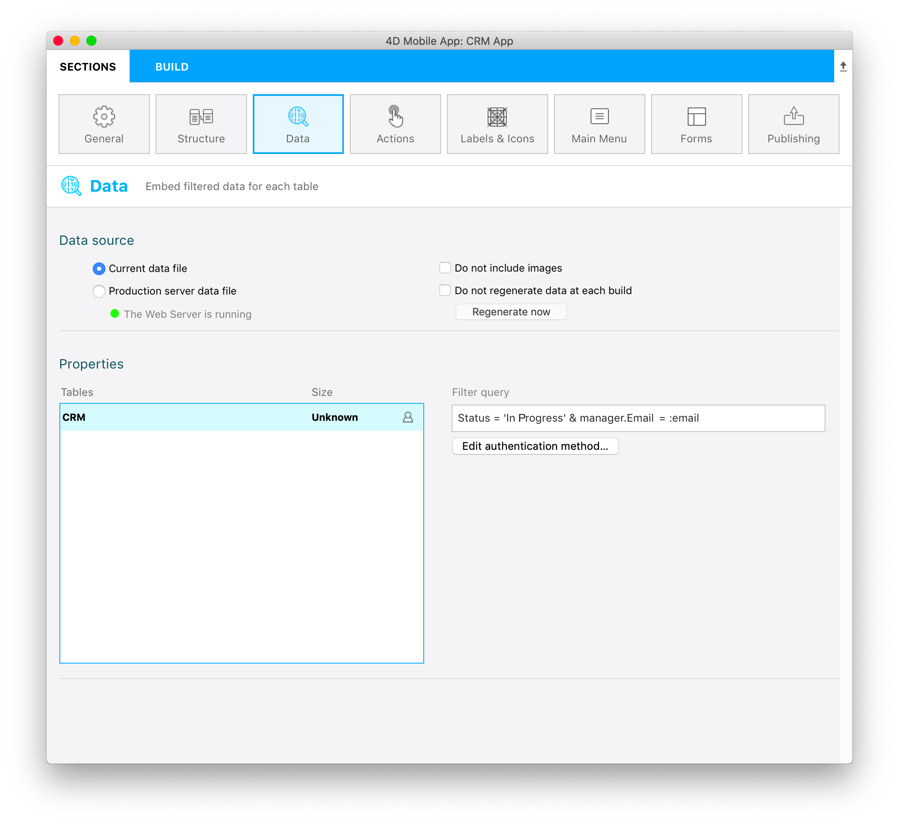
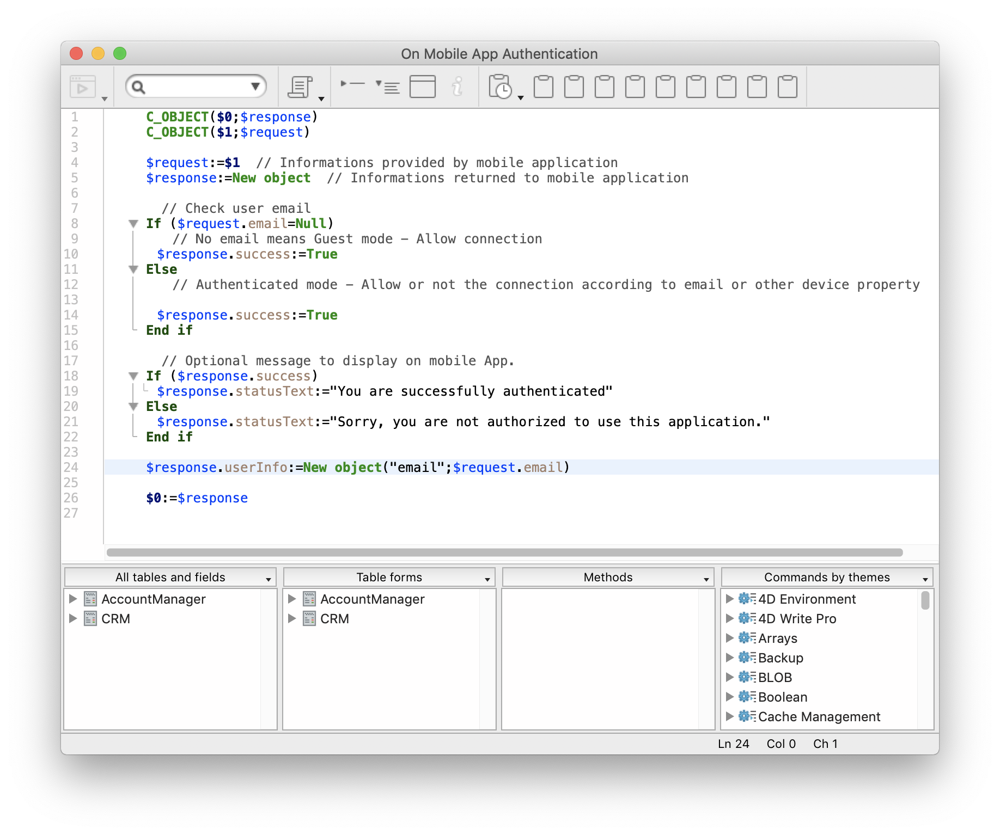
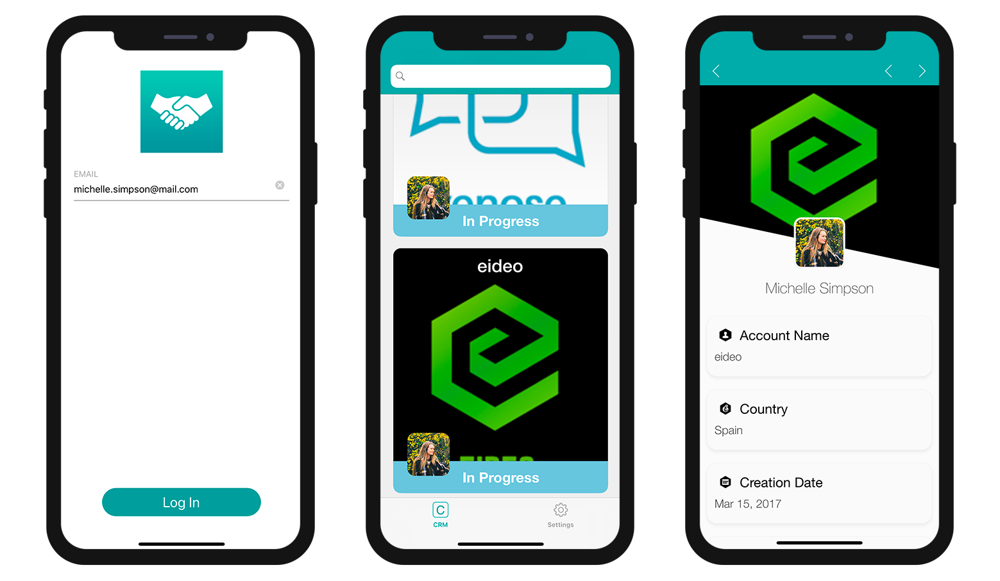

ユーザーのログインメールアドレス (ユーザー情報) に基づき、アプリに表示されるデータがフィルターされるようにしましょう。

* **データ** セクションに移動します。
* **フィルタークエリ** 欄をクリックすると、**フィールド・比較演算子・演算子ボタン** が表示されます。
* **演算子** ボタンをクリックし、**AND** を選択します。
* データベースメソッドの中で参照したいユーザー情報を入力します。 ここでは、**:email** です。
* **検証** ボタンをクリックして、クエリを検証します。 これを忘れてしまうと，アプリがビルドできません。



```4d
Status = 'In Progress' & manager.Email = :email 
```

このフィルタークエリを通過できるのは、ステータスが **&apos;In Progress&apos;** であり、かつ、**営業担当者のメールアドレス** (*Ｎ対１リレーション* により、AccountManagerテーブルから取得) が合致するデータだけです。

> **注記**
> 
> * ユーザー情報に基づくクエリが設定されているテーブルの横には **ユーザーアイコン** が表示されます。
> * ユーザー情報に基づくフィルタークエリを入力して確定したのであれば、**On Mobile app Authentication** データベースメソッドを編集しなければなりません。 **認証メソッドを編集… ** ボタンをクリックすると、データベースメソッドの編集ウィンドウが開きます。

データベースメソッドに以下のコードを追加します。

```4d
$response.userInfo:=New object("email";$request.email)
```

これで、表示できるデータを判定するための条件として、営業担当者のログインメールアドレスが参照できるようになります。



アプリをビルドし、メールアドレスに "michelle.simpson@mail.com"  と入力してログインしてみてください。 Michelle Simpsonさんの *"In progress (進行中)"* の商談だけが表示されます。




