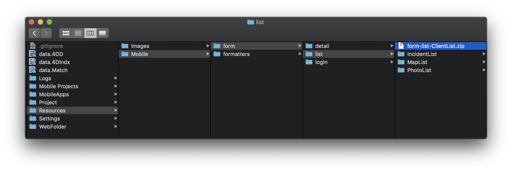
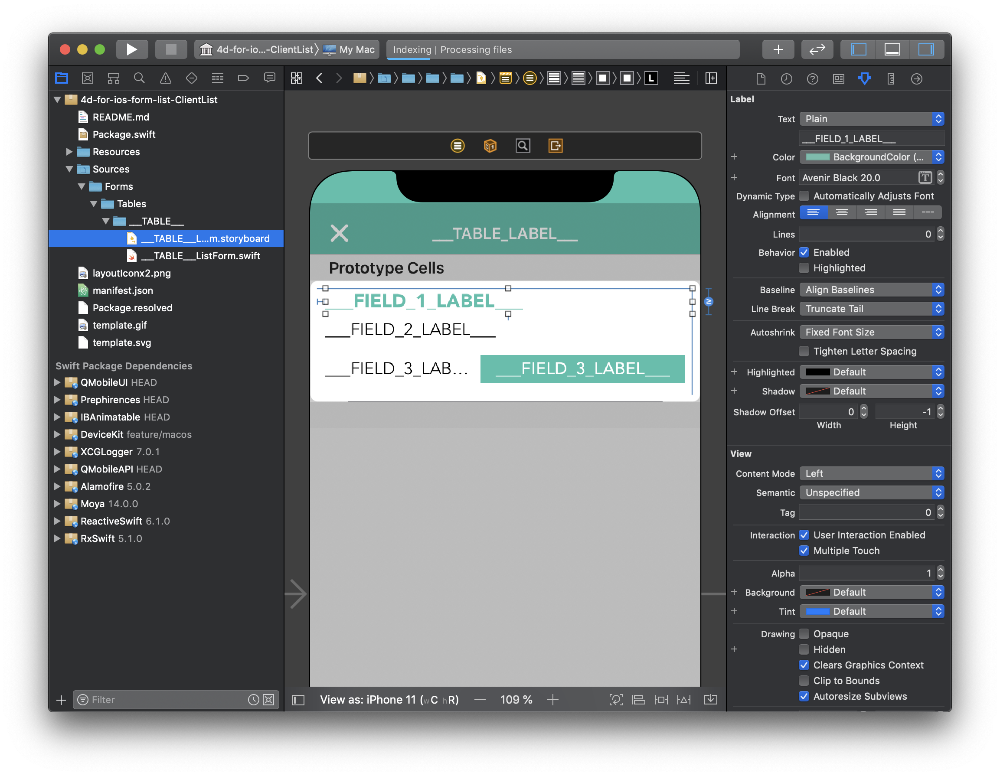

> **目標**
> 
> ダウンロードしたテンプレートを開いて、改善します。

## テンプレートを開く

ギャラリーからダウンロードしたテンプレートを修正するには:

* まず、*YourDatabase.4dbase/Resources/Mobile/form/list* フォルダーに移動します。

* ここで、先ほどダウンロードしたテンプレートが利用可能であることが確認できます。
* zipファイルを解凍して開きます。
* 次に、package.swift ファイルをダブルクリックします。

* すると、すべてのソースとともにテンプレートが Xcode で開かれ、テンプレートを修正することができます。

## テンプレートの編集

パッケージが読み込まれたら、左のツリー表示を展開して、.storyboard ファイルを選択します。さっそく、ストーリーボードを編集してみましょう。

操作は難しくありません！

たとえば、Attributes inspector を使って、FIELD_1_LABEL のフォントとカラーを変更しましょう。

テンプレートの改良が完了したら、プロジェクトエディターのフォームテンプレートピッカーからテンプレートを選択して使用することができます。

## テンプレートをシェアしましょう

テンプレートに大幅な改良を加えて完成させた場合、おそらくそれをシェアしたくなることでしょう。

テンプレートギャラリーの最後に、シェアするためのボタンがあります。

シェアするための条件と手順は Github の投稿ページで説明されています。

## これからどうする？

[投稿ガイド](https://github.com/4d-go-mobile/gallery/blob/master/.github/CONTRIBUTING.md#how-do-you-add-a-package) に従って Github でテンプレートをシェアすれば、プロジェクトエディターに表示されるようにすることができます。

