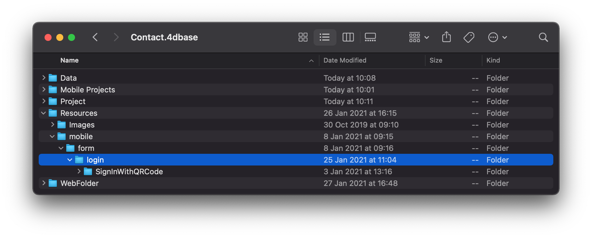
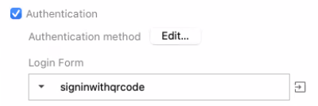
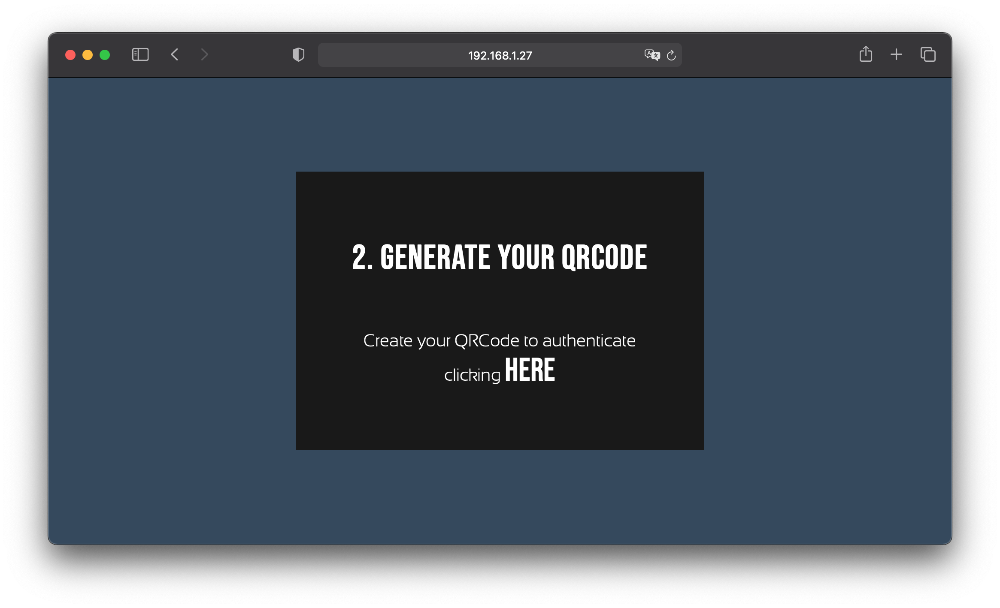
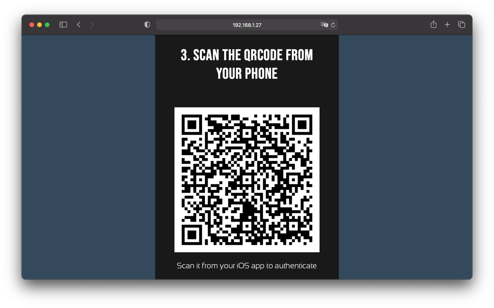

このチュートリアルでは、次のことを紹介します:

- [カスタムログインフォーム](../../project-definition/publishing#ログインフォーム) の作成と使用
- QRコードのスキャンによる認証済みユーザーのログイン

:::info

このチュートリアルを完了するには、モバイルデバイスの実機が必要です (シミュレータがカメラ機能を搭載していないため)。

:::

*シナリオ: 認証済みユーザーをもつ Webサイトがすでにあり、モバイルデバイスで QRコードをスキャンするだけでそれらのユーザーがアプリにログインできるようにします。*

[**4D go mobile gallery**](https://4d-go-mobile.github.io/gallery//#/type/form-login) からこのカスタムログインフォームをダウンロードできます。


## ⒈ はじめに

このチュートリアルでは、次のことをおこないます:

* カスタムログインフォームを追加する
* QRコードをスキャンするだけで、アプリユーザーがログインできる機能を実装する

このプロジェクトには、データベースファイルのほかに、すぐに使える Webページが WebFolderフォルダーに格納されています:

<div className="center-button">
<a className="button button--primary"
href="https://github.com/4d-go-mobile/tutorial-CustomLoginForm/archive/main.zip">スタータープロジェクト</a>
</div>

:::info

このプロジェクトには、各認証済みユーザーについてログインID とパスワードを格納した Users テーブルがあらかじめ含まれています。

:::

## ⒉ ⒉ カスタムログインフォームを追加する

カスタムログインフォームを追加するには、まず *YourDatabase.4dbase/Resources/Mobile/form/login* フォルダーを作成します。

[QRコードログインフォーム](https://github.com/mesopelagique/form-login-SignInWithQRCode/archive/master.zip) をダウンロードし、先ほど作成した login フォルダーにドロップします。



プロジェクトエディターの [公開ページ](../../project-definition/publishing#認証オプション) で、**認証** をクリックし、**SignInWithQRCode** フォームを選択します。



## ⒊ ⒊ On Mobile App Authentication データベースメソッド

公開ページで、**作成...** ボタンをクリックすると、4Dメソッドエディターで `On Mobile App Authentication` データベースメソッドが開きます。 このような表示になります:

```4d
var $0 : Object
var $1 : Object

var $request; $response : Object

$request:=$1  // モバイルアプリから提供される情報
$response:=New object  // モバイルアプリに返される情報

$entity:=ds.User.query("login = :1"; $request.email)
If ($entity.length>0)
    $password:=$entity.first().password  // テーブルからパスワードを取得します

    If (Verify password hash($password; $request.parameters.token))
        // リクエストから受け取ったパスワードと比較します

        $response.success:=True
    Else 
        $response.success:=False
    End if 
Else 
    $response.success:=False
End if 

// モバイルアプリに表示する任意のメッセージ
If ($response.success)
    $response.statusText:="認証に成功しました"
Else 
    $response.statusText:="このアプリを使用する権限がありません"
End if 

$0:=$response
If ($response.success)
    $response.statusText:="認証に成功しました"
Else 
    $response.statusText:="このアプリを使用する権限がありません"
End if 

$0:=$response
```


## ⒋ ⒋ プロジェクトメソッド

### Authentication メソッド

ここでは、フォームから変数を取得し、それらの値が Userテーブルに存在するかどうかを確認します:

```4d
// フォームの変数をすべて取得します
C_TEXT($1)
ARRAY TEXT($arrNames; 0)
ARRAY TEXT($arrVals; 0)

// 認証 Webページの変数のうち、ログインID およびパスワードを取得します
WEB GET VARIABLES($arrNames; $arrVals)
$VLOGIN:=Find in array($arrNames; "VLOGIN")
$VPASS:=Find in array($arrNames; "VPASS")

// コードからアクセスできるよう、共有変数を作成します
Use (Storage)
    Storage.session:=New shared object("login"; ""; "password"; "")
End use 

// ユーザーを認証してよいか確認するため、ログイン情報が存在するか検索します
$entity:=ds.User.query("login = :1 and password = :2"; $arrVals{$VLOGIN}; $arrVals{$VPASS})

// 見つかった場合は、ログイン情報を共有変数に代入します
If ($entity.length>0)
    Use (Storage.session)
        Storage.session.login:=$arrVals{$VLOGIN}
        Storage.session.password:=$arrVals{$VPASS}
        Storage.session.success:=True
    End use 

    // Webページにリダイレクトします
    WEB SEND HTTP REDIRECT("/createQRCode.html")

Else 
    // ホームページに戻ります
    Use (Storage.session)
        Storage.session.success:=False
    End use 
    WEB SEND HTTP REDIRECT("/")
End if 
```

### GenerateQRCODE メソッド

ここでは、*vqrCodeData* プロセス変数を生成します。 この変数は、ユーザーのメールアドレスと暗号化されたパスワードを含む jsonです。 これらのデータが QRコードに埋め込まれます。

```4d
// Storage 変数を使います
$currentUserEmail:=Storage.session.login
$token:=Storage.session.password
$options:=New object("algorithm"; "bcrypt"; "cost"; 4)
$hash:=Generate password hash($token; $options)

// vqrCodeData 変数を生成します (メールアドレスと暗号化されたパスワードの json 値)
vqrCodeData:=JSON Stringify(New object("email"; $currentUserEmail; "token"; $hash))

// QRコード Webページにリダイレクトします
WEB SEND HTTP REDIRECT("/generatedQRCode.shtml")
```


## ⒌ ⒌ Webサイト

このチュートリアルでは、WebFolder フォルダーに 3つの htmlページが用意されています:

* 認証ページ (index.html)
* QRコード生成ページ (createQRCode.html)
* ユーザーがモバイルデバイスでスキャンする最終ページ (generatedQRCode.shtml)

これら 3つのページを見ていきましょう:

### index.html

ここでは 4DACTION を使って、ステップ4 で確認した *Authentication プロジェクトメソッド* で使用するログインとパスワードを POST します:

```html
  <form class="box" ACTION="/4DACTION/Authentication" METHOD=post>
  <h1>1. Login</h1>
  <input type="text" id="login" placeholder="Username" name=VLOGIN >
  <input type="password" id="login" placeholder="Password" name=VPASS>
  <input type="submit" name="" value="Login">
  </form>
```

### createQRCode.html

ここでは 4DACTION を使用して、*GenerateQRCODE プロジェクトメソッド* を呼び出しています:

```html
<h1>2. GENERATE YOUR QRCODE</h1>
    <div>
        <p>Create your QRCode to authenticate clicking <a href="/4DACTION/GenerateQRCODE">Here</a></p>
    </div>
```

### generatedQRCode.shtml

この最後のページでは、[4Dタグ](https://developer.4d.com/docs/ja/Tags/tags/) を使って、*data* の値を取得しています:

```html
<h1>3. SCAN THE QRCODE FROM YOUR PHONE</h1>
  <div id="canvas"></div>

  <script type="text/javascript">

    const qrCode = new QRCodeStyling({
      width: 300,
      height: 300,
      data: '<!--#4DEVAL vqrCodeData-->',
      dotsOptions: {
        color: "#000",
        type: "square"
      },
      backgroundOptions: {
        color: "#FFFFFF",
      }
    });
    qrCode.append(document.getElementById("canvas"));
  </script>

```

## ⒍ テストしましょう

### Webサイトのトップページにログインする

実行メニューから "Web サーバーテスト" を選択して Webサイトのホームページを開き、Username 欄に **david@4D.com**、Password フィールドに **TEST** と入力し、Login をクリックします (これは User テーブルに存在するレコードです)。


### QRコードを生成する

**HERE** ボタンをクリックし、QRコードを生成します。



最後の QRコードのページにリダイレクトされます。



### 実機でアプリをビルドする

プロジェクトエディターから、モバイルアプリを実機にインストールします。

すると、カスタムログインフォームが表示されます。 ここで、さきほど生成した QRコードをスキャンすることで、モバイルアプリにログインできます。

このような結果になります:


