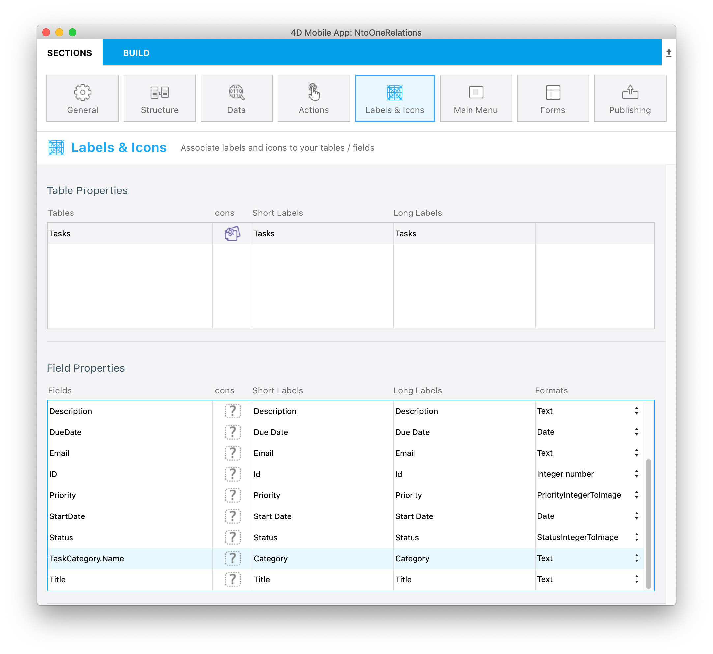

このチュートリアルでは、4D for iOSアプリで N対1リレーションを使用する方法を見ていきます。

:::note

このチュートリアルでは、テーブル同士をリンクするリレーションの名前を使用します。 ストラクチャー定義を容易にするため、リレーションには意味のある名前を設定することが推奨されます。

:::

スタータープロジェクトをダウンロードしてください:

<a className="button button--primary" href="https://github.com/4d-go-mobile/tutorial-ManyToOneRelations/releases/latest/download/tutorial-ManyToOneRelations.zip">スタータープロジェクト</a>

生成されたアプリの詳細フォームに、各タスクのカテゴリを表示したいと思います。 ファイルメニューから **開く ＞ モバイルプロジェクト...** を選択し、**NtoOneRelations** プロジェクトを開きます。

ストラクチャーセクションに移動し、**Tasks** テーブルを選択します。

### ストラクチャーセクション

* フィールドリストの **TaskCategory** リレーションに下線が表示されていることに注目してください。

* リレーション名をクリックすると、リンク先のフィールドが表示されます。

* **Name** フィールドを選択します。

* 以降の画面では、このリレートフィールドを他のフィールドと同じように扱うことができます。

* このリレートフィールドは、データセクションのフィルタークエリでも使用することができます。 具体的には、`TaskCategory.Name != 'Personal'` をフィルタークエリフィールドに入力して、個人的なタスクを除外しましょう。

 

* ラベル＆アイコンセクションでは、**アイコン**・**短いラベル**・**長いラベル**・**フォーマット** を設定することができます。

* フォームセクションでは、このリレートフィールドを詳細フォームにドラッグ＆ドロップしましょう。

* ビルドして実行

アプリの詳細画面にリレート先の 1フィールドが表示されました！

