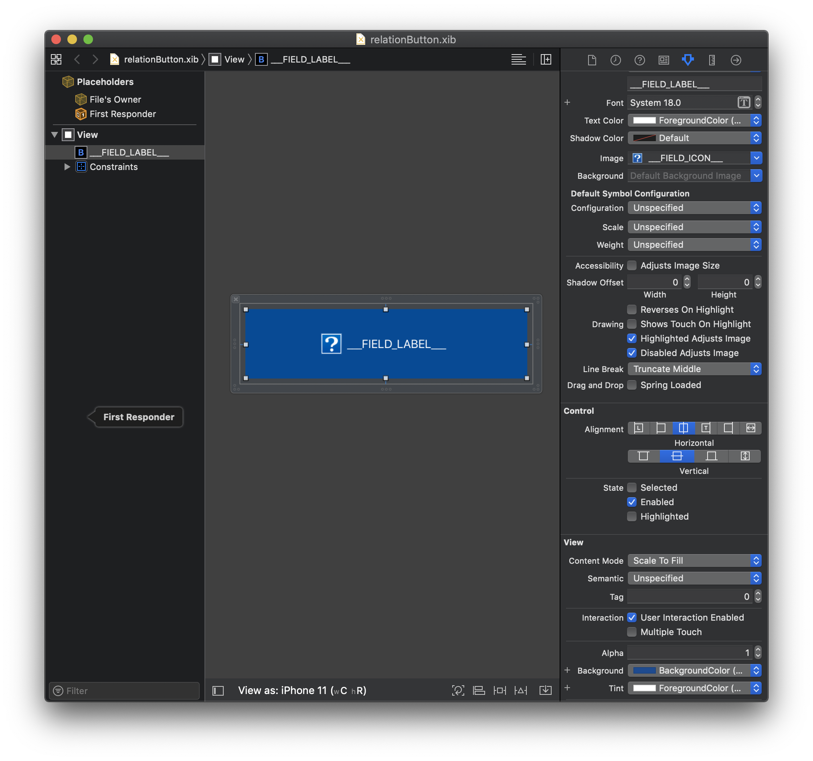
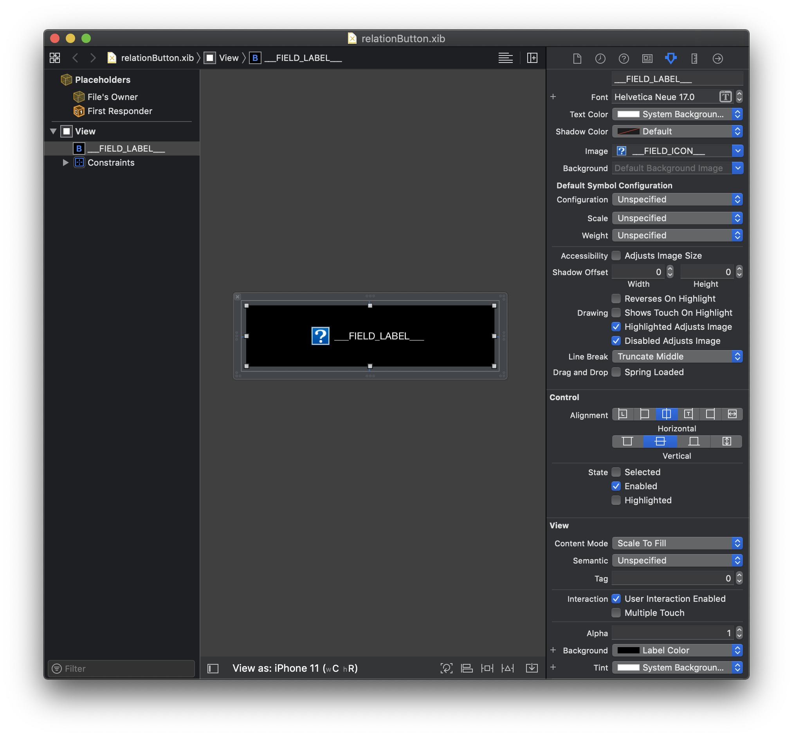
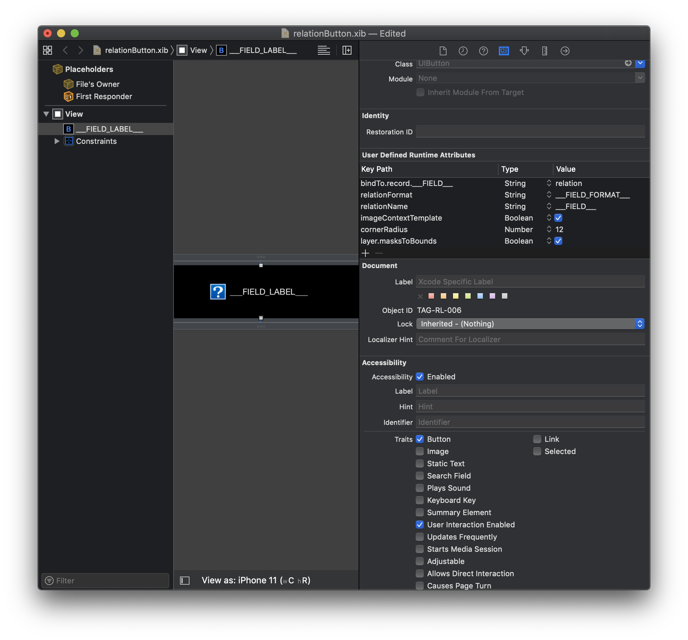
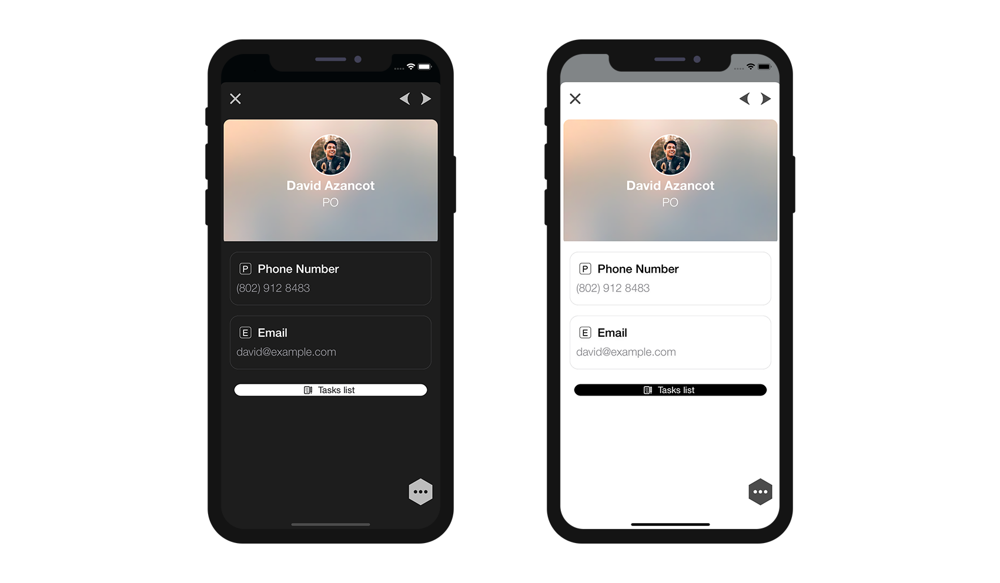
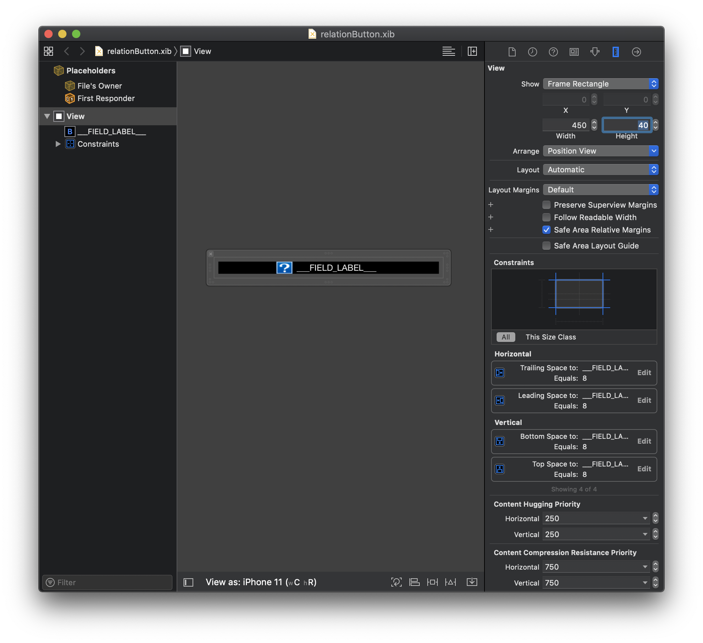
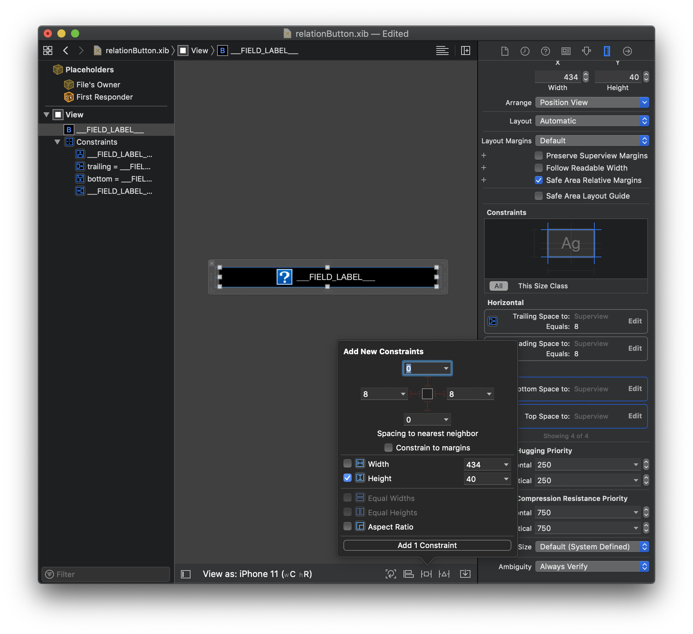
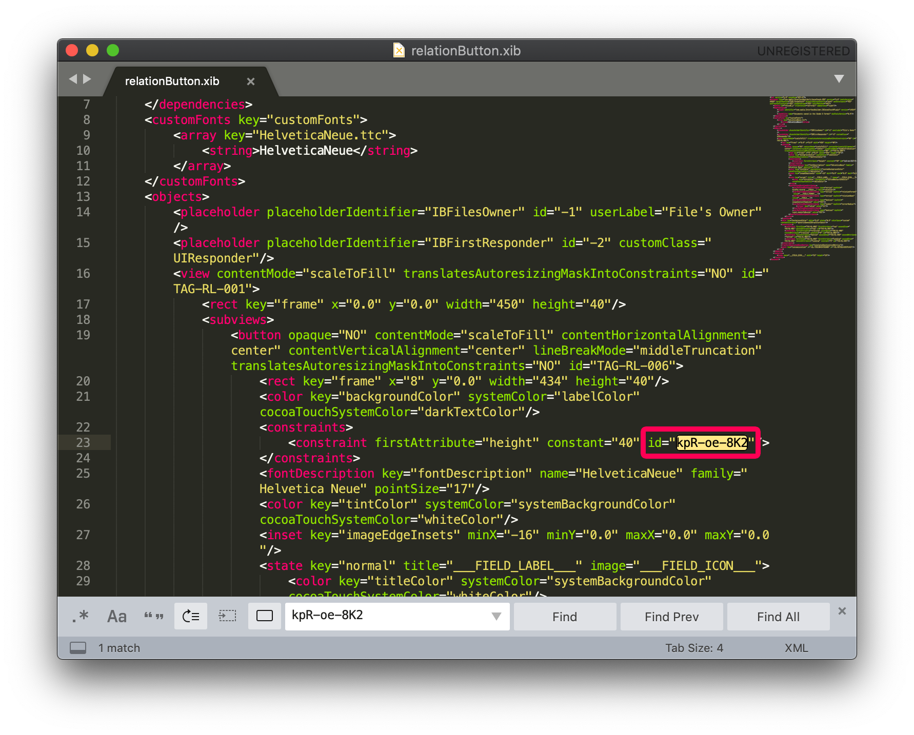

これまでに見てきたように、4D モバイルエディターでは、いろいろなものがカスタマイズできるようになっています。

テンプレートやフォーマッターだけでなく、リレーションボタンもカスタマイズできます。

しかも、その手順はとても簡単です！ カスタムテンプレートにカスタムボタンをドラッグ＆ドロップするだけです。

以下が用意されているスタータープロジェクトをダウンロードしてください:

* データベースとモバイルプロジェクト
* 標準のリレーションボタン

<a className="button button--primary"
href="https://github.com/4d-go-mobile/tutorial-OneToManyCustomButton/archive/c507e764e97e006c6c785dfc468f71f5bd708845.zip">スタータープロジェクト</a>

## ボタンを追加する

まず、ボタン relationButton.xib を 4D for iOS で使用できるように、カスタムテンプレートに追加しましょう。

ボタンを追加するには、`TimeKeeper.4dbase/Resources/Mobile/form/detail/BlackVisual Contact` フォルダーにこのファイルをドロップすれば OK です。

簡単ですね！

## ボタンの設定

Xcode で .xib ファイルを開きます。

このように表示されるはずです:

Attribute inspector でさまざまな項目の値を変更することができます:

* カラーとフォント
* ボタンのスタイル
* ボタンのサイズ

さっそく、ボタンのカラーとラベルフォントを変えてみましょう！

### カラーとフォントのカスタマイズ

ボタンを選択し、Attribute inspector でカラーとフォントを変更します。

Background には、ライトおよびダークモードの両方で最良のコントラストになるように Label Color を選択します。

Text Color は System Background Color (システム背景色)、フォント名は Helvetica Neue Medium 17 に設定します。

Tint にも System Background Color を適用しましょう。

シミュレーターで、ダークモードとライトモードそれぞれの結果を確かめます:

### ボタンの角の丸み

今度は、リレーションボタンの角に丸みをつけてみましょう！

Identity inspector を開きます。

ボタンを選択し、User Defined Runtime Attributes に次の 2行を追加します:

* **Key Path**: `cornerRadius`

* **Type**: `Number`

* **Value**: `12`

および

* **Key Path**: `layer.masksToBounds`

* **Type**: `Boolean`

* **Value**: Check the box

カスタマイズしたプロジェクトを実際にビルドしてみましょう！

下図のように表示が変化していれば成功です:

### サイズと制約

カスタム詳細フォームのテンプレートと同じように、ボタンに **制約を追加** するのであれば、xib の XMLファイルに **タグを追加** する必要もあることに留意してください。 タグを追加することにより、同じ詳細フォーム内でリレーションボタンを複数表示する場合にも、ボタンが正しく複製されるようになります。

そのことを踏まえ、ボタンに制約を設定してみましょう！

#### 制約を追加する

このチュートリアルでは、画面上でもっと大きく表示されるよう、ボタンの高さを設定します。

⒈ ビューを選択し、Size inspector で高さを 123 から 40 に変更します。

⒉ **Top Space Constraint** をダブルクリックし、値を 8 から 0 に変更します。

⒊ 同じことを **Bottom Space Constraint** でおこない、8 から 0 に変更します。

下図のようになっていれば成功です:

⒋ Add Constraints ボタンをクリックし、高さの制約 40 にチェックを入れて追加します。

下図のようになっていれば成功です:

プロジェクトエディターに対し、このビュー内の全要素が一緒に複製されるべきであることを示すため、各要素および制約にタグを追加します。

### タグを追加する

ストーリーボードの各要素は、オブジェクトID を持ちます。 試しに Field View 2 を選択し、**Identity inspector** を確認してください。オブジェクトID が表示されているはずです:

1つずつ変更するのは少々面倒ですし、途中でミスをしてしまうかもしれません。 Identity inspector で操作するのは大変なので、ここは使い慣れたコードエディターでストーリーボードファイルを開いて作業を進めることにしましょう！

#### 高さの制約にタグを追加する

⒈ ストーリーボード内で制約のオブジェクトID を選択してコピーします。

⒉ XMLファイル内でこの ID を検索し、**TAG-RL-007** (未使用のタグ) で置換します。

⒊ XMLファイルを保存します。

⒋ ストーリーボードのウィンドウにフォーカスを移動し、制約が正しく更新されていることを確認します。

おつかれさまでした！ 表示するリレーションが複数あったとしても、このボタンを複製して使用できるようになりました。

## これからどうする？

このチュートリアルでは、カスタムリレーションボタンを作成する方法を紹介しました。 カスタムリレーションボタンの完成プロジェクトは下記のリンクからダウンロードできます。

完成したプロジェクトをダウンロード

<a className="button button--primary"
href="https://github.com/4d-go-mobile/tutorial-OneToManyCustomButton/releases/latest/download/tutorial-OneToManyCustomButton.zip">ダウンロード</a>

