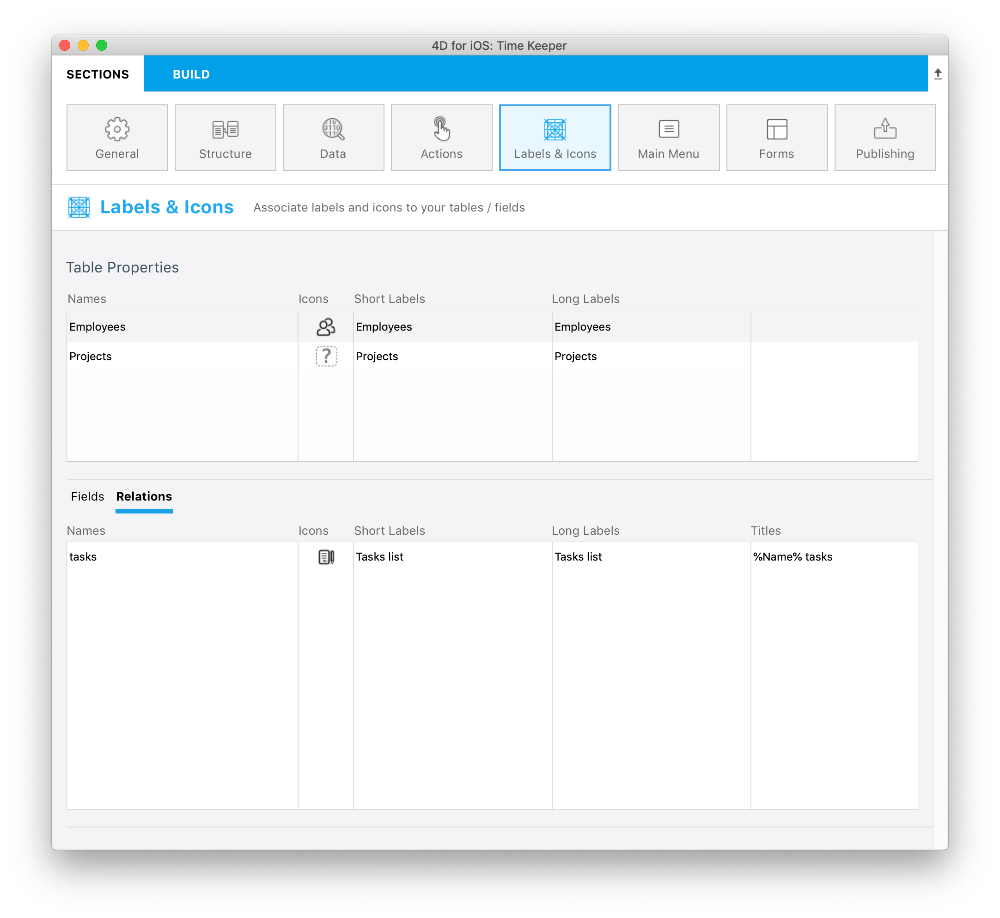
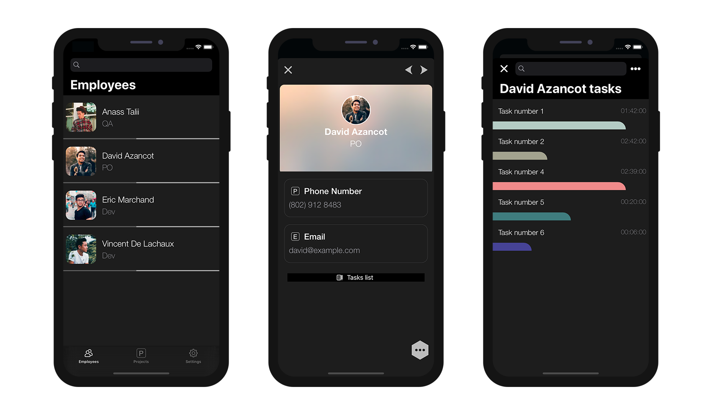

### 移動先の画面にタイトルを設定する

アプリ内でどの画面から移動してきたのかがわかるように、4D for iOS では画面のタイトルをカスタマイズすることができます。

このチュートリアルでは、以下のプロジェクトを使用します:

<a className="button button--primary"
href="https://github.com/4d-go-mobile/tutorial-OneToManyTitleDefinition/archive/4b831959e7efe4777071af0b2904d458918cfbc2.zip">スタータープロジェクト</a>

ファイルメニューの **開く ＞ モバイルプロジェクト...** を選択し、*Time Keeper* プロジェクトを開いて **ラベル＆アイコン** セクションに移動します。

画面の下部をフィールドからリレーションタブに切り替えて、*tasks*リレーションの **タイトル** フィールドに次の文字列を入力します: `%Name% tasks`

このように定義すれば、直前の詳細画面に表示されていた従業員の **Name** フィールドに応じて、表示タイトルが変化するようになります。

どの画面から移動してきたのかが一目でわかりますね！

次のチュートリアルでは、リレーションボタンを自分で作成してカスタマイズする方法を学びます。