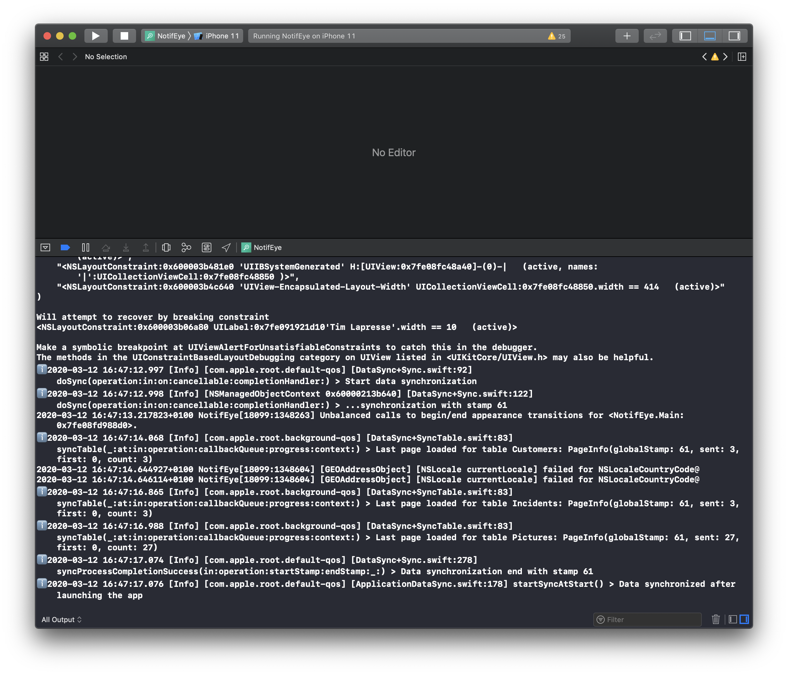
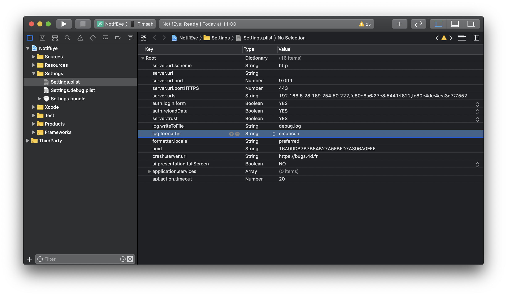

If you have issues during the build process, you can open your generated project with Xcode selecting the **Open the product with Xcode** option from the **Project** Menu.

From here you can **launch your application** in the Simulator clicking on the **Build button** and get all the logs at the bottom of the Xcode work space.

## Logger

A logger is an object that will allow you to log and trace.

For that we use the [XCGLogger](https://github.com/DaveWoodCom/XCGLogger) framework.

You will find the logger settings definition in your Xcode project/Settings/Settings.plist.

## Levels

You can filter and display different log level into your console adding log.level in you Settings.plist file.

To do so, add a row Right clicking inside the Settings.plist file and enter:
* log.level as Key
* Number as Type
* 3 as Value (for example)

The **available values** are the following :

* 0 for verbose
* 1 for debug
* 2 for info (default value)
* 3 warning
* 4 error
* 5 severe

So for this example, if you set log.level Value to 3, you will get **warning, error and sever** in your Xcode console.

## Format

You can display different visual indicators in the Xcode console to **highlight different log types**.

To do so, you just have to open your Xcode project/Settings/Settings.plist

### Emoticones

 * prefixes[.verbose] = "🗯"
 * prefixes[.debug] = "🔹"
 * prefixes[.info] = "ℹ️"
 * prefixes[.warning] = "⚠️"
 * prefixes[.error] = "‼️"
 * prefixes[.severe] = "💣"

### Circles

* prefixes[.verbose] = "🔘"
* prefixes[.debug] = "🔵"
* prefixes[.info] = "⚪"
* prefixes[.warning] = "☢️"
* prefixes[.error] = "🔴"
* prefixes[.severe] = "⚫"

