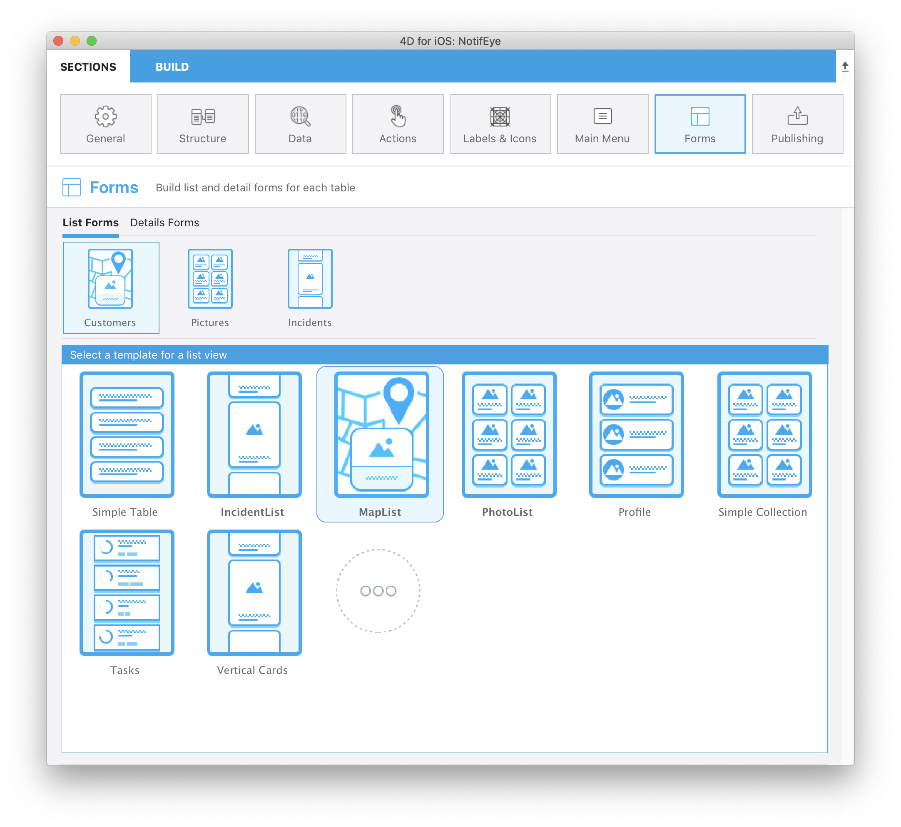

フォームページでは、各公開テーブルに対してリストフォームと詳細フォームの両方を選択できます。 公開テーブル 1つにつき、1つのリストフォームと 1つの詳細フォームが選択できます。

4Dモバイルエディターには、カスタムのトランジションエフェクトがある様々なテンプレートが用意されていて、これらを使用して現代的かつ新鮮なモバイルアプリがビルドできます。 デフォルトでは、アプリのリストフォーム/詳細フォームに対してシンプルな空のテンプレートが使用されます。

この画面を上から順に解説していきます:

* **リストフォーム / 詳細フォーム:** それぞれのテーブルに対して定義するリストフォーム/詳細フォームを切り替えます。
* **公開テーブル:** [ストラクチャー](structure.md) セクションで公開されている全テーブルを表示します。
* **フォーム:** 利用可能なフォームの一覧です。 テンプレートの選択画面とコンテンツの定義画面が切り替えられます。 コンテンツ定義エリアでは、フォームフィールド上で追加の情報を提供する Tips が表示できます。

## リストフォーム

テーブルに対してリストフォームのテンプレートを選択すると、コンテンツ定義画面が表示されます。 ここでは、左のフィールド一覧から右のモデルへと、フィールドをドラッグ＆ドロップできます。

:::note

リストフォームにおいては、テンプレートにあらかじめ含まれている以上のフィールドを追加することはできません。

:::

ほとんどのリストフォームには、任意の **検索** および **セクション** フィールドが指定可能です。 また、**バーコードスキャナー** を有効化することもできます。

### 検索

**検索** フィールドを指定すると、入力に応じてリストを動的に絞り込むことができます。

#### 複数条件検索

検索エリアには、複数のフィールドをドロップすることができます。 その場合、エリアには "複数条件検索" と表示されます:

この場合、アプリは "OR" 演算子を使用して該当フィールドから検索文字列を検索します。 検索フィールドを削除するには、検索エリアの削除ボタンをクリックして、削除するフィールドを選択します:

### セクション

セクションフィールドを指定すると、そのフィールドの値に応じて、リスト内のエンティティをグループ化したり、並べ替えしたりします。

### バーコードスキャナー

バーコード検索を有効化するには、検索エリアの虫眼鏡アイコンをクリックし、**バーコードスキャナーを有効化する** オプションを選択します。

バーコード検索には 2つの機能があります:

* テキスト値を格納したバーコードをスキャンすることで、リストフォームをフィルターできます。 フィルター後に 1件しか結果が残らない場合は、検索バーに値を表示し、詳細フォームを開きます。
* [**ディープリンク**](../special-features/deep-linking.md) 機能が有効化されていれば、**URLスキーム**、または **ユニバーサルリンク** のバーコードをスキャンするだけで、特定のリストフォームおよび詳細フォームを表示できます。

## 詳細フォーム

リストフォームの定義と同様に、テンプレート選択後にフィールドを設定します。 詳細フォームには、フィールドを必要なだけ追加することができます。

詳細フォームにフィールドを追加する方法は複数あります:

* 右側のエリアにフィールドをドラッグ＆ドロップすることで、最後に追加されたフィールドのすぐ下、あるいは既に表示されているフィールドの間に追加項目として表示できます。

* フィールドをダブルクリックします。 そのフィールドはリストの最後に追加されます。

* 左の一覧で利用可能なフィールドを右クリックし、コンテキストメニューから **不足しているフィールドを追加** を選択します。

詳細フォームのフィールドの並び順は、ドラッグ＆ドロップでいつでも変更できます。

:::tip

フィールドを並べた後に他のテンプレートを試してみたい場合には、そのまま他のテンプレートを選択します。 表示されていたフィールドは、新しく開かれたテンプレート内においてテンプレートとフィールドの型に応じて自動的に配置されます。

:::

## ギャラリー

フォームセクションのテンプレート選択画面では、リストフォームと詳細フォームの両方において "..." アイコンが表示されています。

これをクリックすると、4Dモバイルギャラリーにある追加テンプレートの一覧を表示します:

あとは用途に応じたテンプレートを選択するだけです。 インストールの処理はモバイルエディターがすべて管理します。 テンプレートはすぐに使える状態で用意されているため、フォームの作成に直接取りかかることができます。

追加テンプレートの選択画面において、すでにダウンロードしたフォームの左上には GitHubアイコンが表示され、GitHub から取得したものであることを示します。

:::tip

ギャラリーを GitHub上で直接確認することも可能です。
- [**リストフォームのテンプレートのギャラリー**](https://4d-for-ios.github.io/gallery/#/type/list-detail/picker/0)
- [**詳細フォームのテンプレートのギャラリー**](https://4d-for-ios.github.io/gallery/#/type/form-detail/picker/0)

:::

## 独自のテンプレートを作成する

ダウンロードしたテンプレートをカスタマイズしたい、または独自のテンプレートを作成したい場合には、**以下のチュートリアル** でやり方を紹介しています:

- [**テンプレートのフォームをカスタマイズする**](../tutorials/gallery/update-gallery-template.md)
- [**リストフォームを作成する**](../tutorials/creating-list-forms/list-form-template.md)
- [**詳細フォームを作成する**](../tutorials/creating-detail-forms/detail-form-template.md)