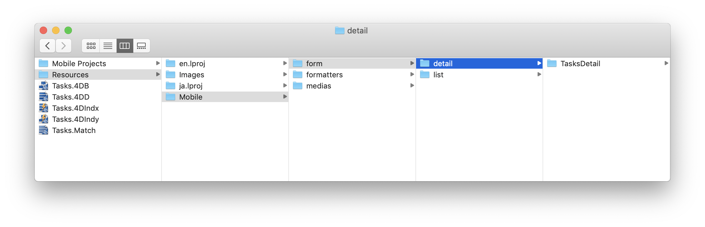
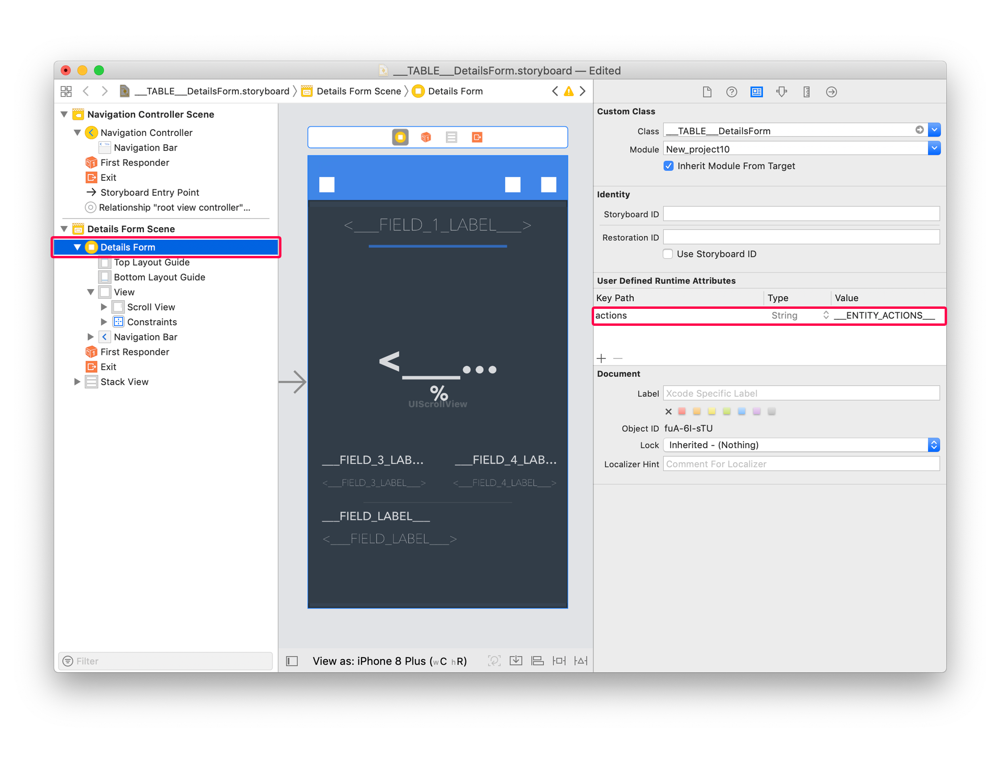
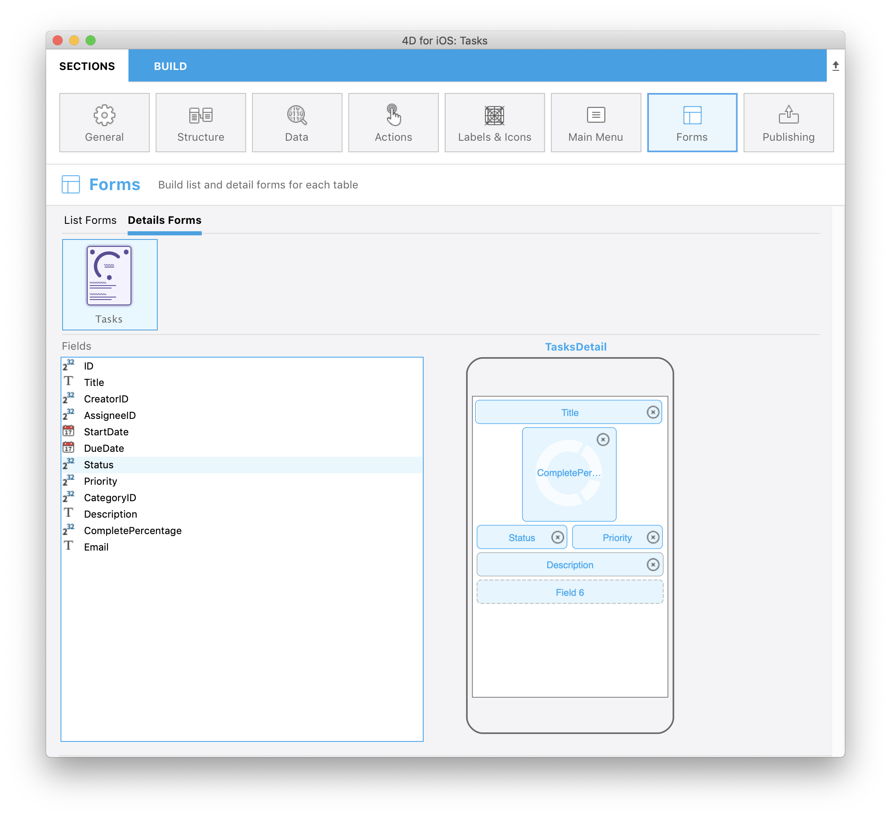

> **目標**
> 
> アクションを追加してリストフォーム/詳細フォームのテンプレートをカスタムします。

> **用意するもの**
> 
> 始めるために必要なものについては `[here](requirements.html)` をクリックしてください。

このチュートリアルでは、どうやって簡単に **カスタムテンプレートにアクションを追加する** かを見ていきます。

## ⒈ スタータープロジェクトをダウンロード

**スタータープロジェクト** をダウンロードします。これには、以下のものが収録されています:

* リストフォームのカスタムテンプレートが 2つ (TasksList および TasksCollection)
* 詳細フォームのカスタムテンプレートが 1つ (TasksDetail)
* データベース (Tasks.4dbase)

<a class="button button--primary"
href="https://github.com/4d-go-mobile/tutorial-AddingActionToTemplates/archive/1dc5aecfbea62a9999d571cb1a956f1ef6983111.zip">ダウンロード</a>

## ⒉ 4D for iOS プロジェクトにカスタムテンプレートを追加

以下の操作でテンプレートをインストールします:

* **TasksList** および **TasksCollection** テンプレートフォルダーを *Tasks.4dbase/Resources/Mobile/form/list* フォルダーにドロップ

* **TasksDetail** テンプレートフォルダーを *Tasks.4dbase/Resources/Mobile/form/detail* フォルダーにドロップ

## ⒊ リストフォームにアクションを追加

2種類のアクションが利用可能です:
* テーブルアクション
* エンティティアクション

まず最初に、`list/TasksList/Sources/Forms/Tables/___TABLE___/___TABLE___ListForm.Storyboard` ファイルを開いてみましょう。

### TasksList カスタムテンプレートにアクションを追加する

#### Ａ テーブルアクションタグを追加

下図のように当該ビューの **Controller** を選択し、Identity inspector を開いて **User Defined Runtime Attributes** に以下の記述を追加します:

* Key Path: `actions`
* Type: `String`
* Value: `___TABLE_ACTIONS___`

#### Ｂ エンティティアクションタグを追加

ツリーを展開して Animatable Table View を選択し、Identity inspector で **User Defined Runtime Attributes** に以下の記述を追加します:

* Key Path: `actions`
* Type: `String`
* Value: `___ENTITY_ACTIONS___`

これでカスタムテンプレートがアクション対応になりました！

**フォーム** セクションで TaskList カスタムテンプレートを選択し、以下のフィールドを追加します:

続けて、TasksCollection カスタムテンプレートにもアクションを追加しましょう。

### TasksCollection カスタムテンプレートにアクションを追加する

まず、`list/TasksCollection/Sources/Forms/Tables/___TABLE___/___TABLE___ListForm.Storyboard` ファイルを開きます。

#### Ａ テーブルアクションタグを追加

作業は TasksList カスタムテンプレートの場合とよく似ています。

下図のように当該ビューの **Controller** を選択し、Identity inspector を開いて **User Defined Runtime Attributes** に以下の記述を追加します:

* Key Path: `actions`
* Type: `String`
* Value: `___TABLE_ACTIONS___`

#### Ｂ エンティティアクションタグを追加

エンティティアクションを表示する方法は、リスト形式の TableView とグリッド形式の CollectionView で異なります。 後者はスワイプ操作に不向きです。

CollectionView においては操作したいセルに対し、**長押し** ジェスチャーに反応してアクションを表示させるのが良い方法です。

そのためには、CollectionView のセルを選択して、Identity inspector で **User Defined Runtime Attributes** に以下の記述を追加します:

* Key Path: `actions`
* Type: `String`
* Value: `___ENTITY_ACTIONS___`

タッチしたときに触覚フィードバックと拡大エフェクトが発生するように設定するため、**User Defined Runtime Attributes** に以下の記述も追加します：

* Key Path: `touch.zoomScale`
* Type: `Number`
* Value: `0.96` (ズーム倍率は好みに応じて調整できます)

**フォーム** セクションで TasksCollection カスタムテンプレートを選択し、以下のフィールドを追加します:

## ⒋ 詳細フォームにアクションを追加

詳細フォームでは、ナビゲーションバーの "**...**" 汎用ボタンを使用することもできますが、**オリジナルのカスタムアクションボタン** を作成することも簡単です。 どちらの場合にも、タグを追加する必要があります。

ナビゲーションバーの汎用ボタンの場合には、詳細フォームの .storyboard ファイルを開いて当該ビューの Controller を選択し、Identity inspector で **User Defined Runtime Attributes** に以下の記述を追加します:

* Key Path: `actions`
* Type: `String`
* Value: `___ENTITY_ACTIONS___`

このチュートリアルでは、カスタムの汎用ボタンを作成しましょう。 まず、`detail/TasksDetail/Sources/Forms/Tables/___TABLE___/___TABLE___DetailsForm.storyboard` ファイルを開きます。

開いたら右下のボタン (More Button) を選択し、Identity inspector で **User Defined Runtime Attributes** に以下の記述を追加します:

* Key Path: `actions`
* Type: `String`
* Value: `___ENTITY_ACTIONS___`

見てのとおり、Storyboard ファイルにはいくつかのボタンの画像が不足しています。 これらのファイルは、フォームテンプレートの **Resources** フォルダー内にあります。 ビルドを実行すれば、これらの画像ファイルはプロジェクトにコピーされます。

たとえば、**moreButton.imageset** は右下のボタンの関連ファイルです:

**フォーム** で TasksDetail カスタムテンプレートを選択し、以下のフィールドを追加します:

完成した iOSアプリのリストフォームと詳細フォームが両方ともアクション対応になりました！

完成したプロジェクトをダウンロード

<a className="button button--primary"
href="https://github.com/4d-go-mobile/tutorial-AddingActionToTemplates/releases/latest/download/tutorial-AddingActionToTemplates.zip">ダウンロード</a>

