> **目標**
> 
> アクションパラメーターを使用し、アプリ上でデータが更新できるようにします。


ひとつ前のチュートリアルでは、アクションセクションでアクションを定義することにより、iOSアプリ側から 4Dメソッドを呼び出す方法を紹介しました。

このチュートリアルでは、次のようなアクションを作成する方法を見ていきます:

* 新規タスクを **追加** する
* 既存タスクを **編集** する
* 既存タスクを **削除** する
* 特定のタスクに関連したメッセージを **メールで送信** する

ここまでのチュートリアルで作成したアプリをベースにした **スタータープロジェクト** をダウンロードしてください:

<div className="center-button">
<a className="button button--primary"
href="https://github.com/4d-go-mobile/tutorial-ActionParameters/archive/159a7b73bd3556890a205024af42440faf0b277c.zip">ダウンロード</a>
</div>

## ⒈ 追加アクション

ひとつのアクションを追加するところから始めましょう。 モバイルアプリのプロジェクトを開き、**アクション** セクションに移動します。

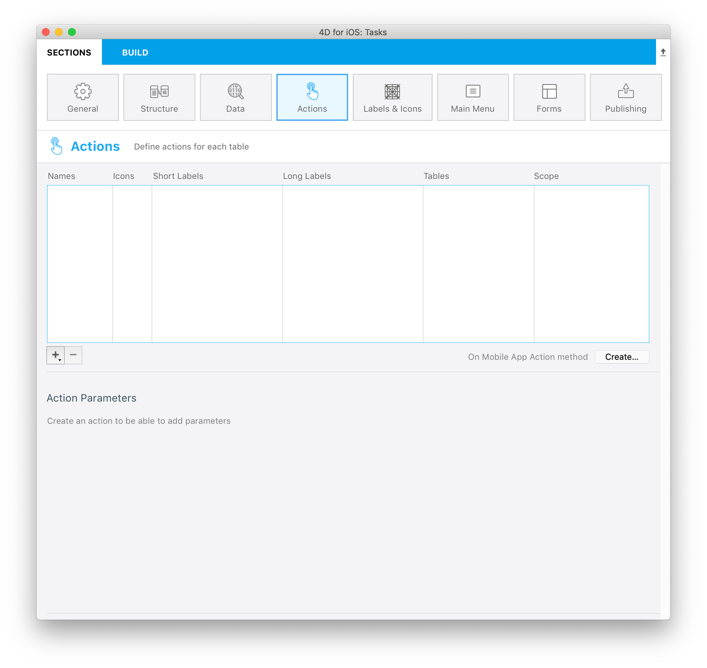

この時点では、すべての項目が空です。 iOS アプリで **新規タスクを追加する** アクションを作成することに取り掛かりましょう。

プリセットの **追加** アクションを使用して、新規アクションを作成します:

* アクションリストの下にある **＋ボタン** の三角部分をクリックします。
* **追加** オプションを選択します。
* **Tasks** テーブルを選択します。

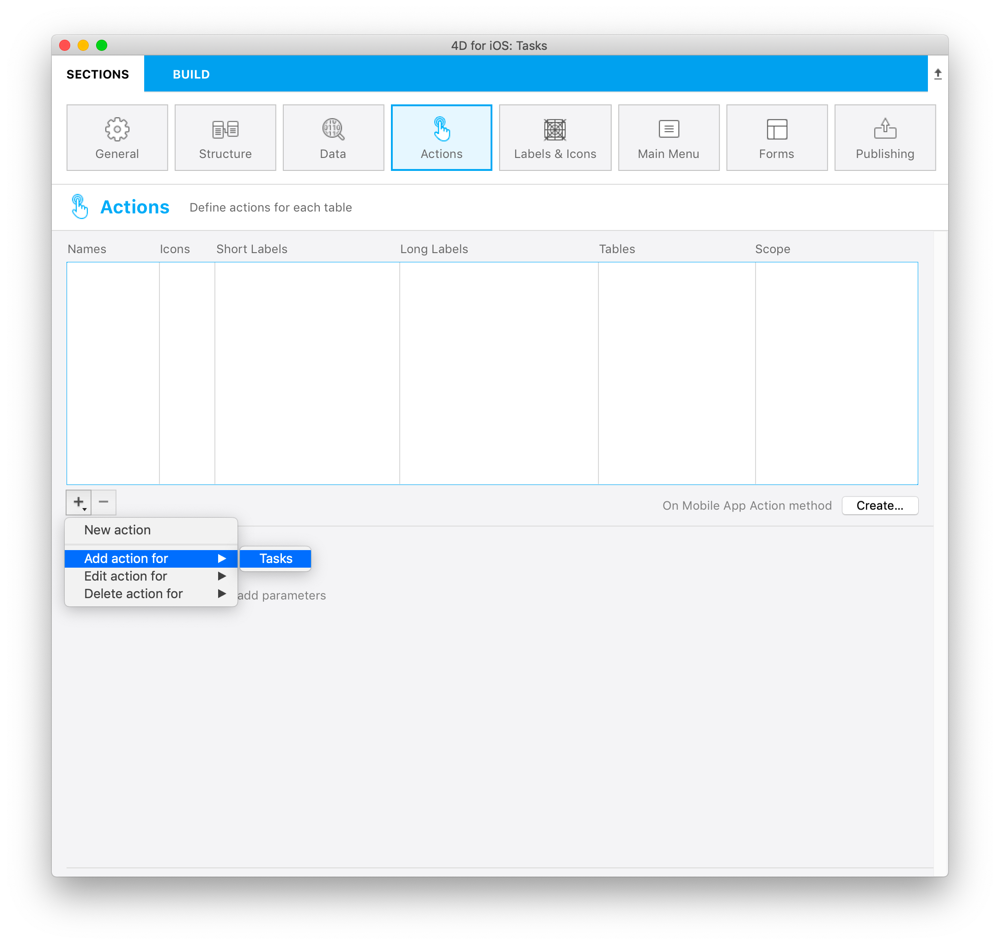

* *"addTasks"* という名称で *"追加..."* というデフォルトのラベルタイトルが設定された **新規アクション** が表示されます。
* 追加アクションに必要な **パラメーター** および **プロパティ** が **アクション引数** エリアに表示されます。

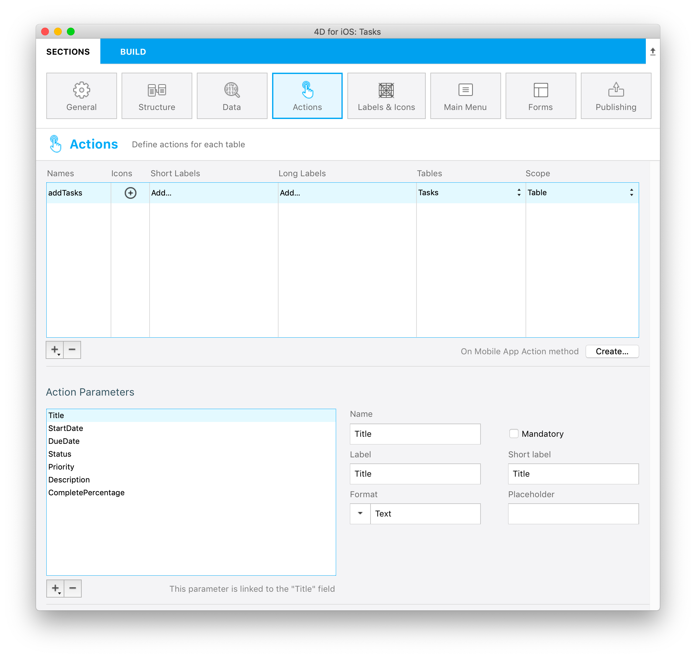

追加アクションに必要な **パラメーター** はすべて揃っているので、これで設定は完了です。

## ⒉ 編集アクション

今度は、iOS アプリで **既存タスクを編集する** アクションを作成してみましょう。

プリセットの **編集** アクションを使用して、新規アクションを作成します。

* アクションリストの下にある **＋ボタン** の三角部分をクリックします。
* **編集** オプションを選択します。
* **Tasks** テーブルを選択します。

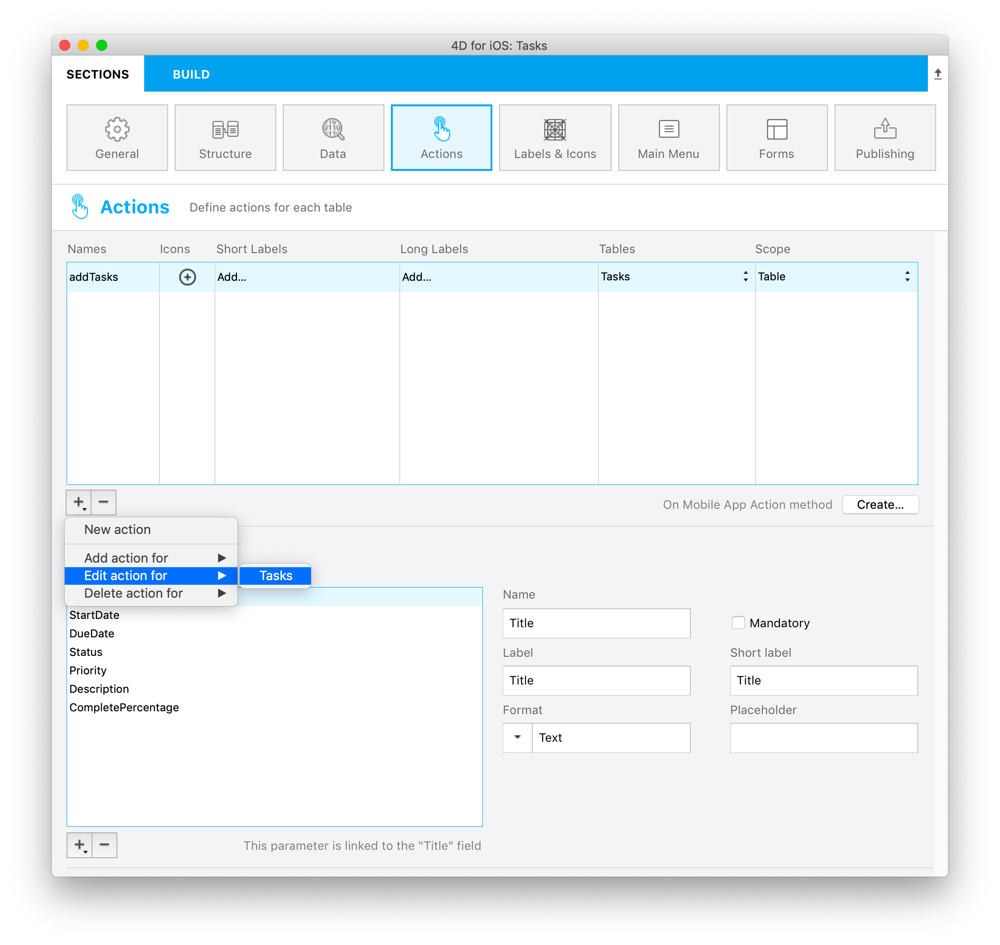

この時点で、下記のようになっているはずです:

* *"editTasks"* という名称で *"編集..."* というデフォルトのラベルタイトルが設定された **新規アクション** が表示されています。
* 編集アクションに必要な **パラメーター** および **プロパティ** が **アクション引数** エリアに表示されています。


ご心配なく、アクションを実行するために必要なメソッドは後ほど作成します。 :-)

## ⒊ 削除アクション

プリセットの **削除** アクションは、編集アクションとほとんど一緒です:

* アクションリストの下にある **＋ボタン** の三角部分をクリックします。
* **削除** オプションを選択します。
* **Tasks** テーブルを選択します。

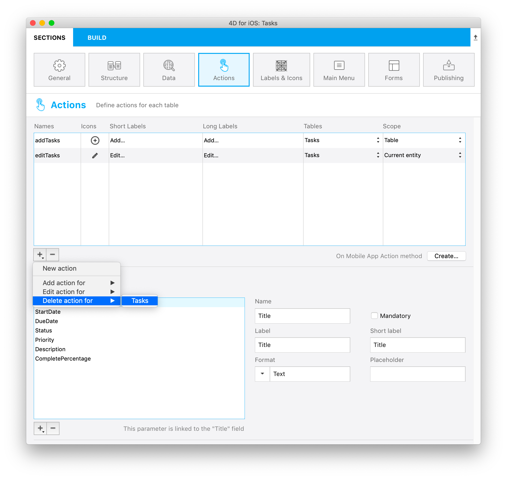

*"deleteTasks"* という名称で *"削除"* というデフォルトのラベルタイトルが設定された **新規アクション** が表示されます。

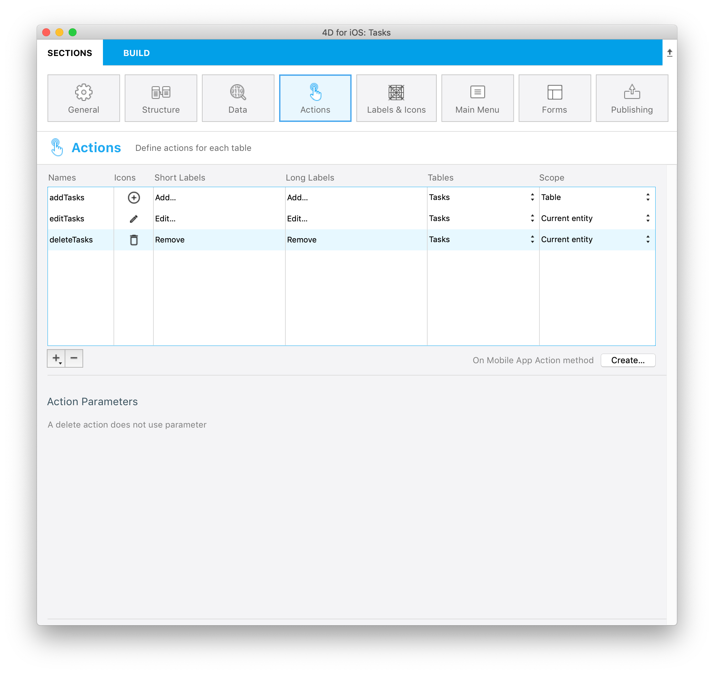

削除アクションは、パラメーターやプロパティを必要としません。

## ⒋ コメント送信アクション

選択したタスクに対して入力されたコメントを **特定のアドレス** に **メール送信する** アクションを作成しましょう。 ＋ボタンをクリックし、**sendComment** という名称の新規アクションを作成します。

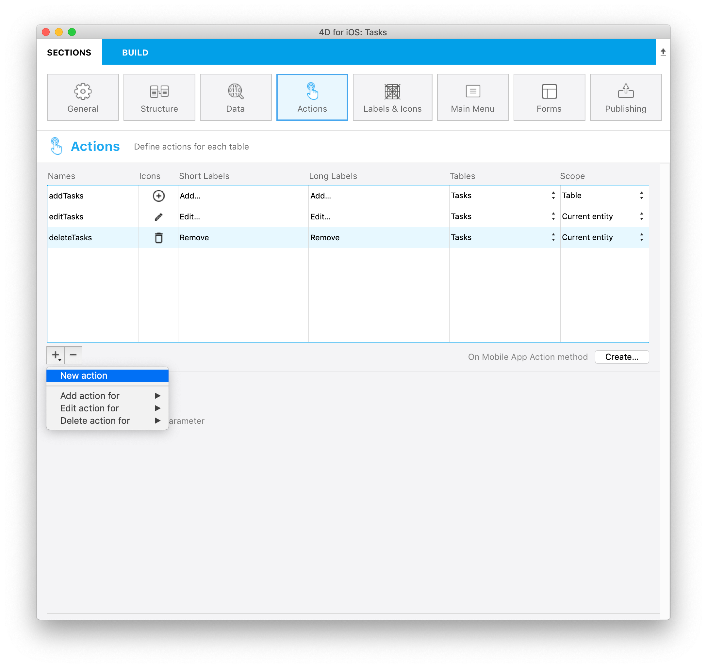

作成したアクションに対し、3個のパラメーター (引数) を定義します:

* 引数エリアの下にある ＋ボタンの三角部分をクリックし、アクションパラメーターのリストから**Title** を選択します。 送信するメールにタスク名を含めるためです。
* ＋ボタンをクリックし、**Comment** パラメーターを作成します。 フォーマット (入力コントロール) は "テキスト ＞ テキストエリア" です。
* 同じ要領で **Email** パラメーターを追加し、フォーマットは "テキスト ＞ メールアドレス" に設定します。

アクションの定義が下図のようになっているのを確認してください:

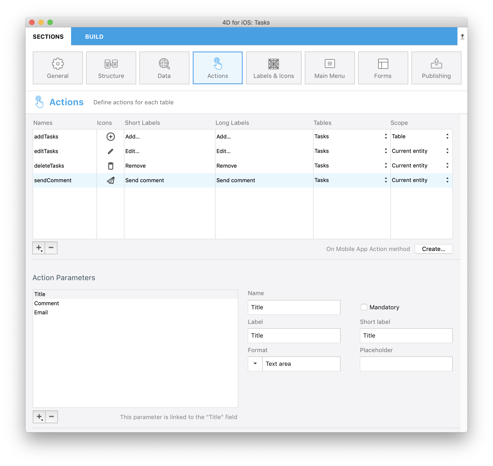

## ⒌ On Mobile App Action メソッド

アクション一覧の右下の "作成..." ボタンをクリックして *On Mobile App Action* データベースメソッドを開き、必要な処理を追加します。

プロジェクトエディターで定義したアクションの名称は、データベースメソッドに自動挿入されています。

アクションに応じた処理を追加して、これを完成させましょう。

*On Mobile App Action* データベースメソッドの内容は、以下のようになります:

```4d
C_OBJECT($0;$response)
C_OBJECT($1;$request)

C_OBJECT($o;$context;$request;$result;$parameters)

$request:=$1  // モバイルアプリから送られた情報

$context:=$request.context
$parameters:=$request.parameters

Case of 

    : ($request.action="addTasks")

          // "追加…

        " アクション用のコードをここに挿入します

        $o:=New object(\
        "dataClass";$context.dataClass;\
        "parameters";$parameters)

        $result:=addAction ($o)

    : ($request.action="editTasks")

          // "編集…

        " アクション用のコードをここに挿入します

        $o:=New object(\
        "dataClass";$context.dataClass;\
        "ID";$context.entity.primaryKey;\
        "parameters";$parameters)

        $result:=editAction ($o)


    : ($request.action="deleteTasks")

          // "削除" アクション用のコードをここに挿入します

        $o:=New object(\
        "dataClass";$context.dataClass;\
        "ID";$context.entity.primaryKey)

        $result:=deleteAction ($o)

    : ($request.action="sendComment")

          // "コメント送信" アクション用のコードをここに挿入します

        $o:=New object(\
        "dataClass";$context.dataClass;\
        "ID";$context.entity.primaryKey;\
        "parameters";$parameters)


        $result:=sendMail ($o)

    Else 

          // 未知のアクション

End case 

$0:=$result

```

## ⒍ アクションメソッドを作成する


### addAction

```4d
C_OBJECT($0)
C_OBJECT($1)

C_OBJECT($entity;$in;$out)

$in:=$1

$out:=New object("success";False)

If ($in.dataClass#Null)

    $entity:=ds.Tasks.new()  // 新規エンティティの参照を作成します

    For each ($key;$in.parameters)

        $entity[$key]:=$in.parameters[$key]

    End for each 

    $entity.save()  // エンティティを保存します


    $out.success:=True  // アクションが成功したことをアプリに通知します
    $out.dataSynchro:=True  // エンティティセレクションのリロードを要求します
    $out.statusText:="Task added"

Else 

    $out.errors:=New collection("No Selection")

End if 

$0:=$out


```

### editAction

```4d
C_OBJECT($0)
C_OBJECT($1)

C_OBJECT($dataClass;$entity;$in;$out;$status;$selection)

$in:=$1

$selection:=ds[$in.dataClass].query("ID = :1";String($in.ID))

If ($selection.length=1)

    $entity:=$selection[0]

    For each ($key;$in.parameters)

        $entity[$key]:=$in.parameters[$key]

    End for each 

    $status:=$entity.save()

    $out:=New object

    If ($status.success)

        $out.success:=True  // アクションが成功したことをアプリに通知します
        $out.dataSynchro:=True  // エンティティのリロードを要求します
        $out.statusText:="Task edited"

    Else 

        $out:=$status  // ステータスをアプリに通知します

    End if 

Else 

    $out.success:=False  // アクションが失敗したことをアプリに通知します

End if 

$0:=$out


```

### deleteAction

```4d

C_OBJECT($0)
C_OBJECT($1)

C_OBJECT($dataClass;$entity;$in;$out;$status;$selection)

$in:=$1

$selection:=ds[$in.dataClass].query("ID = :1";String($in.ID))

If ($selection.length=1)

    $entity:=$selection.drop()

    $out:=New object

    If ($entity.length=0)

        $out.success:=True  // アクションが成功したことをアプリに通知します
        $out.dataSynchro:=True  // エンティティのリロードを要求します
        $out.statusText:="Task deleted"

    Else 

        $out:=$status  // ステータスをアプリに通知します

    End if 

Else 

    $out.success:=False  // アクションが失敗したことをアプリに通知します

End if 

$0:=$out


```

### sendMail


```4d
C_OBJECT($0;$out)
C_OBJECT($1;$in)

C_OBJECT($dataClass;$entity;$selection)

$in:=$1

$selection:=ds[$in.dataClass].query("ID = :1";String($in.ID))

If ($selection.length=1)

    $entity:=$selection[0]

    For each ($key;$in.parameters)

        $entity[$key]:=$in.parameters[$key]

    End for each 

    $out:=New object

    $server:=New object
    $server.host:="smtp.gmail.com"
    $server.port:=465
    $server.user:="test@mail.com"
    $server.password:="yourPassword"

    $transporter:=SMTP New transporter($server)

    $email:=New object
    $email.subject:="New comment about one of your task"
    $email.from:="yourEmail"
    $email.to:=$emailToSend
    $email.htmlBody:="<h1>Comment from Tasks for iOS</h1>"+"<p><b>Task:</b> "+$taskTitle+"</p><p><b>Comment:</b> "\
    +$commentToSend+"</p><br><p><i>Send from my 4D for iOS app</i></p>"\

    $status:=$transporter.send($email)
    If ($status.success)
        $out.success:=True  // アクションが成功したことをアプリに通知します
        $out.statusText:="Mail sent"

    Else 
        $out.success:=False  // アクションが失敗したことをアプリに通知します
        $out.statusText:="Mail not sent"

    End if 

Else 

    $out.success:=False  // アクションが失敗したことをアプリに通知します

End if 

$0:=$out


```

**sendMail** メソッドで実行されるコードは、ご利用のメールサーバーに合わせて値を変更してください。


## ⒎ アプリをビルドする


あとは、アプリをビルドするだけです！

ナビゲーションバーのアクションボタンをクリックすると、**新規タスクを作成する** ことができます。


リスト画面上で、作成したばかりのタスクのセルを長押しすると、アクションリストが表示され、**編集...** アクションを選択することができます。

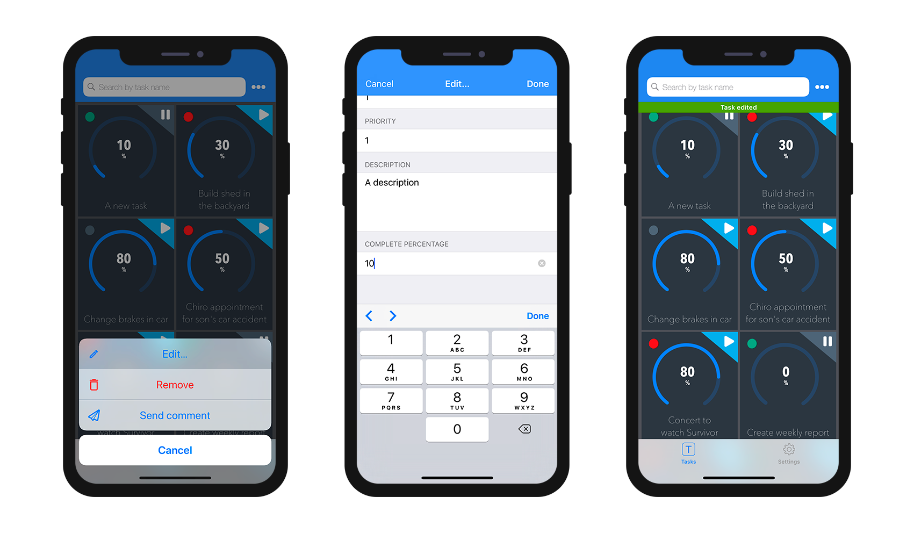

**コメント送信** アクションでメッセージを送信することもできます。

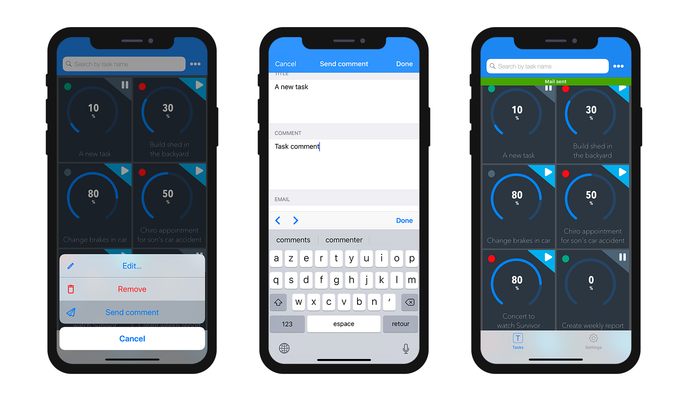

**削除** アクションでエンティティを削除することができます。

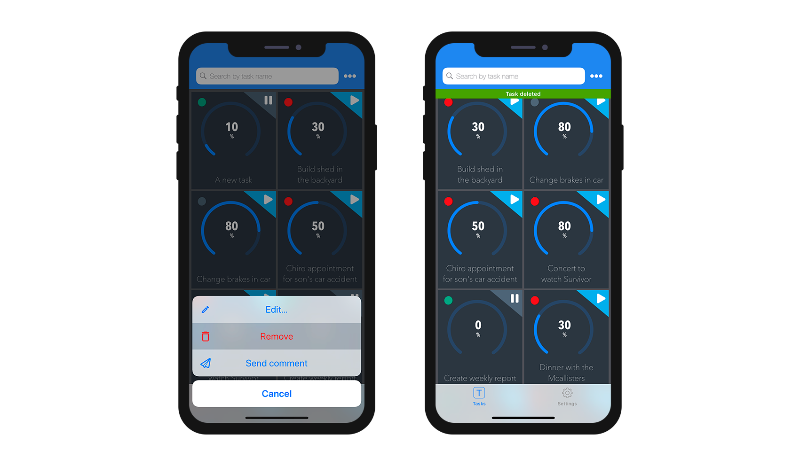

## ⒏ これからどうする？

おつかれさまでした！ これでこの iOSアプリが完成しました！　デバイス上で直接データを変更することができ、更新した内容はサーバーとシンクロさせることができます！


完成したプロジェクトをダウンロード

<div className="center-button">
<a className="button button--primary"
href="https://github.com/4d-go-mobile/tutorial-ActionParameters/archive/0.0.1.zip">完成したプロジェクトをダウンロード</a>
</div>


