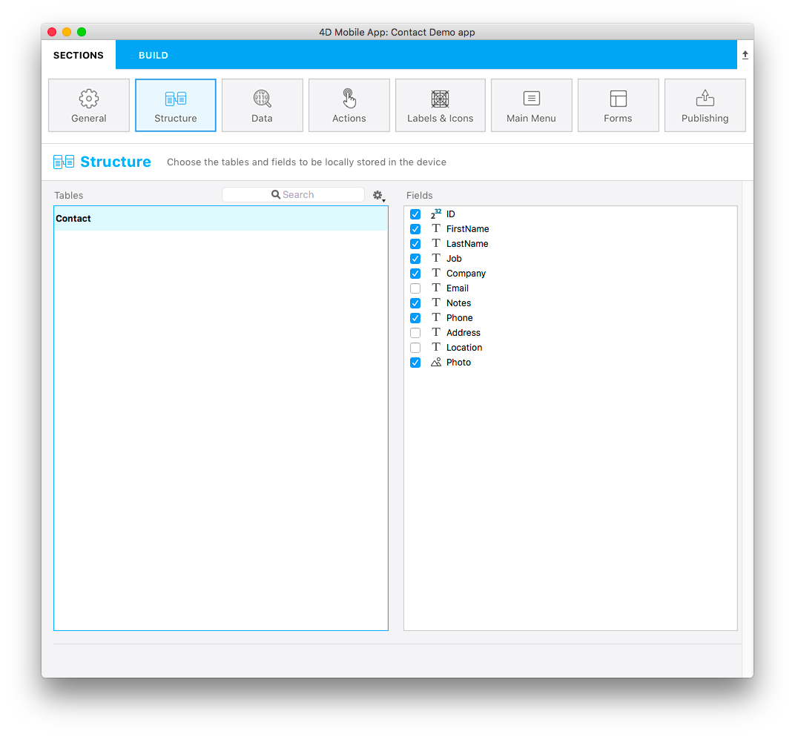
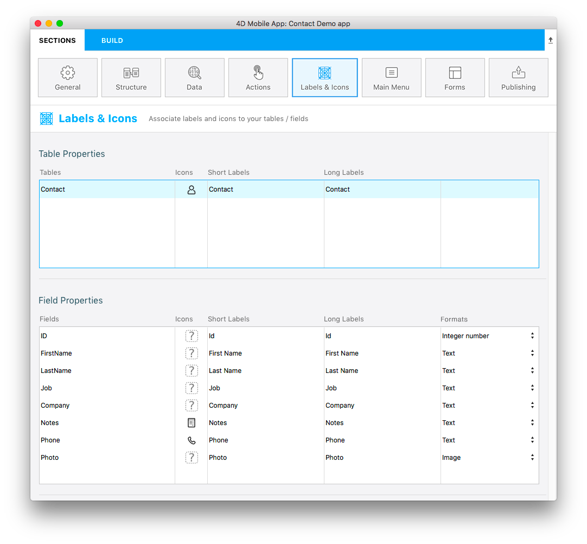
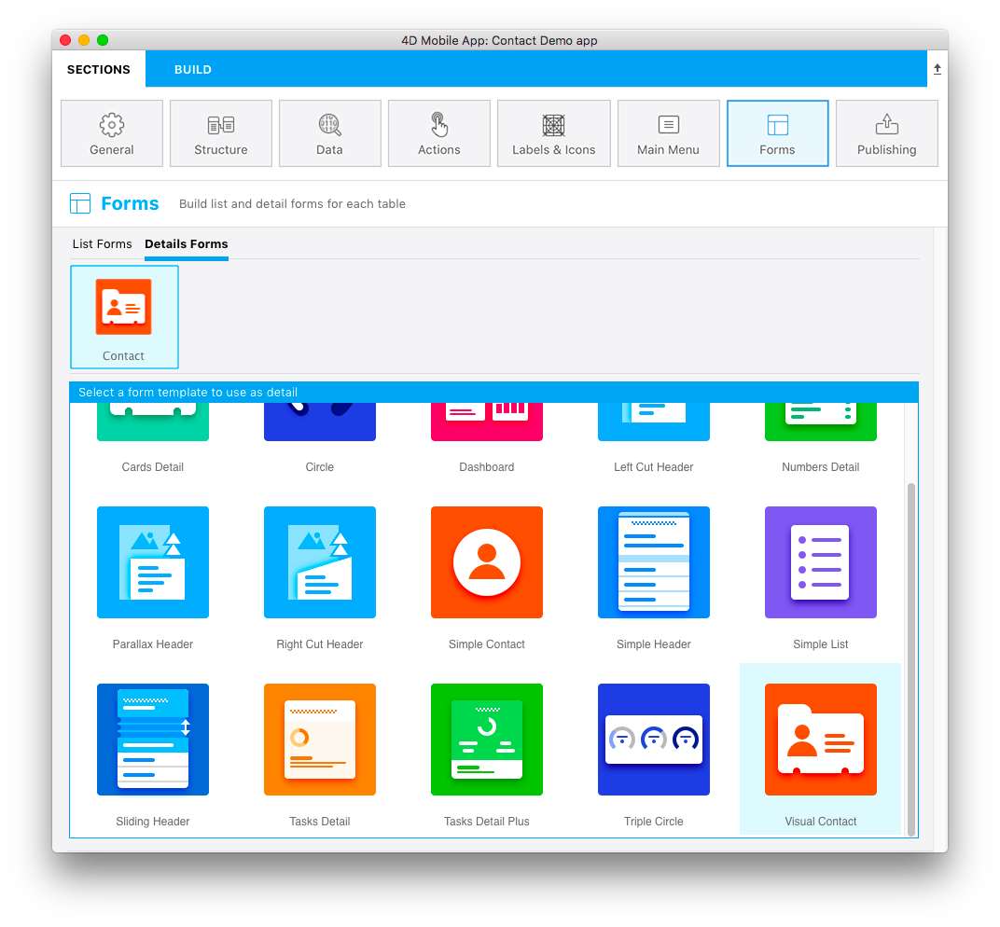
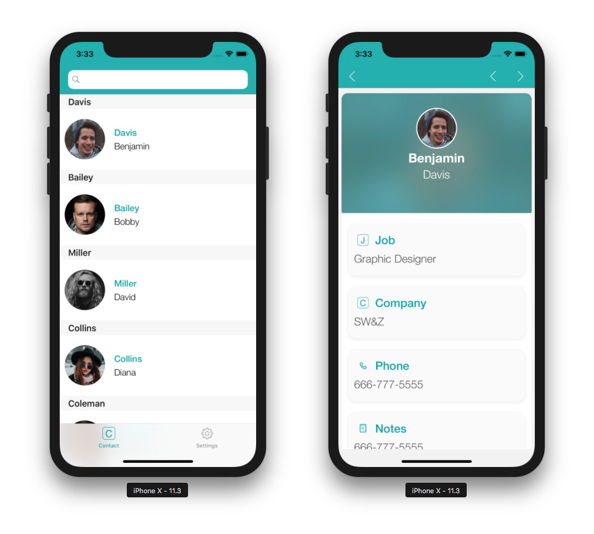

4Dモバイルアプリケーションビルダーへようこそ。 このチュートリアルでは、4D を使った iOS および Android向けのモバイル開発をすぐに始められます。

:::note

始める前に、4Dモバイルプロジェクト開発のためのハードウェアとソフトウェアの [要件](../getting-started/requirements.md) を満たしていることを確認してください。

:::

**シナリオ:** あなたは商業的なビジネスマネージャーで、連絡先情報を外出先でも確認したいと考えています。 これを実現するため、iOS や Android向けに連絡先アプリを作成しましょう。 リスト画面で顧客名を検索して選択し、その詳細を確認できるようなイメージです。 アプリ名は "Contact" です。 アプリ名は "Contact" です。

## ⒈ ⒈ スタータープロジェクトをダウンロード

これにはデータベースファイルおよびプロジェクトのアイコンが含まれていますが、モバイルプロジェクトはまだ作成されていません。

<a className="button button--primary" href="https://github.com/4d-go-mobile/tutorial-ContactApp/archive/acbb699c3c9d9edd3a8bbb715e87c17140b7e15f.zip">スタータープロジェクト</a>

## ⒉ ⒉ モバイルプロジェクトの作成

4Dアプリケーションを起動し、ダウンロードしたスタータープロジェクトを開きます。 ストラクチャーを表示して、テーブルを 1つだけ含んだ非常にシンプルなものであることを確認してください。

上部のメニューから **新規 ＞ モバイルプロジェクト** を選択します。 ようこそ画面が開いたら、モバイルプロジェクトに名前をつけましょう。

**続ける** をクリックします。

Androidプロジェクトの開発には、追加のコンポーネントが必要です。 **OK** をクリックすると、ダウンロードします:

## ⒊ ⒊ 一般ページ

この画面では、アプリの基本的な情報を入力します。

* **ターゲットOS:** ビルドするモバイルプラットフォーム

:::note

Windows では、**Android** のみ利用可能です。 macOS では、**Android** と **iOS** の両方を選択できます。

:::

* **組織:** 開発者 (あなた) の会社名とアプリの識別子を英数字で入力します。
* **プロダクト:**
    * **名前:** アプリの名前です。 ここでは "Contact" と名付けましょう。
    * **ID** (バンドルID): 組織の識別子とプロダクト名を組み合わせる形で自動生成されます。
    * **バージョン** と **Copyright:** ここでは 1.0 にしておいてください。
    * **アイコン:** スタータープロジェクトに収録されている画像ファイル (ContactIcon.png) をエリアにドラッグ＆ドロップします。
* **デベロッパー:**
    - **名前:** コンピューターのユーザー名から自動入力されます。
    - **部署名:** Developer アカウントの Team ID です。 シミュレーター向けにビルドするだけであれば、空欄のままで構いません。

## ⒋ ⒋ ストラクチャーページ

ここでは、モバイルデバイスに対して公開するデータのサブセット (具体的にはテーブルやフィールド) を定義します。 左のエリアでテーブルを、右のエリアでフィールドを選択します。

今回は、**ID**, **First Name**, **Last Name**, **Job**, **Company**, **Phone**, **Notes**, **Photo** を選択します。

> データベースの各レコードを識別するため、プライマリーキー (ここでは IDフィールド) は除外しないようにしてください。

## ⒌ ⒌ ラベル & アイコンページ

:::note

[**データ**](project-definition/data.md) と [**アクション**](project-definition/actions.md) ページでは、アプリのデータを設定したり、サーバー上のコードをトリガーしたりできます。 今回は、シンプルにするために、デフォルトの動作を使用します。

:::

**ラベル & アイコン** ページを選択します。 ここでは、テーブル、フィールド、リレーションについて、アプリ内で使用されるラベルやアイコンを定義することができます。

* 短いラベルと長いラベルは、利用可能なスペースに応じてアプリが自動的に使用します。
* テーブルアイコンを定義するには、テーブルの **アイコン** カラムをクリックします。 アイコンライブラリーが表示され、テーブルやフィールドを説明するアイコンを選択することができます。 また、アイコンを指定しない場合、デフォルトのアイコンが生成されます。
* フィールドのアイコンを少なくとも 1つを選択しましょう。 残りのフィールドについては、エディターがデフォルトのアイコンを生成します。 また、すべてのフィールドを空にすることで、フィールドアイコンを表示させないこともできます。

## ⒍ フォーム

あともう少しです！　アプリの外観を決めるために、デザインを選びましょう。 リストフォームと詳細フォーム、それぞれのサンプルが用意されています。

* レコードをリスト形式で表示するために、listビューのテンプレートを選択します。 ここでは、**Profile** テンプレートを使用しましょう。

テンプレートを選択すると、設定画面の下半分がテンプレートのリストからデザイン画面に切り替わります。

* 表示させたいフィールドをテンプレートにドラッグ＆ドロップします。 Last Name を "検索に使用するフィールド" と "タイトル" にドロップしましょう。 "検索に使用するフィールド" および "セクションとして使用するフィールド" の使用は任意です。

あとは詳細フォームを決めるだけです。

* アプリのコンセプトにふさわしいデザインを選ぶようにしてください。 ここでは、**Visual Contact** テンプレートを使用しましょう。

* 詳細フォームテンプレートの適切な場所にフィールドをドラッグ＆ドロップします: Photo は "ピクチャー"、First Name は "フィールド1"、Last Name は "フィールド2"。

## ⒎ ⒎ アプリのビルド

おつかれさまでした！ デザインしたアプリをビルドして、シミュレーターで動かしてみましょう！

* 画面を **ビルド** タブに切り替えます。
* 機種ボタンをクリックして、シミュレーターで起動するデバイスのモデルを選びます。
* **ビルドして実行** をクリックします。
* そのまま待っていると… モバイルアプリの完成です！

## これからどうする？

このチュートリアルでは、アプリの基本的な作り方を紹介しました。ほんとうに手軽に作れる、という手応えが得られたのではないでしょうか。 もちろん、他にもさまざまなオプションや機能を用意しています。 下の **完成プロジェクト** をクリックすると、完成した Contact アプリをダウンロードできます。

<a className="button button--primary"
href="https://github.com/4d-go-mobile/tutorial-ContactApp/releases/latest/download/tutorial-ContactApp.zip">完成プロジェクト</a>

