iOSアプリのカスタムリストフォームのインターフェースを Xcode で作成しましょう！

完成イメージ

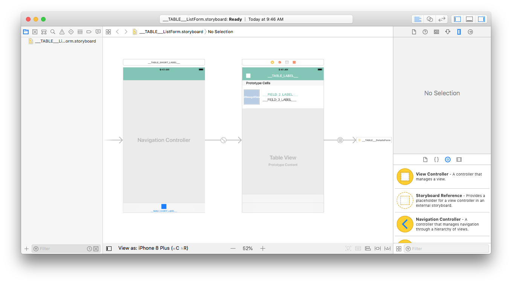

テンプレートに表示する次のフィールドのレイアウトをデザインします:

* アイコン
* タイトル
* サブタイトル

## ストーリーボードを Xcode で開く

.storyboardファイル (拡張子は非表示かもしれません) を Xcode で開きます。

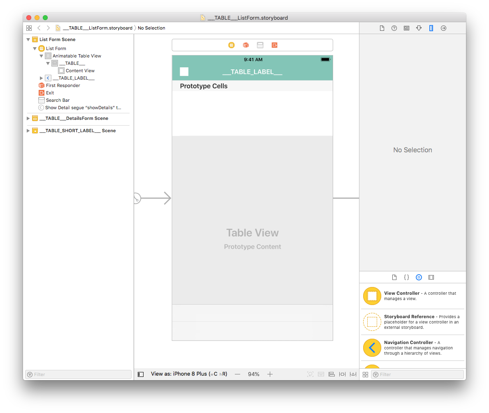

ほとんど白紙の状態です。早速、中身を追加しましょう！

## Image View を追加する

エディターを右にスクロールして第2画面 (シーン) に移動し、**オブジェクトライブラリ** から **Image View** を探してセルにドラッグ＆ドロップします。 オブジェクトライブラリは、View メニューから Show Library を選択して表示できるほか、command+shift+L で直接表示することもできます。

**Size inspector** (ウィンドウ右側パネルの三角定規アイコンをクリック) で Image View の Width (幅) と Height (高さ) の両方を 110 に設定します。 また、X座標を 8、Y座標を 3 に設定します。

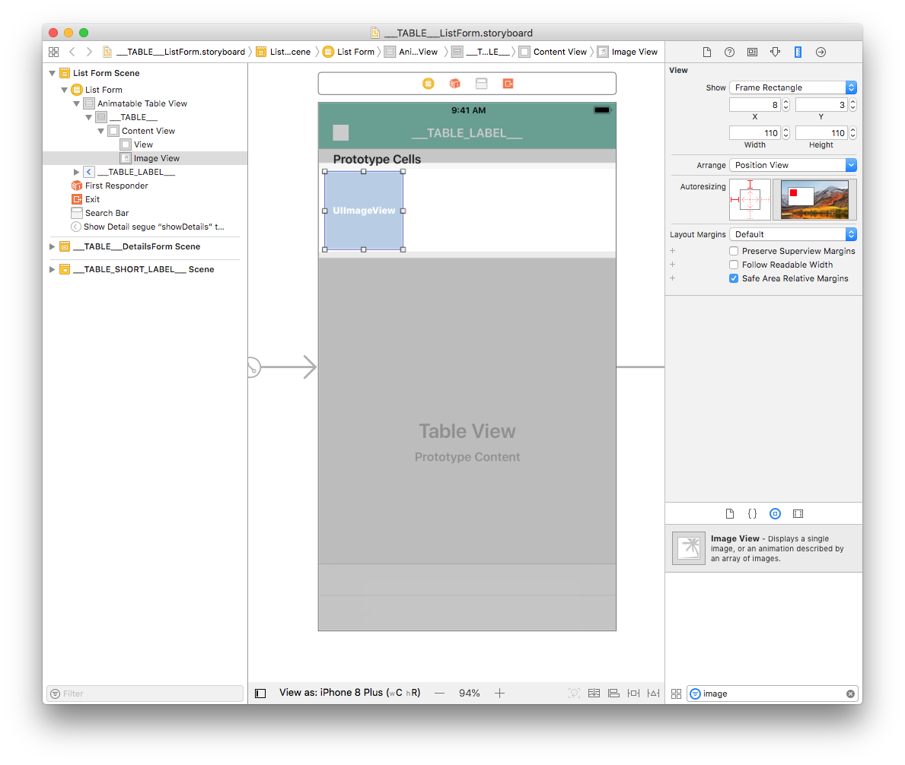

**Add New Constraints** ボタンをクリックします。 Height のチェックボックスもクリックして、高さ固定の制約を追加したら、確定します:

**Align** (ウィンドウ下部の四角が左揃えになっているアイコン) ボタンをクリックして、Vertically in Container (縦中央揃え) のチェックボックスを有効にして、これも確定します。

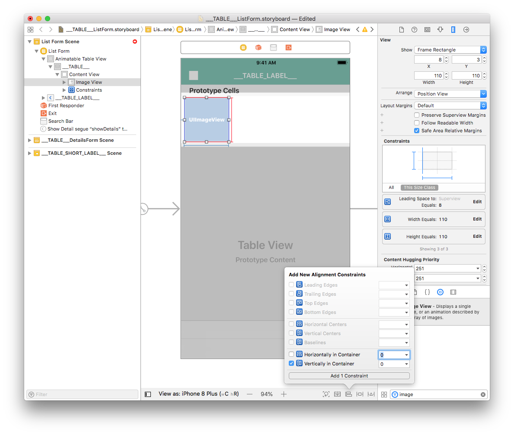

これで、Image View のレイアウトが決まりました。

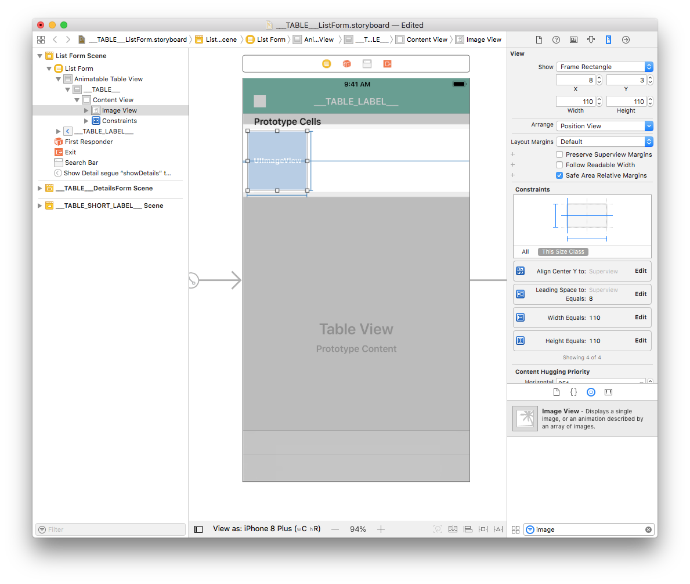

セル内に表示されるラベルのほうに目を向けましょう。

## タイトルおよびサブタイトルのラベル

まず **View** を追加しましょう。 **オブジェクトライブラリ** で View (View Controllerではありません) を探し、セルにドラッグ＆ドロップします。

**Size inspector** (ウィンドウ右側パネルの三角定規アイコンをクリック) で View の Width (幅) を 277 に、Height (高さ) を 94 に設定します。 また、X座標を 126、Y座標を 10 に設定します。

**Add New Constraints** (ウィンドウ右下にある T に囲まれた四角のアイコン) ボタンをクリックします。

今度は、**オブジェクトライブラリ** で Label を探し、View の上にドラッグ＆ドロップします。

**Size inspector** で Label の Width (幅) を 269 に、Height (高さ) を 32 に設定します。 また、X座標と Y座標の両方を 8 に設定します。

ラベルを **複製** (command+D) し、**Size inspector** で X座標を 8、Y座標を 48 に設定します。

**Add New Constraints** ボタンをクリックします。左右上下 (Leading・Trailing・Top・Bottom) の余白をそれぞれ 8・0・8・Multiple に設定し、余白がすべて有効なのを確認します (赤い実線)。Height のチェックボックスもクリックして、高さ固定の制約を追加したら、確定します:

一方のラベルだけを選択し、制約を編集するためにウィンドウ右側パネルに表示されている **Height equals: 32** をダブルクリックします。

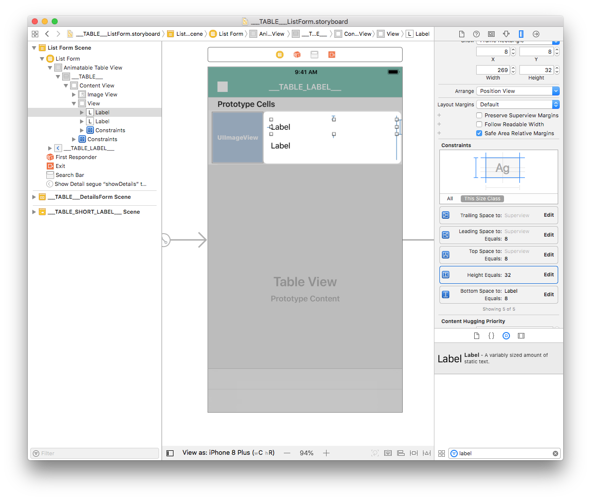

Relation を Equal から **Greater Than or Equal** に変更します。 垂直方向に拡張可能にすることで、複数行のラベルにも対応することが狙いです。

他方のラベルに対しても同じことをします。

## ラベルのカスタマイズ

ラベルのフォントカラーは、Attribute inspector (ウィンドウ右側パネルの横スライダーのアイコンをクリック) でカスタマイズできます。 低い位置のラベルのフォントカラーを **Dark Gray Color** に設定しましょう。

表示される色見本の中から BackgroundColor を選択すれば、アプリの支配的なカラーに設定することができます。

同じ要領でフォントもカスタマイズすることができます。 両方のラベルを選択し、Font を クリックして Custom を選択します。 そうすれば、**Helvetica Neue** のようなフォント名が設定できるようになります。

仕上げに、両方のラベルが選択された状態で Attribute inspector で **Lines** を 1 から 0 に変更します。 これでラベルに表示できる行数が無制限となります。

:::note

このストーリーボードは、セルの内容に応じて **高さが可変** になるよう、Animatable Table View の Row Height と Estimate が Automatic に設定されています。

:::

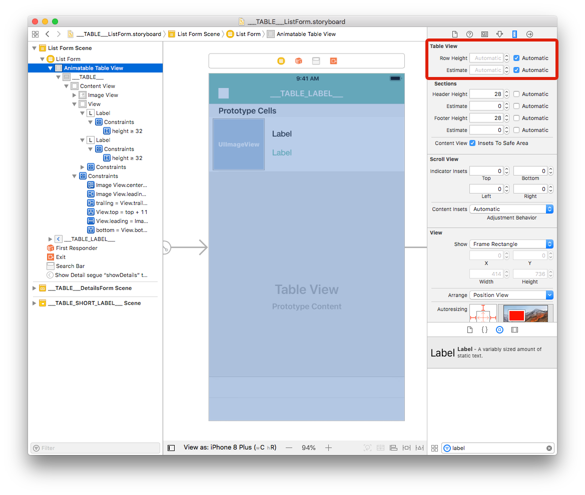

## セルとフィールドを関連付ける

### Image View

Image View を選択し、**Identity inspector** (ウィンドウ右側パネルの身分証明書アイコンをクリック) の User Defined Runtime Attributes にアクセスします。 行を追加するために **＋** ボタンをクリックします。

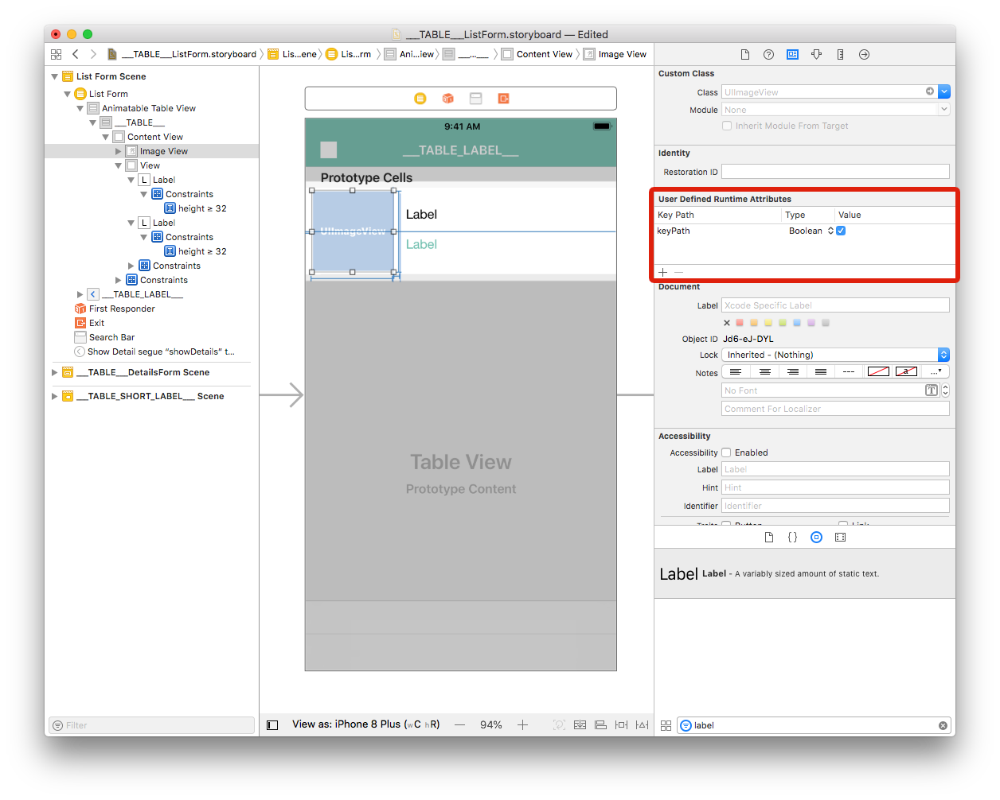

* **Value**: 属性名です。 `___FIELD_1_BINDING_TYPE___` と入力します。

* **Type**: `String`

* **Value**: 属性名です。 `___FIELD_1_BINDING_TYPE___` と入力します。

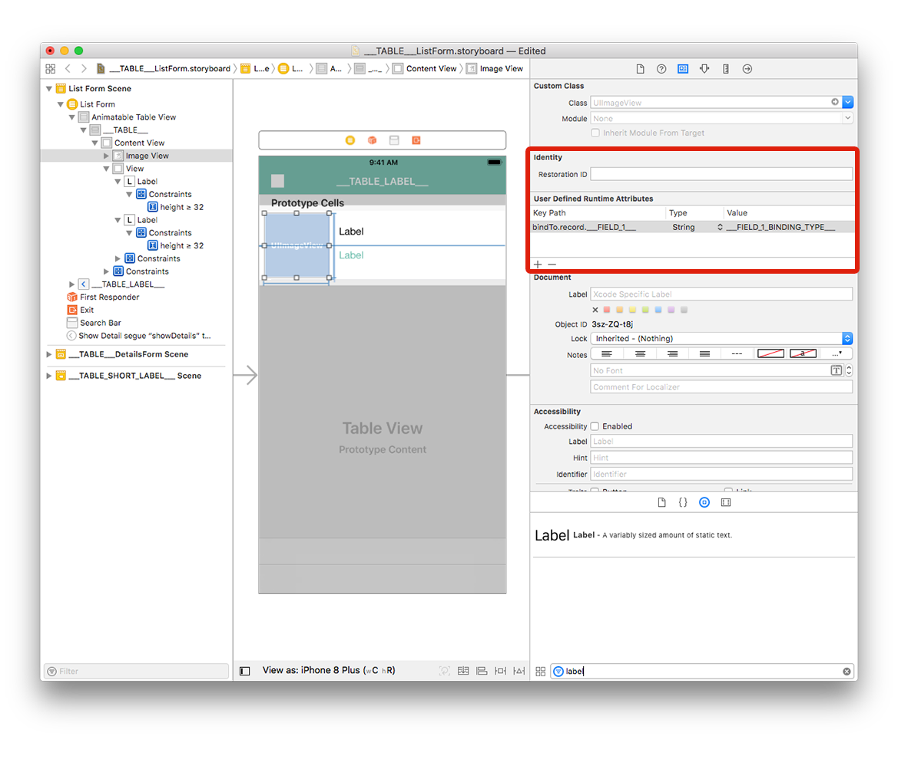

### ラベル

高い位置のラベルを選択し、さきほどと同様に User Defined Runtime Attributes に行を追加します:

* **Key Path**: `bindTo.record.___FIELD_2___`

* **Type**: `String`

* **Value**: `___FIELD_2_BINDING_TYPE___`

低い位置のラベルを選択し、こちらにも User Defined Runtime Attributes に下記の 1行を追加します:

* **Key Path**: `bindTo.record.___FIELD_3___`

* **Type**: `String`

* **Value**: `___FIELD_3_BINDING_TYPE___`

直感的に理解できるように **ストーリーボードに表示されるラベル** を変更することができます:

* 高い位置のラベルを選択し、`___FIELD_2_LABEL___` と入力します。
* 低い位置のラベルを選択し、`___FIELD_3_LABEL___` と入力します。

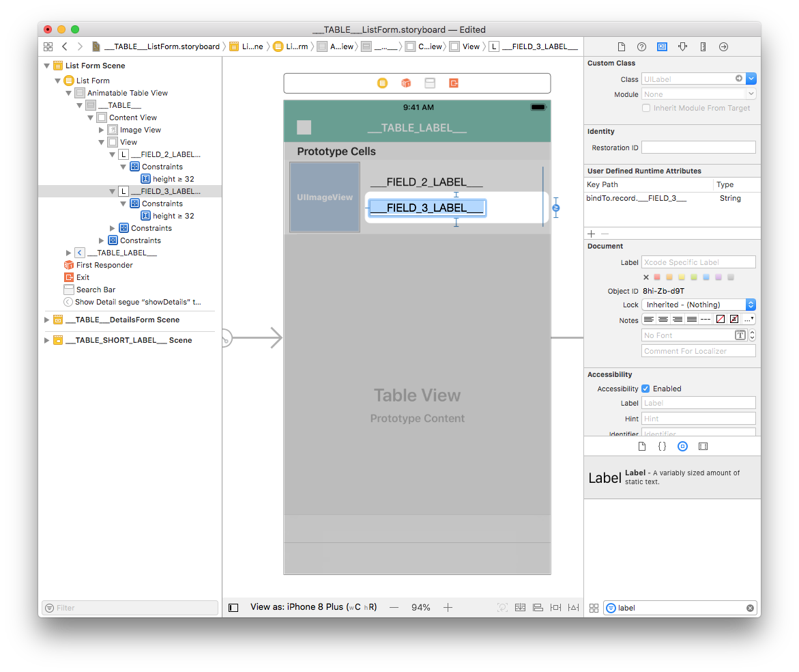

モバイルプロジェクトエディターを開き、フォームセクションでリストフォームのカスタムテンプレートを選択した上で、"ビルドして実行" を選択します。

シミュレーターでうまく動けば、成功です:

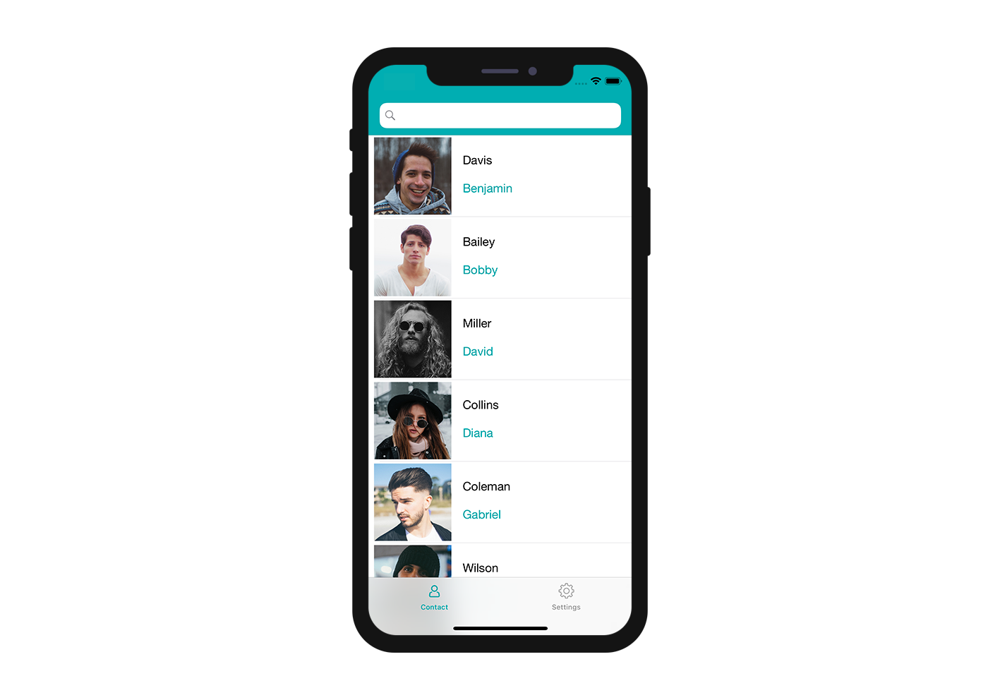

## アプリをカスタマイズする

Image View の角の丸みをカスタマイズして、デザインに個性を持たせましょう。

Image View を選択し、User Defined Runtime Attributes に次の 2行を追加します:

* **Key Path**: `cornerRadius`

* **Type**: `Number`

* **Value**: `12`

および

* **Key Path**: `layer.masksToBounds`

* **Type**: `Boolean`

* **Value**: Check the box

カスタマイズしたプロジェクトを実際にビルドしてみましょう！

## これからどうする？

このチュートリアルでは、iOS のリストフォーム用カスタムテンプレートを作成する方法を紹介しました。 スタータープロジェクトを参考に、シンプルなカスタムテンプレートが簡単に自作できる、という手応えが得られたのではないでしょうか。 もちろん、リストフォームだけでなく、[詳細フォームのテンプレート](../creating-detail-forms/detail-form-template.md) も独自に作成することができます。

完成したリストフォームのテンプレート入りプロジェクト:

<a className="button button--primary"
href="https://github.com/4d-go-mobile/tutorial-CustomListForm/archive/53ac1d5f506aa4ca2a8d78760ef799044c5c8bdc.zip">ダウンロード</a>

