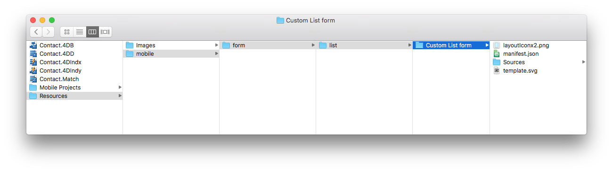
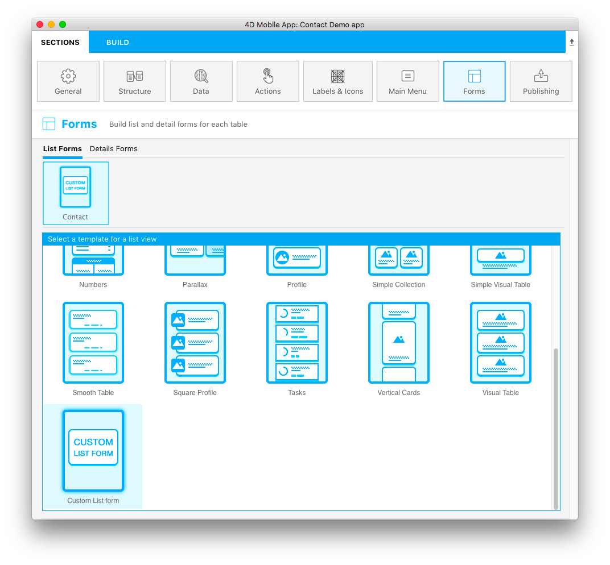

このチュートリアルでは、リストフォーム用のカスタムテンプレートを作成するために必要なスキルを身につけることができます。これには、フォームへの **検索窓** の追加、**画像** フィールドの表示、各セルへの **タイトル** および **サブタイトル** の表示が含まれます。

## スタータープロジェクトをダウンロード

**スタータープロジェクト** をダウンロードします。これには、以下のものが収録されています:

* **Custom List form** フォルダー
* すぐに使えるモバイルアプリの付いたデモ4Dプロジェクト ("Contact")。

<a className="button button--primary"
href="https://github.com/4d-go-mobile/tutorial-CustomListFormStarter/archive/refs/heads/master.zip">スタータープロジェクト</a>

## プロジェクトにリストフォームのテンプレートを追加する

まず、*Contact.4dbase/Resources/Mobile/form/* に `list` フォルダーを作成し、**Custom List form** フォルダーをその中にドラッグ＆ドロップします。

4Dアプリケーションを起動し、ダウンロードした "Contact" 4Dプロジェクトを開きます。

次に、モバイルプロジェクトを開きます。これには **ファイル > 開く > モバイルプロジェクト... > Contact Demo app** と選択していきます。

モバイルプロジェクトエディターの **フォーム** セクションで、リストフォームテンプレート選択画面に追加した "Custom List form" テンプレートが表示されていれば成功です:

それでは、**Custom List form** フォルダーの中身を見ていきましょう。

## リストフォームテンプレートフォルダーの中身

フォルダーには、次のものが格納されています:

* **layoutIconx2.png**: 160x160pxサイズのアイコンファイルです。プロジェクトエディターのテンプレート選択画面に表示されます。
* **manifest.json**: テンプレートの基本的な説明が記述されています。
* **template.svg**: リストフォームのレイアウトを決定する画面に表示されるテンプレートのプレビューです。
* ストーリーボード (グラフィカルインターフェース) と **Swift** ファイル (フォームのコード) を `Source/Forms/Tables/___TABLE___` フォルダー内に格納する **ios フォルダー**
* layout.xml ファイル (グラフィカルインターフェース) を `app/src/main/res/layout` フォルダー内に格納する **android フォルダー**

これらのファイルやフォルダーについては、次のセクションで説明していきます。 
