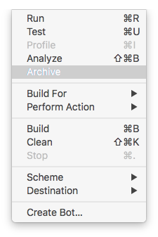
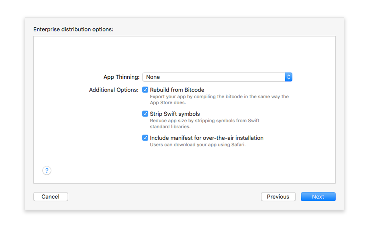
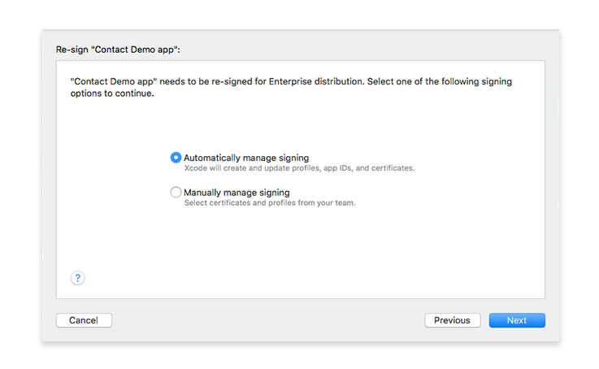

> **目標**
> 
> * 4D for iOS プロジェクトをアーカイブし、エクスポートする
> * .ipaファイルおよびマニフェストファイルを生成する

> **用意するもの**
> 
> * [Apple Enterprise Developer Program](../tutorials/developer-program/register-apple-developer-enterprise-program)
> * セキュアな Webサーバー
> * 57 x 57 px のアイコン
> * 512 x 512 px のアイコン


## ⒈ ⒈ Xcode の設定

Appleによるアカウントの承認後、Xcode を開き、Preferences > Accounts でApple Enterprise Developer アカウントを追加します。

Xcode は、必要な Provisioning Profile と証明書を自動的にインストールします。

## ⒉ ⒉ Team ID を取得する

* Apple Developer アカウントにログインします。 Team ID は Membership にて確認できます。


## ⒊ ⒊ 4D for iOS の設定

* 4D for iOS を起動します。

* セクションタブにて:

    * 一般: Team ID を入力します。

    

    * 公開: プロダクションURL を入力します (運用環境では HTTPS が必須です)。

* ビルドタブにて:
    * ビルドして実行: プロジェクトをビルドします。

## ⒋ 4D for iOS プロジェクトエディターのビルドタブで、プロジェクト > プロジェクトをXcodeで開く... をクリックします。

* 4D for iOS プロジェクトエディターのビルドタブで、**プロジェクト > プロジェクトをXcodeで開く...** をクリックします。


## ⒌ ⒌ Xcode でプロジェクトをアーカイブする

* Xcode でツールバーのシミュレーター選択メニューを開き、**Generic iOS Device** を選択します。


* 次に、上部メニューから Product をクリックし、**Archive** を選択します。



## ⒍ ⒍ プロジェクトをエクスポートする

* アーカイブ処理の最後に、作成したアーカイブを表示する Organizer ウィンドウが表示されます。

* **Export** をクリックします。


## ⒎ ⒎ 配布方法を選択する

* **Enterprise** を選択し、**Next** をクリックします。


## ⒏ ⒏ Enterprise distribution options を選択する

* オプションはすべてチェックしたままでかまいません。



* manifest.plist ファイルは、Xcode に生成させるか、手動で生成するかを選択することができます。

* **Next** をクリックします。

#### manifest とは？

manifest は、XMLベースのプロパティリストであり、以下を含む必要があります:

* **URL**: .ipa ファイルを指す URL。
* **display-image**: ダウンロードおよびインストール時に使用される 57 x 57 px (iPad では 72 x 72 px) の PNG アイコンを指す URL。
* **full-size-image**: iTunes アプリを表す 512 x 512 px の PNG画像を指す URL。
* **bundle-identifier**: アプリの識別子 (文字列)。 アプリの .plistファイルから取得することができます。
* **bundle-version**: アプリの現在のバンドルバージョン (文字列)。 アプリの .plistファイルから取得することができます。
* **title**: アプリ名。

以下は、manifest.plist ファイルの一例です:

```xml
<?xml version="1.0" encoding="UTF-8"?>
<!DOCTYPE plist PUBLIC "-//Apple//DTD PLIST 1.0//EN" "http://www.apple.com/DTDs/PropertyList-1.0.dtd">
<plist version="1.0">
<dict>
    <key>items</key>
    <array>
        <dict>
            <key>assets</key>
            <array>
                <dict>
                    <key>kind</key>
                    <string>software-package</string>
                    <key>url</key>
                    <string>https://...Contact.ipa</string>
                </dict>
                <dict>
                    <key>kind</key>
                    <string>display-image</string>
                    <key>url</key>
                    <string>https://...Contact_icon_57.png</string>
                </dict>
                <dict>
                    <key>kind</key>
                    <string>full-size-image</string>
                    <key>url</key>
                    <string>https://...Contact_icon_512.png</string>
                </dict>
            </array>
            <key>metadata</key>
            <dict>
                <key>bundle-identifier</key>
                <string>com.contactApp.ContactDemoapp</string>
                <key>bundle-version</key>
                <string>1.0</string>
                <key>kind</key>
                <string>software</string>
                <key>title</key>
                <string>Contact Demo app</string>
            </dict>
        </dict>
    </array>
</dict>
</plist>
```


## ⒐ ⒐ Distribution manifest information

* アプリURL とアイコンURL の入力は、Xcode に任せることをお勧めします。 これらの URL は後で変更することも可能です。


* **Next** をクリックします。


## 10. アプリケーションの再署名

* **Automatically manage signing** オプションを選択して、Xcode に処理してもらいましょう。



* **Next** をクリックします。

## 11. app.ipa の内容を確認する

* アプリの識別子と Team ID が正しいかどうかを確認できます。


* **Export** をクリックし、アプリフォルダーの保存場所を選択します。
