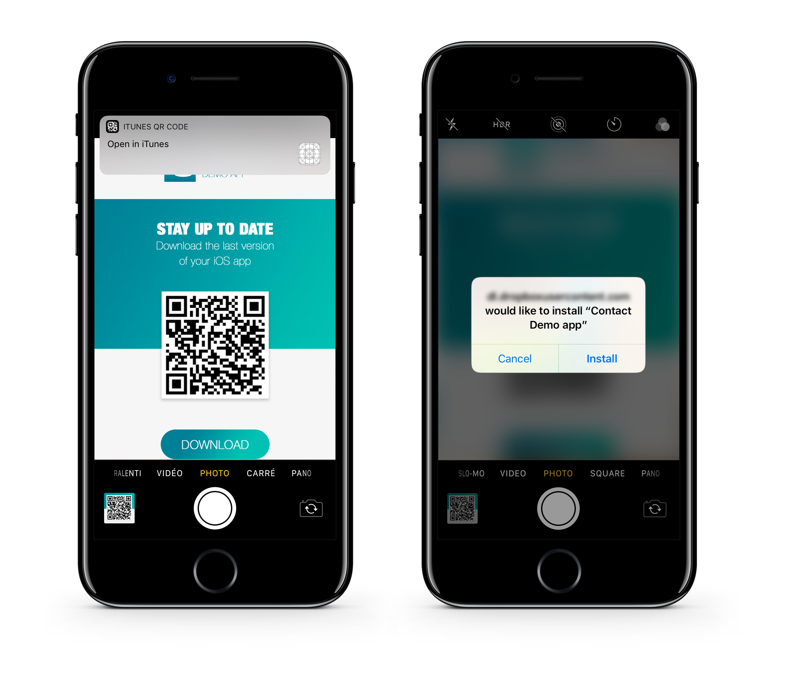
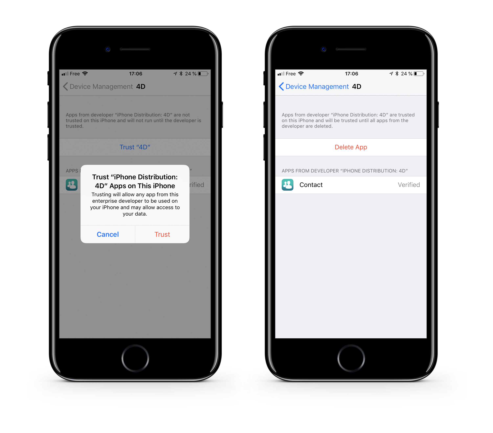

> **目標**
> 
> アプリをセキュアなサーバーにアップロードする。


## ⒈ ⒈ アプリをアップロードする

アプリのファイルをセキュアなサーバーにアップロードします:

* アセット (display-image および full-size-image)
* `manifest.plist` ファイル
* `.ipa` ファイル

アプリの配布は、任意のセキュアなクラウドストレージサービス (Dropbox、Google Drive など) を使用しておこなうことができます。

:::note

アセットと ipa の URL は、`manifest.plist` ファイルで定義されている URL と一致する必要があります。

:::

## ⒉ ⒉ インストール用のリンクを作成する

manifest ファイルの完全な Webアドレスをパラメーターとして、**ITMS Serices link** (iTunes Music Store) を作成します:

```html
itms-services://?action=download-manifest&url=https://mywebserver.com/manifest.plist

```

このリンクは、メールで送信するほか、htmlページへの埋め込み、QRコード内でも使用可能です。

簡単な一例です:


*ここで使用している QRコードは有効ではありません。*

## ⒊ ⒊ iOS にエンタープライズApp をインストールする

* リンクをクリックするか、QRコードをスキャンして、アプリをインストールします。



* 手動でインストールしたエンタープライズApp を初めて開くと、そのアプリの開発者が当該デバイスでは信頼されていないことを示す通知が表示されます。

* このメッセージを無視して、**キャンセル** をクリックします。

* 設定 > 一般 > プロファイル または プロファイル & デバイス管理で、"エンタープライズAPP" の見出しで、開発者のプロファイルが表示されます。


* 開発者プロファイルの名前をタップして、この開発者を信頼するよう設定します。



* その後、アプリを開くことができます。

おめでとうございます... これで、アプリを In-House で配布することができます。
