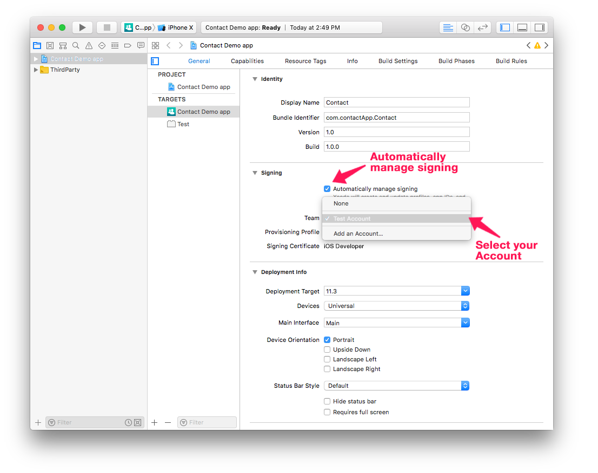

接続されたデバイスにモバイルアプリをインストールし、テストすることができます。

## 要件

Apple Developer Program に加入している必要があります。 目的や好みに応じて、以下のいずれかに入会することができます:

* 無料の Apple Developer Program: テストだけできれば良い場合
* [組織または個人向けの Apple Developer Program](https://developer.apple.com/programs/enroll/): App Store 経由で配布したい場合
* [Apple Enterprise Developer Program](https://developer.apple.com/programs/enterprise/): App Store を経由せずに In-House で運用したい場合

:::note

アプリのインストールを自動化するためには [Apple configurator 2](https://itunes.apple.com/us/app/apple-configurator-2/id1037126344) が macOS にインストールされている必要があります (必須ではありません)

:::

## ⒈ アカウントを作成する

* **Apple ID**: Apple ID を作成します。 まだアカウントを持っていない場合、[ここ](https://appleid.apple.com/account#!&page=create) をクリックしてください。

* **デベロッパーアカウント**: App Store 経由の配布が目的であれば、Apple Developer Program (組織または個人向け)、In-House 運用が目的であれば、Apple Developer Enterprise Program に加入します。

## ⒉ Xcode の設定

* **デベロッパーアカウント**: Xcodeを起動し、アプリケーションメニュー ＞ Preferences ＞ Accounts を選択して Apple ID を追加します。 

## ⒊ Team ID を取得する

* 無料の Apple Developer Program を使用しているのであれば [⒋](#無料アカウントの-team-id) に進みます。
* [組織](../tutorials/developer-program/register-apple-developer-program-organization) および [個人向けの Apple Developer Program](../tutorials/developer-program/register-apple-developer-program-individual) または [Apple Enterprise Developer Program](../tutorials/developer-program/register-apple-developer-enterprise-program) のアカウントを使用しているのであれば [⒌](#有料アカウントの-team-id) に進みます。

## ⒋ 無料アカウントの Team ID

### Provisioning Profile および証明書は、Xcode が自動的に生成します。

* プロジェクトエディターの画面をビルドタブに切り替えて、プロジェクトをXcodeで開く... メニューを選択します。

* 下図のように **Automatically manage signing** オプションがチェックされていることを確認してください。Teamドロップダウンリストをクリックし、ここで追加したアカウントを選択します。

* デバイスを USBケーブルでコンピューターに接続し、Xcode のツールバーにあるシミュレーター選択に使うメニュー (図を参照) をクリックすると、接続中のデバイスも表示されます。これを選択します。

* Xcode は、アプリをビルドするために必要な Provisioning Profile と証明書を自動的に生成します。

### 無料のアカウントを使用して Xcode でプロジェクトをビルドする

* あとは、Xcode の実行ボタン (図を参照) をクリックするだけです！

## ⒌ 有料アカウントの Team ID

* **Team ID**: Apple Developer にログインします。Membership ページに Team ID が表示されているはずです。 

* **4D for iOS**: プロジェクトエディターの画面をセクションタブに切り替えて、一般ページの部署名に Team ID を入力します。 

* ⒍ に進んでプロジェクトのアプリをデバイスにインストールします。

## ⒍ インストール

:::info

この手順では、[Apple Device Developer Mode](../../getting-started/requirements.md#apple-device-developer-mode) が有効にされている必要があります。

:::

### Apple Configurator 2 で自動的にインストールする

* アプリが出来がったら、プロジェクトエディターの画面をビルドタブに切り替えます。
* デバイスを USBケーブルでコンピューターに接続します。
* ビルドタブの **インストール** ボタンをクリックします。

* デバイス上にアプリのインストールが開始するはずです！

### Xcode でインストールする

* アプリが出来がったら、プロジェクトエディターの画面をビルドタブに切り替えます。
* デバイスを USBケーブルでコンピューターに接続します。
* ビルドタブの **インストール** ボタンをクリックします。

* プロジェクトのアーカイブが作成されます。

* アーカイブの作成に成功してダイアログが表示されたら OK をクリックし、アーカイブの場所を Finder で開きます。

* Xcode を起動し、アプリケーションメニュー ＞ Window ＞ Devices and Simulators を選択して、生成された ipaファイルを Installed Apps セクションにドラッグ＆ドロップします。

* デバイス上にアプリのインストールが開始するはずです！

