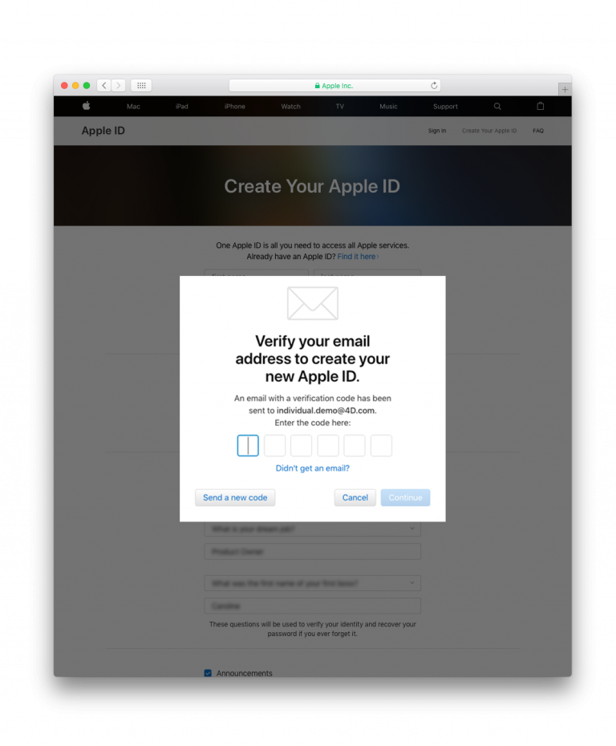

> **目標**
> 
> 適切な Apple Developer Program を選択します。

**iOSアプリを配布** するには、有効な Apple Developer アカウントが必要です。 Apple は 2つのデベロッパープログラムを提供しています:

* **[Apple Developer Program](https://developer.apple.com/programs/)** **組織向け** または **個人向け** ($99/年) - **App Store** でアプリを配布することができます。
* **[Apple Developer Enterprise Program](https://developer.apple.com/programs/enterprise/)** (299ドル/年) - **自社の In-House アプリ** を開発し、従業員に配布するためのリソースのみが提供されます。

**テスト用** には **無料の Apple Developer Program** (*Apple ID でサインイン*、下記参照) が使用できます。

デベロッパーメンバーシップのレベル別比較表は以下のとおりです:

:::info

**Apple Developer Program** に登録するには、組織のドメイン名を使用したメールアドレスと Apple ID が関連付けられている必要があります。

:::

:::info Free Apple Developer account

Apple Developer Program に無料で参加する場合は、無料の Apple ID を作成し、その ID でサインインするだけです。 その場合は、ステップ 1 と 2 だけをおこない、Xcode > Preferences > Accounts から Apple ID を追加してサインインします。
:::

## ⒈ Apple ID を作成する

すでに Apple ID を持っているのであれば、[2.](#-d-u-n-s-番号の取得) に進んでください。

[Apple ID 作成ページ](https://appleid.apple.com/)にアクセスします。

* 必要な情報をフォームに入力し、セキュリティの質問に答えます。
* Apple から確認メールが送られます。
* メールに記載されている確認コードを入力して、アカウントの作成を完了します。

## ⒉ D-U-N-S 番号の取得

:::info

**個人向けの Apple Developer Program** の場合、このステップは必要はありません。

:::

* すでに D-U-N-S 番号を持っているのであれば、[3.](#-登録する) に進んでください。

D-U-N-S番号の申請は [こちら](https://developer.apple.com/enroll/duns-lookup/#/search)。

* フォームに記入します。
* **続ける** をクリックします。
* D-U-N-S 番号はメールでご確認ください。

## ⒊ ⒊ 登録する

**Apple Developer Enterprise Program** および **組織向け Apple Developer Program** については、[こちら](https://developer.apple.com/programs/enterprise/enroll/) でデベロッパー登録することができます。

**個人向けの Apple Developer Program** については、[こちらで](https://developer.apple.com/account/) デベロッパー登録することができます。

その後、*Apple Developer Agreement* を読み、同意して、**Submit** をクリックします。

## ⒋ 参加する

:::info

**Apple Developer Enterprise Program** の場合、このステップは必要はありません。

:::

**組織向けの Apple Developer Program** の場合、[こちらから](https://developer.apple.com/enroll/enterprise/) Apple Developer Program に参加することができます。

**個人向けの Apple Developer Program** の場合は、ページの下にある **Join the Apple Developer Program** をクリックします。

## ⒌ 入会する

* **Start your Enrollment** ボタンをクリックします。
* Entity Type ドロップダウンリストから選択します:
    - **Company / Organization** (Apple Developer Enterprise Program および組織向けの Apple Developer Program の場合).
    - **Individuals / Sole Proprietor / Single Person Business** (個人向けの Apple Developer Program の場合)。

* フォームに記入し、**Continue** をクリックします。

## ⒍ Apple による承認

:::info

このステップは、**Apple Developer Enterprise Program** の場合のみ必要です。

:::

* Apple は内部の承認プロセスを採用しており、通常は最大 6営業日かかります。 入会リクエストを受け取ると Apple は、お客様が Apple Developer Program の法的な契約によって組織を拘束する権限を有していることを確認します。
* Apple は通常、メインコンタクトが実在し、Apple Developer Enterprise Program の登録を要求していることを確認するために電話をかけます。
* その後、入会手続きを完了するための案内メールが届きます。

## ⒎ 購入手続きを完了する

* 入会申し込みが受理されると、支払いに進むことができます。

* 購入が完了すると、デベロッパープログラムへの加入を確認するメールが届きます。

おつかれさまでした！ これで、アプリの運用と公開の準備が整いました！
