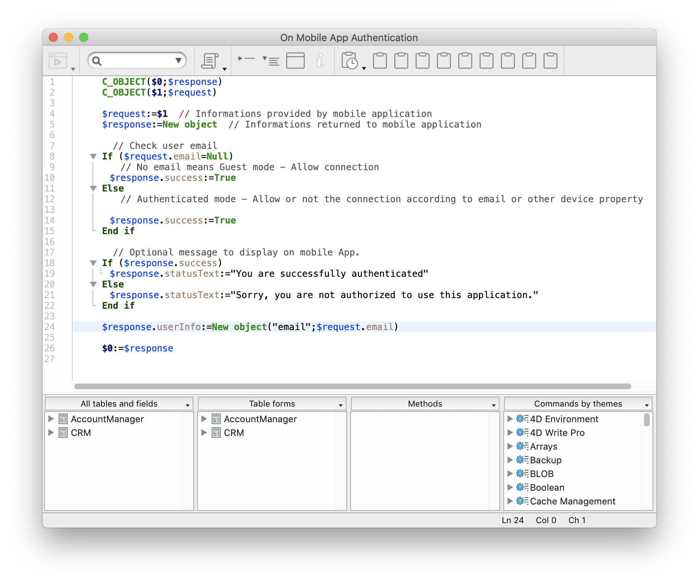

このチュートリアルでは、[**フィルタークエリ**](../../project-definition/data.md#フィルタークエリ) を作成し、モバイルアプリに特定の情報だけが表示されるようにします。

目標は、営業担当者がアプリにログインすれば、担当顧客のうち商談ステータスが *進行中* の案件だけが表示されるようにすることです。

はじめに、*進行中 (In Progress)* の商談だけが表示されるよう、データセクションで **基本的なフィルタークエリ** を設定します。 その後、営業担当者のメールアドレスも条件に含まれるよう、**ユーザー情報に基づくフィルタークエリ** を設定します。

## ⒈ スタータープロジェクトをダウンロード

はじめに、**スタータープロジェクト** をダウンロードします。 **4DforiOSQueries.4dbase** サンプルデータベースには、すぐに使えるモバイルアプリプロジェクトが含まれています。

<div className="center-button">
<a className="button button--primary"
href="https://github.com/4d-go-mobile/tutorial-RestrictedQueries/releases/latest/download/tutorial-RestrictedQueries.zip">スタータープロジェクト</a>
</div>

データベースに含まれているもの:

* **CRM** テーブル: iOSアプリに表示させたいデータが登録されています。
* **AccountManager** テーブル: 営業担当者たちの基本情報 (氏名やメールアドレス) が登録されています。


早速、最初のフィルタークエリを設定してみましょう！

ファイルメニューから **開く** ＞ **モバイルプロジェクト...** を選択し、**CRM app** プロジェクトを開きます。


## フィルタークエリの定義

ログイン画面には営業担当者のメールアドレス "michelle.simpson@mail.com" を入力します。 **営業担当者全員の商談がステータスに関係なく** (*済 (Closed)* と *進行中 (In Progress)* の両方が) 表示されることに注目してください。


前述のように、モバイルアプリにメールアドレスでログインすれば、自分が担当している商談でステータスが *進行中* のものだけを表示するよう、データをフィルターしたいと考えています。 下記の要領で実現することができます。

* **データ** セクションに移動します。
* **フィルタークエリ** 欄をクリックすると、**フィールド・比較演算子・演算子ボタン** が表示されます。
* **フィールド** ボタンをクリックし、**Status** フィールドを選択します。
* **比較演算子** ボタンをクリックし、**等しい** を選択します。
* *進行中* の商談を表示したいので、**&apos;In progress&apos;**と入力します。
* **検証** ボタンをクリックし、フィルターを確定します。 これを忘れてしまうと、アプリがビルドできません。

下図のようになっていることを確認してください。


> **注記**
> 
> * フィルタークエリが設定されているテーブルの横には **フィルター (漏斗)** アイコンが表示されます。
> * 今回のような単純なフィルターの場合、**このテーブルのデータをアプリケーションに埋め込み** チェックボックスによって、データをアプリに埋め込むか、それともログイン後にロードさせるかを選ぶことができます。
> * ビルドを実行すると、計算された **データサイズ** が画面上で確認できるようになります。

アプリをビルドして実行しましょう。 メールアドレス "michelle.simpson@mail.com" を入力してログインすると、今度は *進行中* の商談のみがシミュレーターに表示されます。


惜しいですね！ ここで実現したかったのは、ログインしたユーザーが担当している *進行中* の商談を表示することでした。これには、フィルタークエリにもう少し条件を加える必要があります。


## ユーザー情報に基づくクエリ

それでは、[ユーザー情報](../../project-definition/data.md#ユーザー情報を使用したフィルタークエリ) (営業担当者のメールアドレス) に応じて、アプリのコンテンツをさらにフィルターしましょう。

* **データ** セクションに移動します。
* **フィルタークエリ** 欄をクリックすると、**フィールド・比較演算子・演算子ボタン** が表示されます。
* **演算子** ボタンをクリックし、**AND** を選択します。
* データベースメソッドの中で参照したいユーザー情報を入力します。 ここでは、**:email** です。
* **検証** ボタンをクリックして、クエリを検証します。 これを忘れてしまうと，アプリがビルドできません。


```4d
Status = 'In Progress' & manager.Email = :email 
```

このフィルタークエリを通過できるのは、ステータスが **&apos;In Progress&apos;** であり、かつ、**営業担当者のメールアドレス** (*Ｎ対１リレーション* により、AccountManagerテーブルから取得) が合致するデータだけです。

> **注記**
> 
> * ユーザー情報に基づくクエリが設定されているテーブルの横には **ユーザーアイコン** が表示されます。
> * ユーザー情報に基づくフィルタークエリを入力して確定したのであれば、[`On Mobile app Authentication`](../../4d/on-mobile-app-authentication.md) データベースメソッドを編集しなければなりません。 **認証メソッドを編集… ** ボタンをクリックすると、データベースメソッドの編集ウィンドウが開きます。

データベースメソッドに以下のコードを追加します。

```4d
$response.userInfo:=New object("email";$request.email)
```

これで、表示できるデータを判定するための条件として、営業担当者のログインメールアドレスが参照できるようになります。



アプリをビルドし、メールアドレスに "michelle.simpson@mail.com"  と入力してログインしてみてください。 Michelle Simpsonさんの *"In progress (進行中)"* の商談だけが表示されます。


