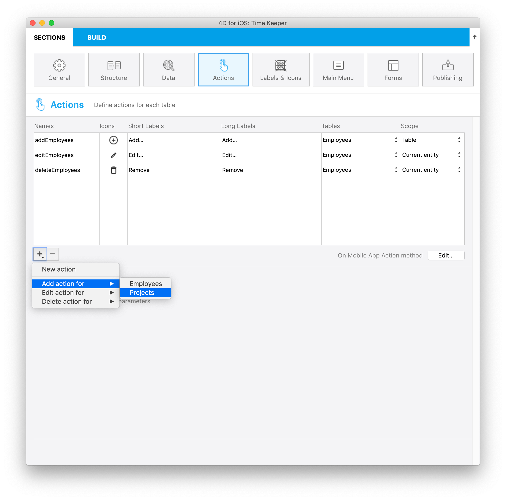

今度は、**特定の担当者 (1側のレコード) のためにタスク (N側のレコード) を新規作成する** 場合を考えましょう。

**親エンティティ** さえ特定できていれば、子エンティティを作成するのは少しも難しいことはではありません！

スタータープロジェクトをダウンロードしてください:

<div className="center-button">
<a className="button button--primary"
href="https://github.com/4d-go-mobile/tutorial-RelationsActions/archive/6c649733f5efd3c799e4e04c05a85e17eeadf7f0.zip">スタータープロジェクト</a>
</div>

## addProject アクションを作成する

* プロジェクトエディターを開いてアクションセクションに移動します。

* `addProject` アクションを追加します。




## On Mobile App Action データベースメソッド

あとは **On Mobile App Action**データベースメソッド内で下記のように **addProject** アクションの動作を定義するだけです:

```4d
: ($request.action="addProjects")

$o:=New object(\
"dataClass";$context.dataClass;\
"parent";$context.parent;\
"entity";$context.entity;\
"parameters";$parameters)

$result:=addProject ($o)


```

## addProject プロジェクトメソッド


**addProject**メソッドには以下のコードを入力します:

```4d
C_OBJECT($0)
C_OBJECT($1)

C_OBJECT($entity;$in;$out)

$in:=$1
$out:=New object("success";False)

If ($in.dataClass#Null)

    $entity:=ds[$in.dataClass].new()  // エンティティを作成します

    For each ($key;$in.parameters)

        $entity[$key]:=$in.parameters[$key]

    End for each 

    $primaryKey:=$in.parent.primaryKey   // 親エンティティのプライマリーキーを取得します

    $parent:=ds[$in.parent.dataClass].get($primaryKey)

  $inverseRelationName:=$in.entity.relationName   // 親エンティティのリレーション名を取得します

    $entity[$inverseRelationName]:=$parent

    $status:=$entity.save()  // エンティティを保存します

    $out.success:=True  // モバイルアプリにアクションの成功を通知します

    $out.dataSynchro:=True  // モバイルアプリにセレクションのリフレッシュするよう通知します

    $out.statusText:="Task added"

    $out.close:=True

Else 

    $out.errors:=New collection("No Selection")

End if 

$0:=$out

```

親エンティティを使用することで、担当者にタスクを追加できるようになりました！

完成したプロジェクトをダウンロード

<div className="center-button">
<a className="button button--primary"
href="https://github.com/4d-go-mobile/tutorial-RelationsActions/releases/latest/download/tutorial-RelationsActions.zip">ダウンロード</a>
</div>