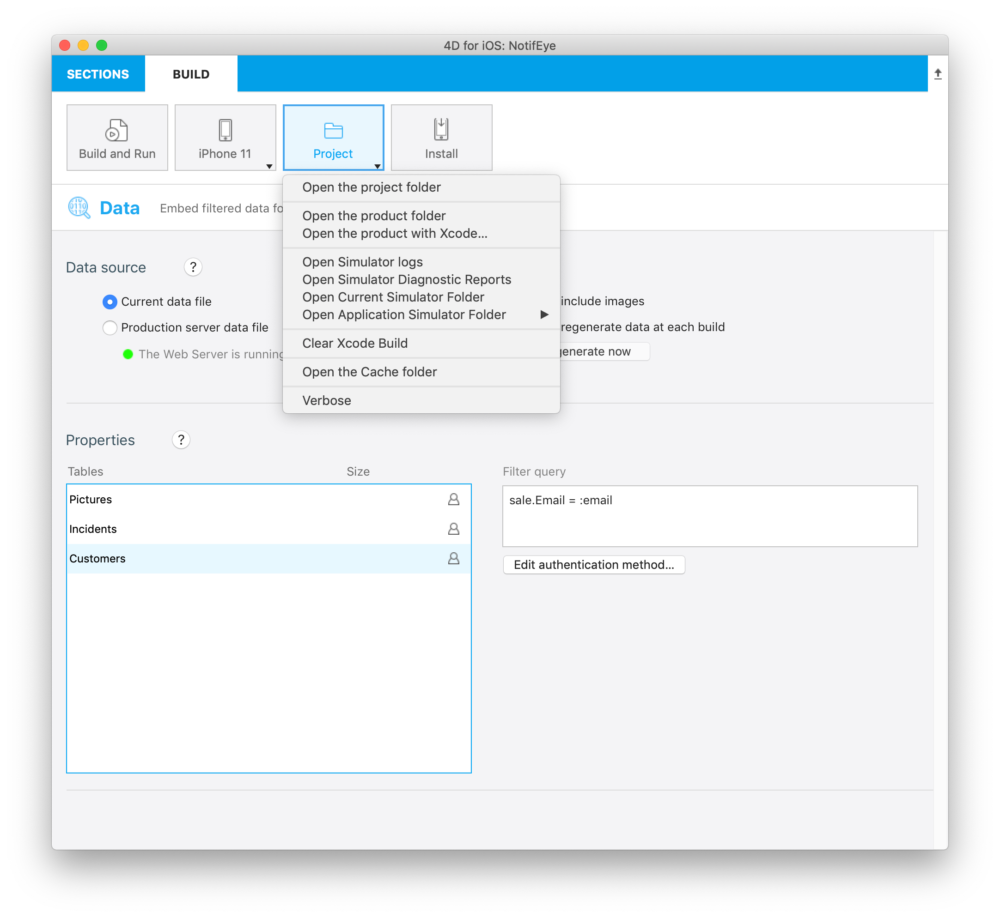

Pode acontecer que tenha problemas usando o editor de projeto 4D móvel em sua aplicação iOS ou android. Ler os arquivos de histórico oferece informação útil nesses casos.

Para acessar arquivos de histórico, aperte a tecla **Alt** e selecione **Project** no painel BUILD do editor de projetos:

Itens de menu debug adicionais aparecem para o [simulador atualmente selecionado](../project-definition/build-panel#using-the-simulator):

* **Open Simulator logs**: aqui pode encontrar a pasta `CrashReporter MobileInstallation`

* **Abra o Relatórios de Diagnóstico de Simulador**

* **Abra a pasta de simulador atual**

* **Open Application Simulator Folder**: abre um submenu para cada aplicação

## Debug your app (Android)

Once your app is complete and the simulator’s result is satisfactory, you may want to test it on your smartphone.

To do so, only one action is needed [on the smartphone](from-your-android-device.md) and another one in the project editor.

In the Project editor, make sure you have plugged your smartphone, then select your physical device from the list and click on the “Build and Run" button.

4D shall then build the application and install it on the connected device.

For Windows developers, make sure you have installed [a USB driver](https://developer.android.com/studio/run/oem-usb) corresponding to your device.

