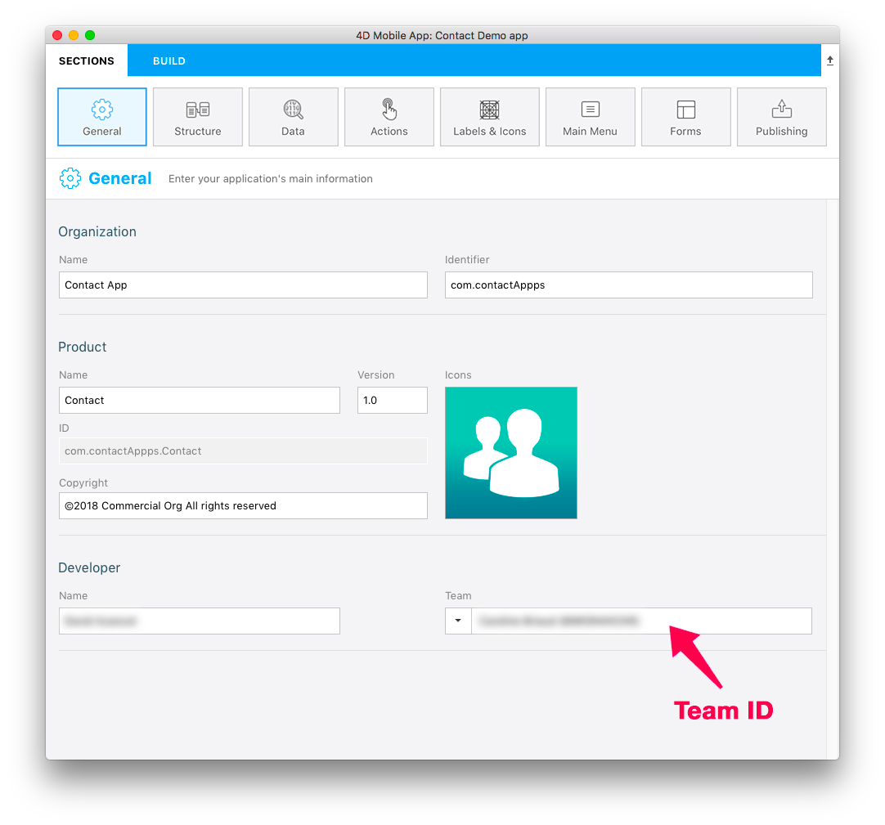
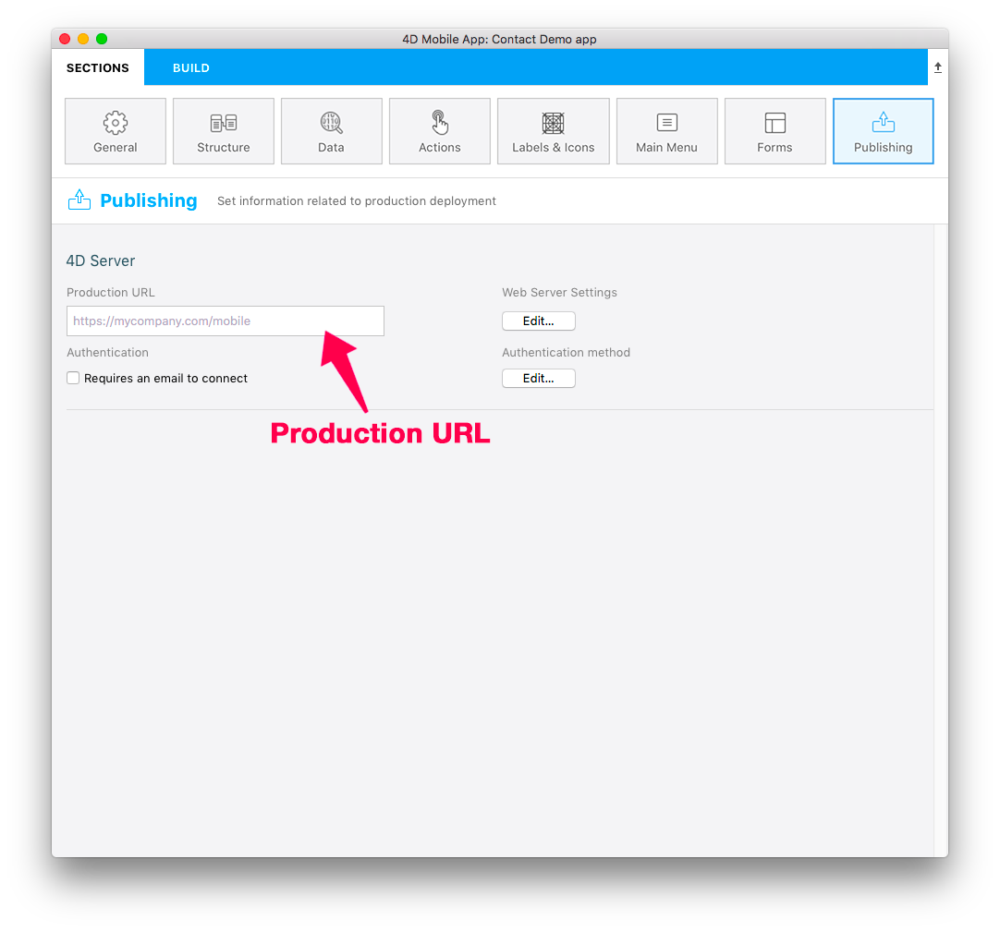
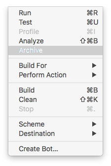

> **OBJETIVOS**
> 
> Arquivar e publicar seu projeto para o App Store Connect.

## PASSO 1. Configuração Xcode
* Se escolher uma Conta de Desenvolvedor Apple como um indivíduo, sua conta está disponível imediatamente.
* Se escolher uma Conta Desenvolvedor Apple como uma organização, tem que esperar pela validação Apple.
* Quando puder acessar sua conta, adicione-a a Xcode em Preferências > Accounts.
* Xcode vai instalar automaticamente o provisionamento e certificados necessários.

## PASSO 2. Obtenha uma ID de Equipe

* Registre-se na sua Conta de Desenvolvedor Apple. Lá pode achar sua ID de membro de um Time ou Equipe.

## PASSO 3. Configure 4D for iOS

* Abra 4D for iOS
* Na aba SEÇÕES:

**Geral: Entre sua Team ID**

**Publicação: introduza sua URL de produção**

(HTTPS é obrigatório para o lançamento).

* Na aba BUILD:

**Criar e executar: crie seu projeto**

## PASSO 4. Abra seu projeto com Xcode

* Desde a aba BUILD do editor de projetos de 4D for iOS, clique no Projeto > Abrir o projeto com Xcode

## PASSO 5. Arquive seu projeto com Xcode

* Desde Xcode, vá ao menu do simulador e selecione **Generic iOS Device**.

* Desde o menu, clique em  Product e selecione **Archive**

## PASSO 6. Valide seu projeto

* No final do processo de arquivo, aparece a janela do Organizador com o arquivo que acaba de criar.

* clique no botão **Validate** para iniciar o processo de validação.

* O primeiro passo é selecionar as opções de distribuição do App Store.

* Então deve voltar a assinar sua aplicação. Deixe que Xcode administre isso marcando a opção **Automaticamente gerencie assinaturas**.

* Verifique o conteúdo de sua aplicação.

* Se seu projeto passar o processo de validação, vai ver esta mensagem:

Se um erro acontecer, uma mensagem será exibida. Estes erros devem ser resolvidos antes de tentar o processo de validação novamente.

* Clique **Done**. Isso vai lhe devolver para a janela de Organizador.

## PASSO 7. Suba para a App Store

Quando o processo de validação tenha terminado, está pronto para adicionar seu app para a App Store.

* Clique o botão **Upload to App Store**.

* Quando seu projeto tiver sido atualizado com sucesso, verá esta janela:

## PASSO 8. Selecione a versão destinada à App Store

* Em App Store Connect > App Store > iOS App, selecione seu app e clique no botão **+** que aparece na seção Build

* Selecione a versão que queira enviar e clique em **Done**.

* Finalmente, clique no botão **Submit for Review**.

## PASSO 9. Envie para Revisão

* O passo final para enviar sua aplicação para revisão é responder algumas perguntas rápidas sobre sua aplicação.

* Quando tiver terminado com as perguntas, clique **Submit**.

* O tempo médio de revisão da App Store é de apenas dois dias!
