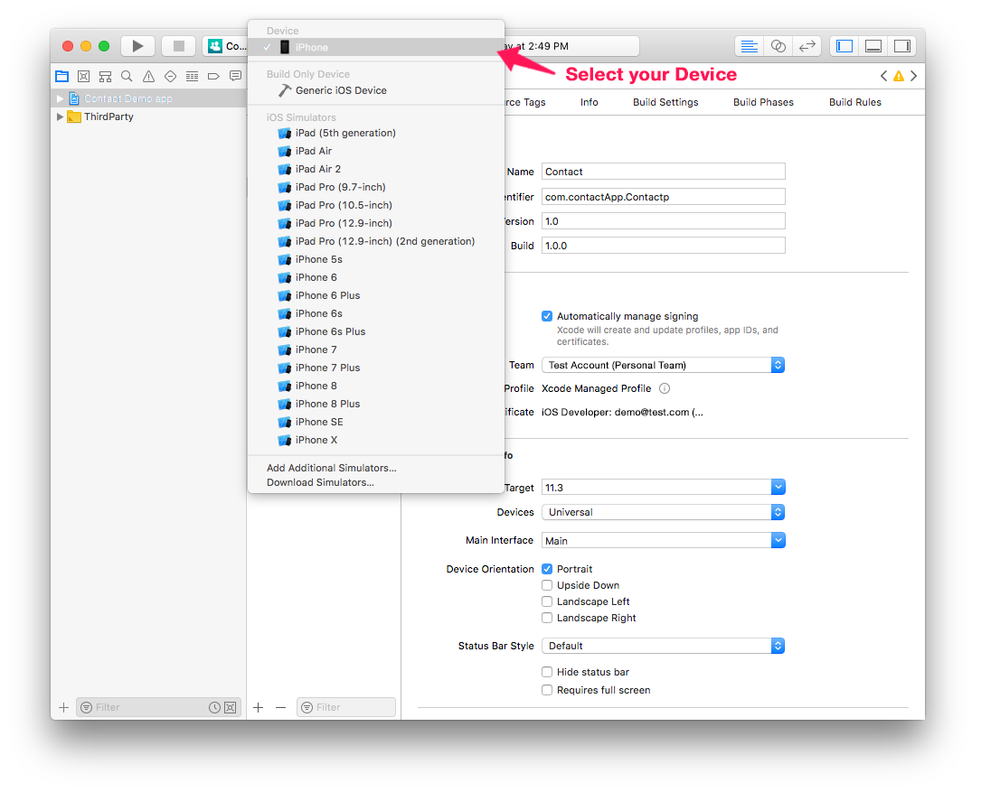
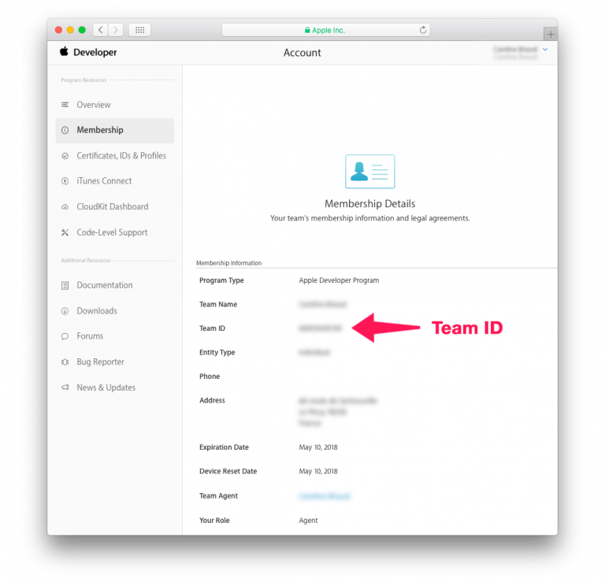

You can install and test your mobile application on a connected device.

## Requisitos

You need to subscribe to an Apple Developer Program. Depending on your objectives and preferences, you can choose to enroll in one of the following:

* [Free Apple Developer Program]`(free-developer-account.html)-- to add`: For testing only
* [Apple Developer Program for organization](../tutorials/developer-program/register-apple-developer-program-organization) or [individual](../tutorials/developer-program/register-apple-developer-program-individual): For an App Store Deployment
* [Apple Enterprise Developer Program](../tutorials/developer-program/register-apple-developer-enterprise-program): To deploy your app in-house

:::nota

You need [Apple configurator 2](https://itunes.apple.com/us/app/apple-configurator-2/id1037126344) installed on your Mac to automate app installation (optional).

:::

## PASSO 1. Account creation

* **Apple ID**: Crie seu identificador Apple. Se ainda não tiver uma, clique em [here](https://appleid.apple.com/account#!&page=create).

* **Developer Account**: Escolha um programa Apple Developer (para empresas ou indivíduos) para lançamento na App Store ou no Programa Apple Developer Enterprise (para lançamentos in-house).

## PASSO 2. Configuração Xcode

* **Developer Account**: Em Xcode > Preferences > Accounts, adicione sua Apple ID. 

## PASSO 3. Obtenha uma ID de Equipe

* If your are using a [Free Apple Developer Program]`(free-developer-account.html--to addd)` go to [step 4](#step-4-team-id-for-free-account).
* If your are using an [Apple Developer Program for organization](../tutorials/developer-program/register-apple-developer-program-organization), [individual](../tutorials/developer-program/register-apple-developer-program-individual) or an [Apple Enterprise Developer Program](../tutorials/developer-program/register-apple-developer-enterprise-program) go to [step 5](#step-5-team-id-for-paid-subscription-account).

## PASSO 4. Team ID for Free account

### Deixe que Xcode gere seu perfil provisório e certificado

* Abra seu projeto atual da aba BUILD

* Verify that the **Automatically manage signing** option is checked and select the account you added [here]`(free-developer-account.html)` from the Team dropdown list.

* Conecte seu aparelho para seu computador e selecione-o do menu superior em Xcode.

* Xcode gera automaticamente os perfis e certificados que precisa para construir seu app.

### Construa seu projeto no Xcode usando sua Conta Gratuita

* Aperte o botão Build and Run de Xcode!

## PASSO 5. Team ID for paid subscription account

* **Team ID**: Clique em Developer Account > Membership e obtenha sua Team ID. 

* **4D for iOS**: Lance 4D for iOS em Sections > General e introduza sua Team ID. 

* Vá para o Passo 6 para rodar seu projeto no aparelho.

## PASSO 6. Installation

### Instale automaticamente com Apple Configurator 2

* Quando seu app estiver pronto, abra a aba BUILD.
* Conecte seu aparelho para seu computador com um cabo USB.
* Na aba BUILD, clique em **Install**.

* O app está sendo instalado em seu aparelho!

### Instale manualmente usando Xcode

* Quando seu app estiver pronto, abra a aba BUILD.
* Conecte seu aparelho para seu computador com um cabo USB.
* Na aba BUILD, clique em **Install**.

* Um arquivo de seu projeto foi criado

* Revela o arquivo gerado em Finder

* Abra Xcode e vá para Menu > Window > Devices e Simulator e arraste o arquivo ipa gerado e solte na seção Installed Apps.

* The app is now being installed on your device.

