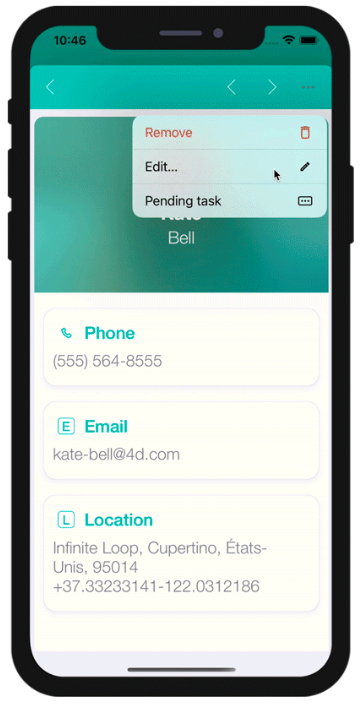

The 4D Mobile Project editor allows you to create actions to include in your mobile app.

You can use [preset actions](#preset-actions) or [custom actions](../tutorials/actions/define-first-action.md) and [define their parameters](#add-parameters-to-your-actions).

On the 4D side, you can execute 4D code in the [On Mobile App Action](../4d/on-mobile-app-action.md) database method.

Actions are automatically available in the [mobile interface](#mobile-app-side).


## No Editor de Projetos

### Crie sua ação

Pode criar uma nova ação clicando no botão +  no fundo da tabela Actions. Uma nova linha vai aparecer na tabela Actions.

Depois precisa definir o abaixo:

* **Names:** The action name to use in the [On Mobile App Action](../4d/on-mobile-app-action.md) database method to trigger your 4D code.
* **Icons:** O ícone a escolher de sua biblioteca ícone. You can also [add your own icon](./labels-and-icons.md#adding-custom-icons).
* **Short and long Labels:** As etiquetas para as ações para exibir em seu app.
* **Table:** A tabela na qual quer aplicar a ação.
* **Scope:** Onde usar a ação, uma **entidade** ou uma **tabela**.


:::note note

You can sort the **Names** with a drag-and-drop. This operation will set the order in which they will appear in the app's menu.

:::

### Adicione parâmetros para sua ação

Você pode adicionar **parâmetros ação** e **editar** dados diretamente de seu app.

Para cada parâmetro, pode editar as propriedades abaixo:

* Nome
* Etiqueta longa
* Etiqueta curta
* [Input control](#built-in-input-controls)
* Mandatory option
* Valor padrão

Depending on the selected input control, you can define the following additional properties:

* Input constraints (minimum or maximum values)
* Placeholder (valores provisórios)
* [Data Source](#dynamic-choice-lists)

:::info

By default, the Input Control menu displays **selectionControls**. This is a filter for selection controls, depending on their "format" property. To select a format, you must have [created](#selection-input-controls) at least one selection input control with this format.

:::


Você é livre para mudar a ordem dos parâmetros usando arrastar e soltar.


## Ações predefinidas

Os projetos móveis incluem as ações predefinidas abaixo para gerenciar o conteúdo de seu app:

* Ação de Adicionar
* Ação de Editar
* Ação de eliminar
* Partilhar
* Ordenar
* Open URL

### Adicionar ação

Projetos 4D móveis torna o processo de criação **Adicionar Ações** bem simples.

A única coisa que precisa fazer é selecionar a opção **Ação adicionar** acessível a partir do  **+ botão** no fundo da tabela Ações.


Depois **selecione a tabela** que quiser linkar à ação adicionar.

Isso vai **criar automaticamente** todos os parâmetros para você no Editor de Projeto. No app gerado, isso permite que edite cada valor de campo.

Para este tipo de ação, vai ver que todas as **propriedades** já estão preenchidas para sua conveniência no lado direito da lista de parâmetros.


### Ação de Edição

A criação de **Ações Editar** segue o mesmo processo que as Ações Adicionar, com exceção que não é possível definir valores predeterminados a partir da seção Ações.


### Ação de eliminação

A criação de **ações de eliminação ** segue o mesmo processo que as ações de edição. A única diferença é que essa ação permite que remova uma entidade.

Para criar uma ação de eliminação, selecione a opção **Ação de eliminação para**, acessível desde o **botão + ** na parte inferior da tabela Ações.

Este tipo de ação deve ser utilizado com precaução.


### Ação Partilhar

Selecionar **Ação Partilhar, ** permite a seus usuários móveis partilhar conteúdo com outros usuários. Só precisa selecionar o escopo:

- **entidade**: para partilhar conteúdo com um formulário detalhada
- **tabela**: para partilhar um formulário lista

Ver a página [Deep Linking](../special-features/deep-linking.md) para saber mais.

### Ação Ordenar

**Ações Ordenar** são úteis para:

- defina uma ordenação padrão para os formulários lista da tabela
- permitir aos usuários móveis escolher a ordem de classificação da lista

Quando criar uma ação ordenação para uma tabela, precisa selecionar o primeiro campo no qual a ordenação será feita:


O campo é adicionado à lista de critérios de ordenação. Uma ordem ascendente é definida como o normal mas pode ser mudada usando o menu **Ordem de clasificação**.

Pode ordenar entidades de ordenação em mais de um campo. Cada campo que ordenar é denominado como um nível de ordenação. Por exemplo, os resultados de uma ordenação ascendente de dois níveiss dos campos `lastName` e `firstName` produziria uma lista como esta:

```4d
Aardvark, Anthony Aardvark, Artemis Aardvark, Arthur
...
Zygote, Elena Zymosian, Elmer
```

Para adicionar mais níveis na lista de critérios de ordenação, selecione o botão **+** abaixo da lista e configure cada nível:


#### Menu de ordenação na aplicação móvel

Quando definir mais que uma ação de ordenação para uma tabela, usuários móveis automaticamente se beneficiam de um menu **de ordenação**. Contém todas as ações predefinidas de ordenação:


> Quando só se define uma ação de ordenação para uma tabela, o menu **ordenação** não é mostrada na parte da aplicação móvel.

### Open URL action

The **Open URL action** allows your mobile users to open an url from their mobile app. This action will display a web page served by 4D Server in a web area from within the mobile app.

When you select this action, you have to define the path that will be opened:


You can only define a path starting with `/`, i.e. relative to the [current 4D web folder](https://developer.4d.com/docs/WebServer/webServerConfig.html#root-folder).

This action can be set for any table and any scope (Table or Current entity). Like other actions, the Open URL action will be automatically available in the [mobile app interface](#mobile-app-side) (short or long label).

:::nota

To close the web page and get back to the mobile app interface, use the `$4d.mobile.dismiss()` function from within the page (see below).

:::

#### Web Server Side

The request sent to the server contains the context of the app (current entity and/or dataclass) in the `X-QMobile-Context` header. The content of this header is formatted in JSON and encoded in base64.

:::dica

You can get the context information already decoded as object using the [**4D Mobile App Server**](https://github.com/4d/4D-Mobile-App-Server#4d-mobile-app-server) component and its [WebHandler class](https://github.com/4d/4D-Mobile-App-Server/blob/main/Documentation/Classes/WebHandler.md).

:::

Context information can be processed in the web page to return through standard 4D web server features:

- [.shtml template pages](https://developer.4d.com/docs/WebServer/templates.html)
- [On Web Connection database method](https://developer.4d.com/docs/WebServer/httpRequests.html#on-web-connection).


#### Web Area Side

For your page to interact with the mobile app, some javascript code is automatically provided in the `$4d.mobile` object. This object contains the following properties and functions:

| Property   |                  |                               | Type     | Descrição                                                                                                                                                        |
| ---------- | ---------------- | ----------------------------- | -------- | ---------------------------------------------------------------------------------------------------------------------------------------------------------------- |
| $4d.mobile | .action          | .name                         | string   | name of the action                                                                                                                                               |
|            |                  | .label                        | string   | label of the action                                                                                                                                              |
|            |                  | .shortlabel                   | string   | short label of the action                                                                                                                                        |
|            | .dismiss()       |                               | Function | closes the native web view                                                                                                                                       |
|            | .status(message) |                               | Function | shows a message in native app for the user <br/>message: string<br/>message: object with "message" (or "statusText") and "success" (or "level") keys |
|            | .logger          | .log(level, message : string) | Function | shows a message in native app for the developer                                                                                                                  |
|            |                  | .info(message : string)       | Function | shows a message in native app for the developer                                                                                                                  |
|            |                  | .info(message : string)       | Function | shows a message in native app for the developer                                                                                                                  |
|            |                  | .warning(message : string)    | Function | shows a message in native app for the developer                                                                                                                  |
|            |                  | .error(message : string)      | Function | shows a message in native app for the developer                                                                                                                  |
|            |                  | .debug(message : string)      | Function | shows a message in native app for the developer                                                                                                                  |
|            |                  | .verbose(message : string)    | Function | shows a message in native app for the developer                                                                                                                  |


:::info See also

Blog post: [4D for Mobile : Display Web Pages in your Mobile Apps](https://blog.4d.com/4d-for-mobile-di…your-mobile-apps/)

:::


### On Mobile App Action

The [`On Mobile App Action`](../4d/on-mobile-app-action.md) database method is available to call all of your 4D methods.

After creating all of your actions, just click on the **Create** button from the Actions table to automatically generate a *Case of* code block that includes all your action names in the *On Mobile App Action* method.

:::nota notas

- You can refresh the selection after executing an action using `$result.dataSynchro:=True`.
- You can notify the app user when action has been executed using `$result.statusText:="Message you want to display"`.
- You can also decide to force close the Edition form using `$result.close:=True`.

:::


## Built-in input controls

Input controls define how information will be entered by the user in the mobile app, and also how it will be rendered. The Project editor provides basic input controls for regular data types. These controls are built-in and can be directly selected in the "Input Control" menu.

You can also define [custom input controls](#custom-input-controls) (see below).

Available built-in input controls depend on the data type:

| Data type | Input controls       | Descrição                                                                                                                        |
| --------- | -------------------- | -------------------------------------------------------------------------------------------------------------------------------- |
| Texto     | Default              | Colocar em maiúscula a primeira letra da string                                                                                  |
|           | Mail Address         | Optimized keyboard for email entry                                                                                               |
|           | Número de telefone   | Keypad for entering telephone numbers                                                                                            |
|           | Conta                | Optimized keyboard for username entry                                                                                            |
|           | Senha                | Otimizado para manejar senhas                                                                                                    |
|           | URL                  | Optimized keyboard for URL entry                                                                                                 |
|           | Código postal CEP    | Optimized keyboard for zip code entry                                                                                            |
|           | Área de texto        | Inclui linhas múltiplas de texto em um único campo                                                                               |
|           | Código de barras     | Extrair valor associado ao código de barra. Formatos compatíveis:  EAN8, EAN13, Code 39, Code 93, Code 128, QR Code, UPC, PDF417 |
| Número    | Default              | Número com decimais                                                                                                              |
|           | Inteiro              | Números sem decimais                                                                                                             |
|           | Científico           | Notação científica                                                                                                               |
|           | Porcentagem          | Notação de porcentagem                                                                                                           |
|           | Números como  letras | Converte os números em strings de texto                                                                                          |
| Data      | Default              | Nov 23, 1937                                                                                                                     |
|           | Data curta           | 11/23/37                                                                                                                         |
|           | Data longa           | Novembro 23, 1937                                                                                                                |
|           | Data completa        | Terça, Novembro 23, 1937                                                                                                         |
| Hora      | Default              | 3:30 PM                                                                                                                          |
|           | Duração              | 2 horas 30 minutos                                                                                                               |
| Boolean   | Default              | Converte os números em strings de texto                                                                                          |
| Hora      | Default              | 3:30 PM                                                                                                                          |
|           | Duração              | 2 horas 30 minutos                                                                                                               |
| Hora      | Default              |    |
|           | Marca de verificação |     |
| Imagem    | Default              |                                                                                                                                  |
|           | Assinatura           | Permitir assinatura com o dedo                                                                                                   |


## Custom input controls

You can add custom input controls to your mobile project to highly customize interactions with the user. There are two categories of custom input controls:

- [**selection**](#selection-input-controls) - used to display a list of values to select (static or dynamic).
- [**action**](#action-input-controls) - contains Swift ot Kotlin code and can do any relevant action.

You can create custom input controls for both categories. Note that you can also download **action** input controls from the [Input control Github gallery](https://4d-go-mobile.github.io/gallery//#/type/input-control).

### Defining custom input controls

A custom input control is associated to a `Manifest.json` file and (optionally) Swift or Kotlin source code. The custom input control files must be stored into a subfolder at the following location:

`myProject/Resources/Mobile/inputControls/`

The `Manifest.json` file must contain the following attributes:

- **name** (text): the input control name
- **inject** (boolean): "inject" to indicate that when generating the app with this formatter, some source code in Sources must be injected in the final project
- **type** (text or collection of text): defines the type ("text", "integer", "boolean") of input control
- **capabilities** (object) (optional): capabilities elements to add some information, some optional according to the needs (map, photo, location, etc.)
- **target** (text or collection): the platform supported by your input control ("ios", "android")


### Selection input controls

Selection input controls display formatted elements (values, pictures) in your mobile apps. These elements are automatically included in your action form, more specifically in a choice list, in order to select one of the values and to use it as a parameter.

These choice lists can be either **static** or **dynamic**.

#### Static choice lists

**Static** choice lists (predefined choices hard coded in json) must be located in a [`manifest.json` file in the "inputControls" folder](#defining-custom-input-controls). They are defined by several elements, as follows:

| Property               | Type               | Descrição                                                                                               |
| ---------------------- | ------------------ | ------------------------------------------------------------------------------------------------------- |
| **"name"**             | texto              | action input control name                                                                               |
| Optional **"binding"** | texto              | "imageNamed" to bind on images (Images must be in a subfolder "images" in the action formatter folder)  |
| **"choiceList"**       | object             | an object or collection to define a list of key(data sent to server)/value(displayed value to the user) |
| **"type"**             | text or collection | one text or a collection of text to define a type (text, integer, boolean) of input control             |
| Optional **"format"**  | texto              | to select interface: "push" (default if not defined), "segmented", "popover", "sheet", "picker"         |

Here is an example of a manifest.json file containing the contact information of a company's subsidiaries, that can be used as a static choice list:

```json
{
    "name": "choiceListSheet",
    "type": [
        "text"
     ],
    "format": "sheet",
    "choiceList": {
        "1":"Paris",
        "2":"Tokyo",
        "3":"Sydney",
        "4":"San Jose",
        "5":"Rabat",
        "6":"Eching"
     }
}
```

#### Dynamic choice lists

**Dynamic** choice lists are based on datasource (choices depending on the database content). This method enables you to get data very fast by filling a form field using helper modules. Not only will your lists be directly accessible from your mobile app, they will also be constantly updated. The [`manifest.json` file](#defining-custom-input-controls) is composed of the following elements:

| Property              | Type               | Descrição                                                                                       |
| --------------------- | ------------------ | ----------------------------------------------------------------------------------------------- |
| **"name"**            | texto              | input control name                                                                              |
| **"choiceList"**      | object             | an object that contain "dataSource" (see table below)                                           |
| **"type"**            | text or collection | one text or a collection of text to define a type (text, integer, boolean) of input control     |
| Optional **"format"** | texto              | to select interface: "push" (default if not defined), "segmented", "popover", "sheet", "picker" |

| Property         |                             | Type                       | Descrição                                                                                                                       |
| ---------------- | --------------------------- | -------------------------- | ------------------------------------------------------------------------------------------------------------------------------- |
| **"dataSource"** |                             | object                     | an object that contain "dataClass", "field" and optional "entityFormat"                                                         |
|                  | **"dataClass"**             | texto                      | table name                                                                                                                      |
|                  | **"field"**                 | texto                      | used to extract data to send to server                                                                                          |
|                  | Optional **"sort"**         | object / collection / text | can be an object that contains **"field"**(sort criteria/fieldName), and optional **"order"** (sort order ascending by default) |
|                  | Optional **"search"**       | boolean / array            | can be an array that contain field to use for search                                                                            |
|                  | Optional **"entityFormat"** | texto                      | for the display value (if no format we use the extracted data from field)                                                       |

**Note:** When the choice list is extensive, the optional "search" element becomes available.

Here is an example of a dynamic choice list:

```json
{
    "name": "datasourcePush"
    "type": [
        "text"
    ],
    "format":"push",

    "choiceList": {
        "dataSource": {
            "dataClass": "Contact",
            "field": "LastName",
            "entityFormat": "%FirstName% %LastName% - %Job%",
            "search": "LastName",
            "order": "descending" 
        }
    }
}
```


On the Project editor side, once you select your **Input control** format, the **Data Source** will be selectable from a filtered list based on the format you have selected. Your app will then be updated and ready-to-use!

The various formats are illustrated in this animation:

 


### Action input controls

You can easily interact with native apps by using custom input controls, which follow the same logic as [Labels & Icons custom formatters](labels-and-icons.md) with native code.

To do so, you can create your own input controls with native code, or you can download input controls from our [Github gallery](https://4d-go-mobile.github.io/gallery/#/type/input-control), depending on what you need for your app. Drop them into the "inputControls" folder (`mybase/Resources/mobile/inputControls`). They will then be available and selectable from the project editor input controls menu, in the parameter properties of the action.

For example, if you want to get a client's phone number from your mobile contact list, the *phoneContact* input control template enables you to automatically fill your client's phone number field.

 

Bear in mind that all input controls from the gallery are open source and available on Github. So feel free to share your own input controls or your feedback on the [4D Forum](https://discuss.4d.com/).

:::info

An example of Kotlin input control definition is provided in [this tutorial](../tutorials/actions/create-kotlin-input.md).

:::


## Ações modo offline

The user of an app can draft, store and queue action requests, even if they are working offline (adding a customer's phone number, uploading a picture, printing an invoice or a quote, deleting an address, etc.). Todas essas tarefas são colocadas em ações Pendentes até que a rede fique acessível. Quando o usuário estiver online, todas as ações pendentes são sincronizadas consistentemente, executadas e então visíveis nas ações Completadas.

Tarefas pendentes podem ser visualizadas e abertas com:

•   *Tela de Configurações*

Exibe um sumário e a história de todas as ações pendentes ou completas.


•   *Formulários Lista & Detalhado*

Exibe todas as tarefas pendentes relacionadas à tabela ou à entidade que está vendo no momento.


:::nota notas

- A ação pré-definida "Share" só é executável no modo online
- As ações são editáveis enquanto estiverem pendentes, mas já não se podem modificar quanto passarem ao modo "Completado".

:::

### Atualizar as tarefas pendentes que falham

Devido à lógica de negócio de seu servidor, algumas tarefas poderiam ser rejeitadas. Para usuários móveis, é possível editar e retentar o envio de tarefas pendentes relevantes. Para fazer isso, pode exibir um texto de status descrevendo, na história de ações "Completo", a razão da falha. Por exemplo, poderia rejeitar uma ação enviada por um usuário móvel ao servidor e informá-lo que a operação falhou. Nesse caso, poderia estabelecer o valor `success` como `False` e oferecer uma mensagem em  `statusText`, como abaixo:

```4d
 $response:=New object("success"; False; "statusText"; "A operação falhou"))
```

 Também pode adicionar erros por parâmetros de ação para o parâmetro `alphaField` , por exemplo:

```4d
$response.errors:=New collection(New object("parameter"; "alphaField"; "message"; "O campo alfa deve conter um valor válido")
```


## Mobile app Side

In your mobile app, actions are available in different ways in your List and Detail forms, depending on the templates you select in the Forms section.

### Formulários Lista em tabela

* **Ação de entidade:** deslize até a esquerda em uma célula para mostrar as ações disponíveis em um formulário Lista. Um botão  "+" é mostrado se definir mais de 3 ações por entidade.


* **Ações de tabela:** um botão de ações genéricas está disponível na barra de navegação para mostrar uma lista de ações de tabela.


:::dica

Ações serão exibidas na mesma ordem que definidas na seção Ação

:::

### Formulários Lista coleção

* **Ação Entidade** Dependendo do modelo selecionado, as ações são mostradas ao clicar no botão genérico ou ao manter o clique em uma célula.


* **Ações de tabela:** como para os formulários Lista em tabelas, há um botão de ações genérico disponível na barra de navegação para mostrar uma lista de ações de tabela.


### Formulários detalhados

Como para as ações de tabela nos formulários detalhados, um botão de ações genéricas está disponível na barra de navegação para mostrar todas suas ações de entidade em uma lista.


### Formulários de edição

Se criou uma ação de edição ou de adição, logo que selecioná-la da lista de ações, aparecerá um **formulário de Edição**.


A partir desse ponto, você pode

* editar todos seus campos ao selecioná-los, e
* validar ou cancelar suas modificações com os botões **Pronto** ou **Cancelar** (disponíveis na barra de navegação).

Para sua comodidade, o formulário de Edição inclui algumas **funcionalidades especiais**:

* O tipo de teclado depende do tipo de parâmetro selecionado na seção Actions.
* Pode ir ao próximo campo ou ao anterior, utilizando a flecha na parte superior do teclado.
* The keyboard can be closed by touching anywhere outside of a field.
* É indicado ao usuário quando um valor não for válido.
* A vista foca em campos obrigatórios vazios quando o usuário clicar no botão Pronto.

## O que fazer agora?

See [this tutorial](../tutorials/actions/getting-started.md) that will guide you through the **action definition process**.

See [this tutorial](../tutorials/actions/create-kotlin-input.md) for an example of custom **Kotlin input control definition**.