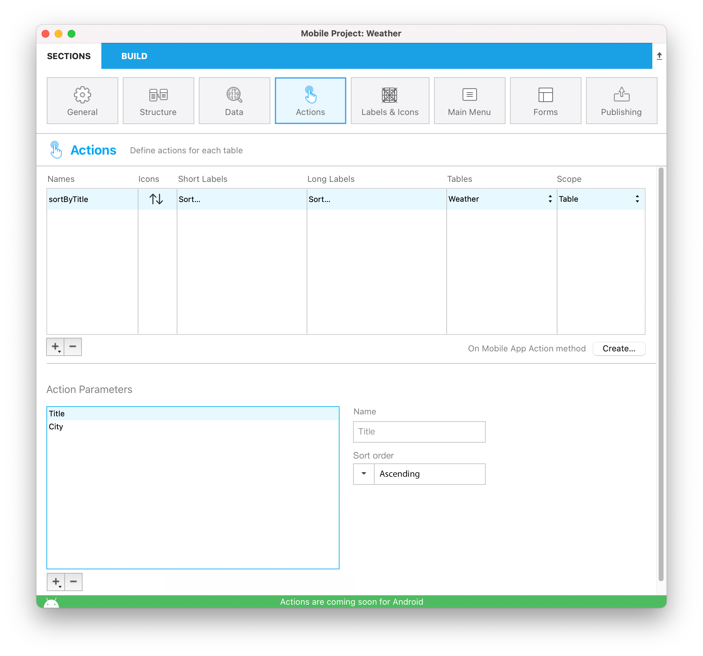
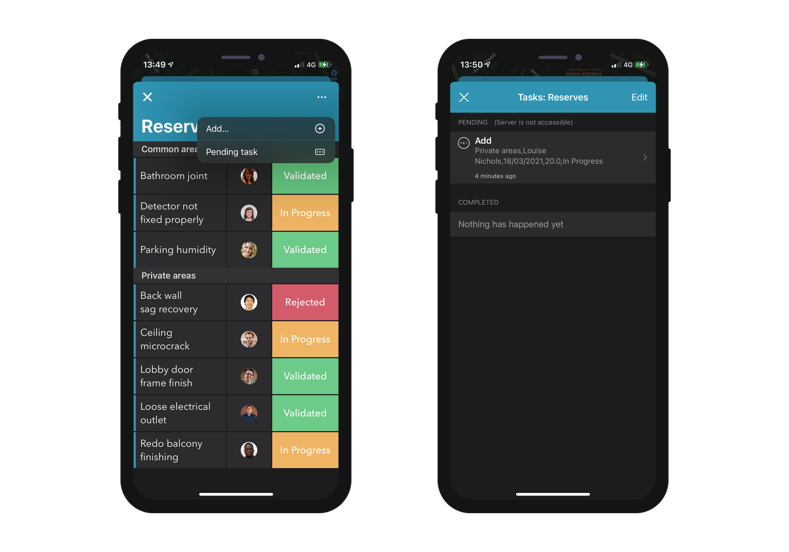

Esta seção permite que:

* crie ações para executar o código 4D a partir de seu app iOS.
* defina e adicione parâmetros para suas ações.

## No Editor de Projetos

### Crie sua ação

Pode criar uma nova ação clicando no botão +  no fundo da tabela Actions. Uma nova linha vai aparecer na tabela Actions.

Depois precisa definir o abaixo:

* **Names:** o nome da ação a usar no método de banco de dados [On Mobile App Action](https://developer.4d.com/4d-for-ios/docs/en/actions.html#on-mobile-app-action) para ativar seu código 4D.
* **Icons:** O ícone a escolher de sua biblioteca ícone. Também é possível adicioanr seu próprio ícone seguindo este [tutorial]`(using-icons.html)`.
* **Short and long Labels:** As etiquetas para as ações para exibir em seu app.
* **Table:** A tabela na qual quer aplicar a ação.
* **Scope:** Onde usar a ação, uma **entidade** ou uma **tabela**.


### Adicione parâmetros para sua ação

Você pode adicionar **parâmetros ação** e **editar** dados diretamente de seu app.

Para cada parâmetro, pode editar as propriedades abaixo:

* Nome
* Etiqueta longa
* Etiqueta curta
* Formato
* Restrições de input (define valores mínimos ou máximos)
* Placeholder (valores provisórios)
* Definição campo obrigatória
* Valor padrão


Você é livre para mudar a ordem dos parâmetros usando arrastar e soltar.

Aqui estão os diferentes **Formatos** que pode selecionar para um parâmetro:

<table>

<tr>
<th colspan="2"  style={{textAlign: 'center'}}>TEXTO</th>
</tr><tr style={{textAlign: 'center'}}>
<th>Formato</th><th>Descrição</th>
</tr><tr>
<td>Texto</td><td>Colocar em maiúscula a primeira letra da string</td>
</tr><tr>
<td>Endereço de email</td><td>Teclado iOS otimizado para a entrada de correio eletrônico</td>
</tr><tr>
<td>Número de telefone</td><td>Teclado iOS para ingressar o número de telefone.</td>
</tr><tr>
<td>Conta</td><td>Teclado iOS otimizado para a entrada de correio eletrônico</td>
</tr><tr>
<td>Senha</td><td>Otimizado para manejar senhas</td>
</tr><tr>
<td>URL</td><td>Teclado iOS otimizado para a entrada  de URLs</td>
</tr><tr>
<td>Código postal CEP</td><td>Teclado iOS otimizado para entrada de código postal</td>
</tr><tr>
<td>Área de texto</td><td>Inclui linhas múltiplas de texto em um único campo</td>
</tr><tr>
<td>Código de barras</td><td>Extrair valor associado ao código de barra. Formatos compatíveis:  EAN8, EAN13, Code 39, Code 93, Code 128, QR Code, UPC, PDF417</td>
</tr>
<tr>
<td colspan="2"></td>
</tr>

<tr>
<th colspan="2" style={{textAlign: 'center'}}>NÚMERO</th>
</tr><tr style={{textAlign: 'center'}}>
<th>Formato</th><th>Descrição</th>
</tr><tr>
<td>Número</td><td>Número com decimais</td>
</tr><tr>
<td>Inteiro</td><td>Números sem decimais</td>
</tr><tr>
<td>Científico</td><td>Notação científica</td>
</tr><tr>
<td>Porcentagem</td><td>Notação de porcentagem</td>
</tr><tr>
<td>Números como  letras</td><td>Converte os números em strings de texto</td>
</tr>
<tr>
<td colspan="2"></td>
</tr>

<tr>
<th colspan="2" style={{textAlign: 'center'}}>DATA</th>
</tr><tr style={{textAlign: 'center'}}>
<th>Formato</th><th>Descrição</th>
</tr><tr>
<td>Data</td><td>Nov 23, 1937</td>
</tr><tr>
<td>Data curta</td><td> 11/23/37</td>
</tr><tr>
<td>Data longa</td><td>Novembro 23, 1937</td>
</tr><tr>
<td>Data completa</td><td>Terça, Novembro 23, 1937</td>
</tr><tr>
<td colspan="2"></td>
</tr>

<tr>
<th colspan="2" style={{textAlign: 'center'}}>HORA</th>
</tr><tr style={{textAlign: 'center'}}>
<th>Formato</th><th>Descrição</th>
</tr><tr>
<td>Hora</td><td>3:30 PM</td>
</tr><tr>
<td>Duração</td><td>2 horas 30 minutos</td>
</tr>
<tr>
<td colspan="2"></td>
</tr>

<tr>
<th colspan="2" style={{textAlign: 'center'}}>BOOLEANO</th>
</tr><tr style={{textAlign: 'center'}}>
<th>Formato</th><th>Descrição</th>
</tr><tr>
<td>Boolean</td><td></td>
</tr><tr>
<td>Marca de verificação</td><td></td>
</tr>

<tr>
<td colspan="2"></td>
</tr>
<tr>
<th colspan="2" style={{textAlign: 'center'}}>IMAGENS</th>
</tr>
<tr>
<td>Assinatura</td><td>Permitir assinatura com o dedo</td>
</tr>

</table>

## Ações predefinidas

Os projetos móveis incluem as ações predefinidas abaixo para gerenciar o conteúdo de seu app:

* Ação de Editar
* Ação de Adicionar
* Ação de eliminar
* Partilhar
* Ordenar

### Adicionar ação

Projetos 4D móveis torna o processo de criação **Adicionar Ações** bem simples.

A única coisa que precisa fazer é selecionar a opção **Ação adicionar** acessível a partir do  **+ botão** no fundo da tabela Ações.


Depois **selecione a tabela** que quiser linkar à ação adicionar.

Isso vai **criar automaticamente** todos os parâmetros para você no Editor de Projeto. No app gerado, isso permite que edite cada valor de campo.

Para este tipo de ação, vai ver que todas as **propriedades** já estão preenchidas para sua conveniência no lado direito da lista de parâmetros.


### Ação de Edição

A criação de **Ações Editar** segue o mesmo processo que as Ações Adicionar, com exceção que não é possível definir valores predeterminados a partir da seção Ações.


### Ação de eliminação

A criação de **ações de eliminação ** segue o mesmo processo que as ações de edição. A única diferença é que essa ação permite que remova uma entidade.

Para criar uma ação de eliminação, selecione a opção **Ação de eliminação para**, acessível desde o **botão + ** na parte inferior da tabela Ações.

Este tipo de ação deve ser utilizado com precaução.


### Ação Partilhar

Selecionar **Ação Partilhar, ** permite a seus usuários móveis partilhar conteúdo com outros usuários. Só precisa selecionar o escopo:

- **entidade**: para partilhar conteúdo com um formulário detalhada
- **tabela**: para partilhar um formulário lista

Ver a página [Deep Linking](../special-features/deep-linking.md) para saber mais.

### Ação Ordenar

**Ações Ordenar** são úteis para:

- defina uma ordenação padrão para os formulários lista da tabela
- permitir aos usuários móveis escolher a ordem de classificação da lista

Quando criar uma ação ordenação para uma tabela, precisa selecionar o primeiro campo no qual a ordenação será feita:


O campo é adicionado à lista de critérios de ordenação. Uma ordem ascendente é definida como o normal mas pode ser mudada usando o menu **Ordem de clasificação**.

Pode ordenar entidades de ordenação em mais de um campo. Cada campo que ordenar é denominado como um nível de ordenação. Por exemplo, os resultados de uma ordenação ascendente de dois níveiss dos campos `lastName` e `firstName` produziria uma lista como esta:

```4d
Aardvark, Anthony
Aardvark, Artemis
Aardvark, Arthur
...
Zygote, Elena
Zymosian, Elmer
```

Para adicionar mais níveis na lista de critérios de ordenação, selecione o botão **+** abaixo da lista e configure cada nível:




#### Menu de ordenação na aplicação móvel

Quando definir mais que uma ação de ordenação para uma tabela, usuários móveis automaticamente se beneficiam de um menu **de ordenação**. Contém todas as ações predefinidas de ordenação:


> Quando só se define uma ação de ordenação para uma tabela, o menu **ordenação** não é mostrada na parte da aplicação móvel.

### On Mobile App Action

O método database [On Mobile App Action]`(https://livedoc.4d.com/4D-Language-Reference-17-R5/Database-Methods/On-Mobile-App-Action-database-method.301-4286697.en.html)` está disponível para chamar a todos seus métodos 4D.

Depois de criar todas as suas ações, simplesmente clique no botão Criar da tabela Ações para gerar automaticamente um bloco de código *Case of* que inclua todos os nomes de suas ações no método *On Mobile App Action*.

:::nota notas

- Pode renovar a seleção depois de executar uma ação usando `$out.dataSynchro:=True`.
- Pode notificar o usuário da aplicação sobre quando uma ação tiver sido executada usando `$out.statusText:="Mensagem que quer exibir"`.
- Pode decidir fechar à força o formulário Edition usando `$out.close:=True`.

:::

## Ações modo offline

O usuário de uma aplicação pode esboçar, armazenar, e colocar em fila petições de ação, mesmo se estiver trabalhando sem conexão (adicionar o número de telefone de um cliente, subir uma foto, imprimir uma fatura ou um orçamento, apagar um endereço, etc.).  Todas essas tarefas são colocadas em ações Pendentes até que a rede fique acessível. Quando o usuário estiver online, todas as ações pendentes são sincronizadas consistentemente, executadas e então visíveis nas ações Completadas.

Tarefas pendentes podem ser visualizadas e abertas com:

•   *Tela de Configurações*

Exibe um sumário e a história de todas as ações pendentes ou completas.


•   *Formulários Lista & Detalhado*

Exibe todas as tarefas pendentes relacionadas à tabela ou à entidade que está vendo no momento.



:::nota notas

- A ação pré-definida "Share" só é executável no modo online
- As ações são editáveis enquanto estiverem pendentes, mas já não se podem modificar quanto passarem ao modo "Completado".

:::

### Atualizar as tarefas pendentes que falham

Devido à lógica de negócio de seu servidor, algumas tarefas poderiam ser rejeitadas. For mobile users, it is then possible to edit and to retry sending the relevant pending tasks. To do so, you can display a status text describing, in the "Complete" actions history, the reason of the failure. For example, you can reject an action sent by a mobile user to the server and inform him that the operation has failed. In that case, you can set the `success` value to `False` and provide a message in `statusText`, as follows:

 ```4d
 $response:=New object("success"; False; "statusText"; "Operation failed"))
 ```
 You can even add some errors by action parameters for the `alphaField` parameter, for example:

  ```4d
$response.errors:=New collection(New object("parameter"; "alphaField"; "message"; "Alpha field must contains a valide value")
  ```


## iOS app Side

In your iOS app, actions are available in different ways in your List and Detail forms, depending on the templates you select in the Forms section.

### Table List forms

* **Entity action:** Swipe left on a cell to display the available actions in a List form. A "More" button is displayed if you've defined more than three actions per entity.


* **Table actions:** A generic actions button is available in the navigation bar to display a list of available table actions.


:::tip

Actions will be displayed in the same order as defined in the Action section.

:::

### Collection List forms

* **Entity action:** Depending on the template, actions are displayed by clicking on a generic button or by maintaing the pressure on a cell.


* **Table actions:** Like the Table List forms, a generic Actions button is available in the navigation bar to display a list of availble table actions.


### Detail forms

As with Table actions in List forms, a generic Actions button is available in the navigation bar to display all your entity actions in a list.


### Edition forms

If you have created an Edit or an Add action, as soon as you select it from the action list, an **Edition form** will appear.


From here, you can:

* edit all of your fields by selecting them, and
* validate or cancel your modifications using the **Done** or **Cancel** buttons (available in the navigation bar).

For your convenience, the Edition form includes a few **special features**:

* The keyboard type depends on the selected parameter type in the Action section.
* You can go to the next or previous field using the arrow on top of the keyboard.
* The iOS keyboard can be closed by touching anywhere outside of a field.
* Indication is given to the user when a value is not valid.
* The view focuses on empty mandatory fields when the user clicks the Done button.

## Where to go from here?

* A [tutorial]`(actions-getting-started.html)` is available to guide you through the **action definition process**.

* Another [tutorial]`(action-custom-template.html)` will guide you through the **action TAG integration** for custom templates.

* A final [tutorial]`(action-parameters.html)` will guide you through the **action parameters definition**.
