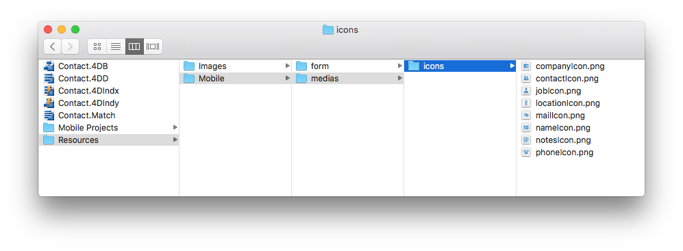

Essa página permite definir as propriedades de exibição para suas tabelas, campos e relações no app móvel.


Propriedades padrão são estabelecidas. Para modificar uma propriedade, selecione um elmeento e digite o novo valor na coluna apropriada.

Pode definir as mesmas propriedades para tabelas, campos e relações. Além disso, formatos podem ser definidos para campos/relações.

Esses elementos serão mostrados em formulários detalhados e lista, dependendo no modelo no app gerado.


## Ícones

Ícones a associar a tabela ou campo/elemento no app móvel a cada vez que um modelo exigir um ícone.

:::info

Para campos de relação, ícones serão exibidos à esquerda do botão **Relação** que permite abrir uma tabela relacionada.

:::

O editor móvel 4D oferece uma grande biblioteca de ícones para atender às suas necessidades. Isso inclui ícones para negócios, finanças, educação, governo, saúde, indústria, imóveis, serviços, etc. ´Para selecionar um ícione, clique no botão **icone** e escolha um ícone da lista:


:::info

Para manter tudo consistente, **os ícones por padrão** são gerados para campos em branco se ao menos um ícone tiver sido definido para um campo.

:::

Também pode deixar a área ícone vazia se não quiser exibir ícones em sua aplicação.


### Adicionar ícones personalizados

Pode adicionar seus próprios ícones à bibilioteca, para que possa selecioná-los no projeto. Pode usar qualquer formato de ícone (SVG ou PNG é recomendado para preservar transparência) e tamanho. É recomendado ter versões coloridas de seus ícones personalizados para melhor visualização no editor de projetos.

Por exemplo, aqui está um conjunto de ícones personalizados que pode usar:

<div className="center-button">
<a
  className="button button--primary"
  href="https://github.com/4d-go-mobile/tutorial-CustomIcons/releases/latest/download/tutorial-CustomIcons.zip">
  Baixar ícones personalizados
</a>
</div>

Para incluir ícones personalizados em seu projeto:

1. Criar uma pasta `icones` no local abaixo:

```
<my4DProjetFolder>/Resources/Mobile/medias
```

:::nota

Pode ser necessário criar uma pasta `medias`.

:::

2. Arraste e solte seus ícones personalizados na pasta `icons`.



Seus ícones podem agora ser selecionados para seu projeto, são listados depois dos ícones padrão.


## Etiquetas curtas e longas

Pode definir as mesmas etiquetas para tabelas, campos e relações. Essas etiquetas serão usadas automaticamente de acordo com o espaço disponível no modelo para otimizar os espaços e evitar lotar a barra de abas.

:::info

For relation fields, labels will be displayed in the **Relation** button that allows to open a related table.

:::

- Short labels should have 10 characters or less
- Long labels can have up to 25 characters
- You can use characters that are not allowed in structure names, such as "/","@", the space character, etc.

By default, the mobile editor uses the table and field names as defined in the structure as labels in the app, and the same string is used for short and long labels.


## Formats

This property allows you to format the data to display in the app. When you click on a field row, a format menu is displayed.


Available built-in formats depend on the field type:

| Field type         | Formats                                                                                                                |
| ------------------ | ---------------------------------------------------------------------------------------------------------------------- |
| **Texto**          | Texto                                                                                                                  |
| **Data**           | Date, Short date, Long date, Full date                                                                                 |
| **Hora**           | Time, Short time, Duration, Integer number                                                                             |
| **Image**          | Image                                                                                                                  |
| **Boolean**        | "No" or "Yes", "False" or "True"                                                                                       |
| **Integer number** | Integer number, Decimal number, Real number, Percentage, Ordinal number, Currency $, Currency €, Currency ¥, Spell Out |


### Adding custom formats

The mobile editor allows you to add customized formats (called "formatters") in your projects. For example, you can define custom formats for emails, invoice numbers, etc.

To add custom formats to your mobile project, you can:

- Download and install customized formats from the [**go-mobile formatters github repository**](https://4d-for-ios.github.io/gallery/#/type/formatter/picker/0).

- Create your own formats.

:::tip tutorial

Visit [**this tutorial**](../tutorials/data-formatter/create-data-formatter) to know how to define a custom format

:::

To install a custom formatter, you just need to drop the formatter folder into the `/Resources/Mobile/formatters` of the 4D project folder. Once installed, a custom format can be selected from the Formats menu, just like a built-in formats.


## Title

This property is only available for Relation fields. The defined title will be displayed on top of the destination view when using a relation.

Use a pair of `%` characters to include the value of the related field in the title. For example, if you want that the title of the `Employee.employer` related field displays the name of the related `employee` field, you can write:

```
%Name%'s employer
```

:::tip tutorial

A [**tutorial**](../tutorials/relations/one-to-many-title-definition) is available to guide you through the Title definition process.

:::
