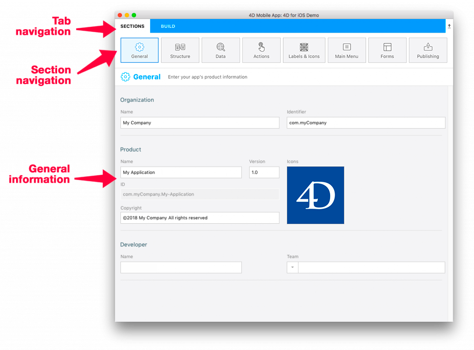
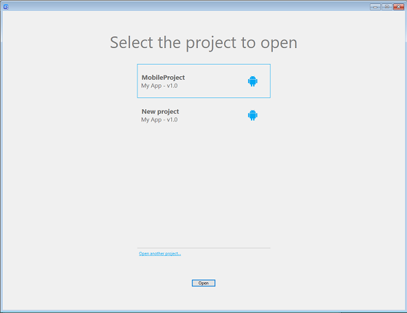

O editor de projeto 4D Móvel permite criar, testar e construir seus projetos móveis nativos para iOS e Android usando uma interface gráfica. A janela tem duas abas: **Seções** e **Construir**.

Na aba **Seçõess**, encontra todos os passos para criar sua aplicação móvel:

* General
* Estrutura
* Data
* Actions
* Labels & Icons
* Main Menu
* Formulários
* Publishing

Na aba **Construir**, encontra ferramentas para construir e testar seu app móvel:

* Build and Run
* Seleção de simulador
* Navegador de projeto e de produto
* Instalar

O editor de projeto 4D Mobile está disponível no ambiente de **4D** desenvolvimento de aplicação (é necessária uma licença 4D Developer Pro).

Um projeto 4D móvel é fortemente vinculado a um modelo de dados 4D. Para poder criar ou abrir um projeto móvel 4D, deve antes abrir o projeto 4D associado.

## Criar um projeto móvel

Para criar um novo projeto móvel:

1. Inicie sua aplicação 4D e abrir o projeto 4D para o qual quer criar um projeto móvel.
2. Selecione **New > Mobile Project** nos menus **File** ou na barra de ferramentas.

:::nota

Precisa ter uma licença 4D Developer Pro para abrir o editor 4D Móvel.

:::

A caixa de diálogo de boas vindas é exibida:

3. Dê um nome a seu projeto e clique em **Continuar**.

O editor de projeto Móvel é exibido e é criada automaticamente a arquitetura de arquivos móveis em seu projeto 4D.

## Abrir projeto móvel

Para abrir projeto móvel:

1. Inicie sua aplicação 4D e abra o projeto 4D para o qual quer criar um projeto móvel.
2. Selecione **Abrir > Projeto Móvel** nos menus **Arquivo** ou na barra de ferramentas.

A caixa de seleção de projeto móvel é mostrada. Contém a lista de projetos móveis já definidas para o banco de dados atual:

O ícone no lado esquerdo indica se o projeto foi criado para Android, iOS ou ambos.

3. Dê um duplo clique no projeto para abrir ou selecionar o projeto e clique em **Abrir**.

### Open another project

The **Open another project...** link allows you to select any valid [`.4dmobileapp`](#mobile-project-architecture) file that is not listed in the dialog box.

:::warning

The selected mobile project must match the current data model, otherwise it will be updated and may not work as expected.

:::

## Deleting a mobile project

To delete a mobile project, just remove the mobile project folder from the 4D project folder.

## Mobile project architecture

Mobile projects are created inside the main 4D project folder:

- My4DProject (*main 4D project folder*)
    + Mobile Projects
        * MyMobileProject
            - project.4dmobileapp
            - *other files and folders*

