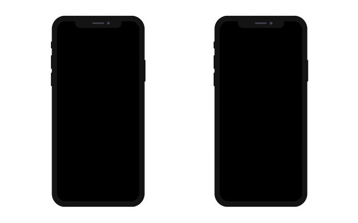

Thanks to the **deep linking** feature, you can share the content that you're currently viewing with all of your collegues. Here's an illustration demonstrating deep linking:



There are two ways to implement deep linking in iOS: **URL scheme** and **Universal Links**. While URL schemes are a well-known method for deep linking, Universal links are the new way that Apple has implemented to easily connect your webpage and your app under the same link.

:::info 4D for Android

Deep linking feature is currently not available in 4D for Android.

:::

## Comparison of deep linking modes

### URL Scheme

Here is a comparison between the two options which are available in the project editor:

| PROS                                | CONS                                              |
| ----------------------------------- | ------------------------------------------------- |
| Fácil de implementar                | Sempre requer permissão                           |
| Não precisa de um backend adicional | Não funciona se a aplicação não estiver instalada |
|                                     | Não funciona em Android                           |

### Universal links

| PROS                                                 | CONS                                     |
| ---------------------------------------------------- | ---------------------------------------- |
| Não requer permissão                                 | Se necessita um backend estático com SSL |
| Não abre o navegador                                 | Mais complexo de implementar             |
| Compatível com Android                               |                                          |
| URL de fallback se a aplicação não estiver instalada |                                          |

## Custom URL Scheme

At the simplest level, URL schemes allow users to open an app from other apps. But the true power of URL schemes is in the ability to perform specific actions as your app opens.


### Custom URL scheme in the project editor

It's very simple to include an URL scheme to your mobile app. Let's see an example:

1. Select the **Share** predefined action from the [**Action** page](../project-definition/actions.md) and select the scope:
    *   entidade - para compartilhar o conteúdo de um formulário detalhado
    *   tabela - para compartilhar um formulário lista
2. Check the **Deep Linking** feature in the **Publishing** section of the project editor
3. The URL Scheme information is automatically filled in with the app name that you previously defined in the [**General** page](../project-definition/general.md). Entretanto, ainda pode ser editado:


4. Fill in your **On Mobile App Action** method, for example:

```4d

// On Mobile App Action database method

var $1 : Object  // Information provided by mobile application
var $0 : Object  // Information returned to mobile application

var $action : Object
$action:=MobileAppServer.Action.new($1)

Case of 

    : ($1.action="shareContact")

        $0:=$action.shareContext()

    Else 

        $0:=New object("success"; False;"statusText"; "Unknown action send to server")

End case 

```

5. Build your app.


### Using URL Schemes in you mobile app

1. Click on the **Action** button to display all of your currently available actions
2. Select the **Share** action that you previously defined in the project editor
3. A new view appears to allow you to start sharing content
4. Select the share method you want to use
5. Send it.

## Universal Links

Universal links provide several key benefits that aren't available with custom URL schemes. Specifically, universal links are:

* **Unique**: Diferente de schemes personalizados de  URL , links universais não podem ser reclamadas por outros apps porque usam links padrão  HTTP ou HTTPS para seu website.

* **Secure**: quando os usuários instalam sua aplicação, iOS verifica que seu site web permita que sua aplicação abra URLs em seu nome. Só você pode criar e subir o arquivo que outorga esta permissão a seu servidor web, pelo que a associação de seu website com sua aplicação seja segura.

* **Flexible**: os links universais funcionam mesmo quando sua aplicação não estiver instalada. Neste caso, ao pressionar um link a seu site web se abre o conteúdo em Safari.

* **Simple**: uma única URL funciona tanto para seu site web quanto para sua aplicação.

* **Private**: outras aplicações podem se comunicar com sua aplicação sem necessidade de saber se sua aplicação estiver instalada.

### Universal Links in the Project Editor

To include Universal links into your app, the process is quite similiar to the URL Schemes process:

1. Select the **Share** predefined action from the [**Action** page](../project-definition/actions.md) and select the scope:
    *   entity - to share a content from a detail form
    *   tabela - para compartilhar um formulário lista
2. Activate the **Deep Linking** feature in the **Publishing** section in the project editor
3. Enter your website URL in the **Universal links** field
4. Fill in your **On Mobile App Action** method, for example:

```4d

// On Mobile App Action database method

var $1 : Object  // Information provided by mobile application
var $0 : Object  // Information returned to mobile application

var $action : Object
$action:=MobileAppServer.Action.new($1)

Case of 

    : ($1.action="shareContact")

        $0:=$action.shareContext()

    Else 

        $0:=New object("success"; False;"statusText"; "Unknown action send to server")

End case 

```

5. Build your app.
6. Trigger universal links from the the **On Web Connection** method, for example:

```4d
// On Web Connection database method

var $1; $2; $3; $4; $5; $6 : Text
var $handler : Object

$handler:=MobileAppServer.WebHandler.new()
Case of
    : ($handler.handle($1; $2; $3; $4; $5; $6))
        // Managed by default mobile code
    Else
        // Your web code
End case

```


## Deep Linking and Push notifications

A great thing about Deep Linking is that it is completely compatible with [push notifications](push-notification.md). This means that you can send deep links to your users and lead them directly to the right page.

As you can see, this feature opens a large range of possibilities. Deep linking is a crucial feature in today’s apps, especially as users consume content faster and faster. This feature brings them directly to the desired location. So we strongly recommend that you use it in your mobile apps.

:::tip

Refer to the [**4D Mobile App Server** component documentation](https://github.com/4d-for-ios/4D-Mobile-App-Server/blob/master/Documentation/Classes/PushNotification.md) for more information on how to combine push notifications and deep linking.

:::


