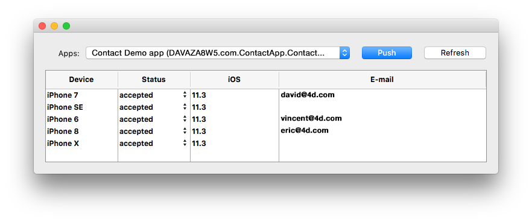

4D for iOS and 4D for Android allow you to manage user sessions, so that you can get information about the connected users and improve their experience on your mobile application.


## Session file

When a user opens the app for the first time, a session file is automatically created and stored next to the current data file in the MobileApps folder.

The session files are organized and grouped by app folder. The Team ID and app bundle ID are concatenated to create the app folder names.

Here is an example of a 4D for iOS-generated session file:

```json
{
"application":{
  "id":"com.contactApp. Contact",
  "name":"Contact",
  "version":"1.0.0"
},
"team":{
  "id":"UTT7VDX8W5"
},
"language":{
  "id":"en_US",
  "code":"en",
  "region":"US"
},
"email":"",
"device":{
  "description":"iPhone X",
  "version":"11.3",
  "id":"0DC5132E-1EF4-407C-A832-5FE33D818AF3",
  "simulator":true
},
"send":"link",
"session":{
  "id":"7023d9205074199d1c16fc00d24354e778137675",
  "ip":"::ffff:192.168.5.4"
},
"status":"accepted",
"token":"eyJhcHBOYW1lSUQiOiJjb20uY29udGFjdEFwcC5Db250YWN0IiwiaWQiOiI3MDIzZDkyMDUwNzQxOTlkMWMxNmZjMDBkMjQzNTRlNzc4MTM3Njc1IiwidGVhbUlEIjoiVVRUN1ZEWDhXNSJ9"
}

```

By default, the "status" is automatically set to "accepted" if the session is validated by the [On Mobile App Authentication](../4d/on-mobile-app-authentication.md) database method (`$result.success` set to `True`). If you want the ability to manually validate the first login for every user session, add `$result.verify:=True` to the object returned by the [On Mobile App Authentication](../4d/on-mobile-app-authentication.md) database method. It will change the "accepted" default status to "pending" in the session file. For more information, see [this example](../special-features/authentication#without-the-component).


## Session object

Mobile sessions can take advantage of the powerful [4D user sessions](https://developer.4d.com/docs/en/WebServer/sessions.html), when they are enabled on the server. In this case, information stored in the [mobile session file](#session-file) is used to fill the [Session object](https://developer.4d.com/docs/en/API/SessionClass.html) on the server, so that you could share a cart for the same user between their web and mobile sessions, for example.

On the mobile project, the [Session object](https://developer.4d.com/docs/en/API/SessionClass.html) is automatically available from:

- the [On Mobile App Authentication](../4d/on-mobile-app-authentication.md) database method
- the [On Mobile App Action](../4d/on-mobile-app-action.md) database method
- [webareas](https://github.com/mesopelagique/form-detail-WebArea) in your forms.

With user sessions, you can access and display user data through [4D tags](https://developer.4d.com/docs/en/Tags/tags.html) in [webareas](https://github.com/mesopelagique/form-detail-WebArea). For example, in a page.shtml form, you can write:

```html
<html><body><h1>You use the following address: <!--#4DTEXT Session.info.mobile.email--> </h1></body></html>
```


## Mobile Session Management Component

Sessions can be managed by the **Mobile Session Management** component:

<div>
<a className="button button--primary"
href="https://github.com/4d/Mobile-Session-Management/releases/latest">Mobile Session Management component</a>
</div>

1. Download and unzip the zip file
2. Go to Build / Components file and get the MOBILE SESSION MANAGEMENT.4dbase
3. Create a **Components** folder next to the 4D project with the app's data.
4. Place the **MOBILE SESSION MANAGEMENT** component in the newly created **Components** folder.
5. Restart 4D.
6. Click on the **Execute** button from the toolbar
7. In the 4D Methods Explorer, select the **MOBILE SESSION MANAGEMENT** method and click on the **Execute** button.
8. The Apps window will appear displaying all of your apps:



* Right click on a session to reveal the session file in the Finder or delete it.
* You can change and define the session status for each device: accepted or pending


* The **Push** button will update the session in memory.
* The **Refresh** button updates the session list. 


