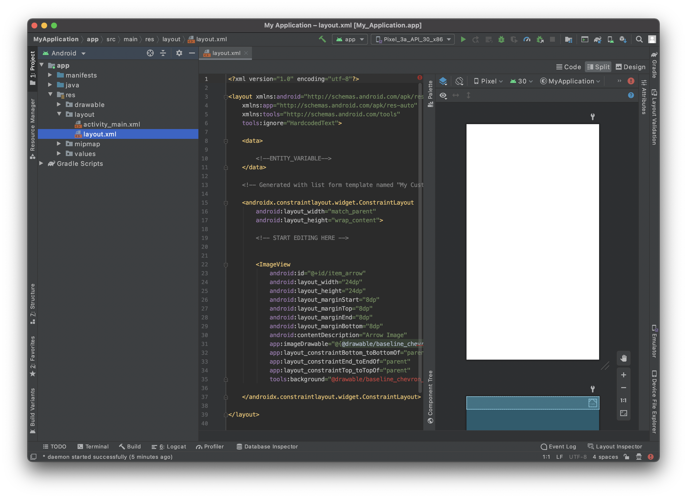
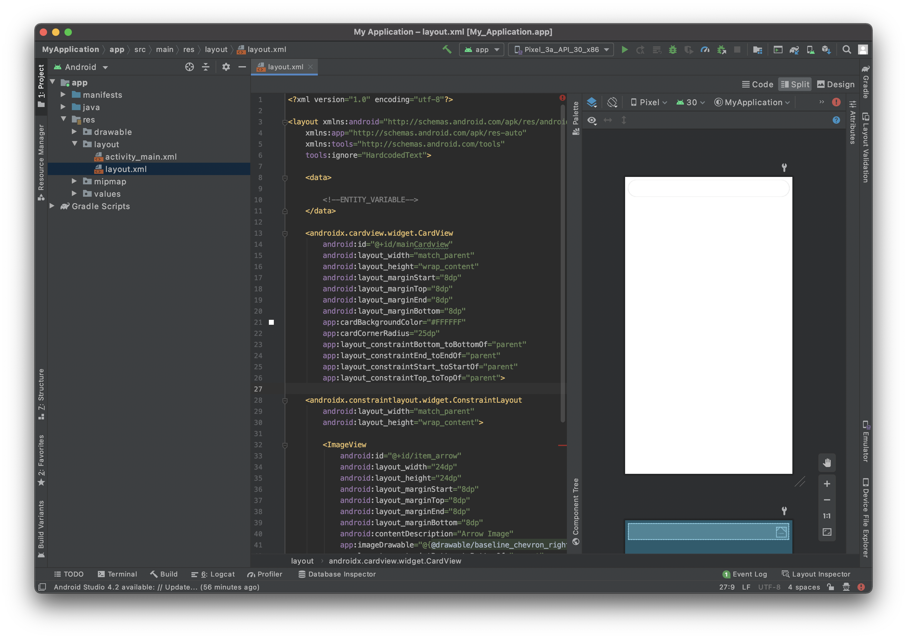
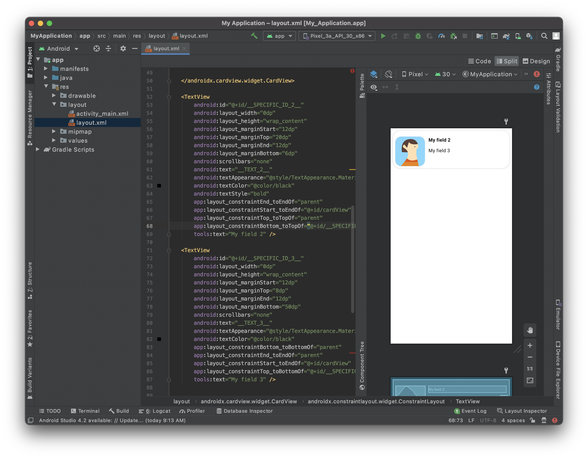

In this section you will see how to create your Android list form interface with Android Studio.

Aqui está o resultado que queremos atingir:


Para cada célula, vamos adicionar:

* Imagem de perfil
* Title
* Subtítulo

## Abrir um arquivo layout com Android Studio

A melhor forma de editar ou criar um modelo é:

* Abrir o Studio Android e criar um novo projeto móvel vazio clicando no Arquivo > New > New Project...

* Selecionar o modelo Empty Activity


* Configure seu projeto e clique em  **Finish**


* Copie o arquivo layout.xml no layout app > res > soltando diretamente na pasta de layout de projeto


* Nesse ponto deve ter:



* Clique na opção direita superior**Split** para visualizar a visualização do modeloassim como código xml.

Está vazio, então vamos adicionar conteúdo!


## Add a CardView container

To have a better rendering of your cells we are going to add a [CardView](https://developer.android.com/guide/topics/ui/layout/cardview).

Adding a CardView container will allow you to display your list form cells as nice cards and gives you the ability to add shadow, elevation, corner radius, background color...

So let's add it to your layout file. Don't forget to close the container adding `</androidx.cardview.widget.CardView>` just before `</layout>`.

```xml
   <androidx.cardview.widget.CardView
        android:id="@+id/mainCardview" 
        android:layout_width="match_parent" 
        android:layout_height="wrap_content"
        android:layout_marginStart="8dp"
        android:layout_marginTop="8dp"
        android:layout_marginEnd="8dp"
        android:layout_marginBottom="8dp"
        app:cardBackgroundColor="#FFFFFF"
        app:cardCornerRadius="25dp"
        app:layout_constraintBottom_toBottomOf="parent"
        app:layout_constraintEnd_toEndOf="parent"
        app:layout_constraintStart_toStartOf="parent"
        app:layout_constraintTop_toTopOf="parent">

        ...

        </androidx.cardview.widget.CardView>

```

It is crucial to **give ids to your layout elements** to refer to it later and positioning them among themselves.

Define the **width** and **height** of your container, the **margins** and as we want the content to take all the parent space (minus the margins) we just have to **add constraints**.


Aqui está o código de layout completo nesse estágio:

```xml
<?xml version="1.0" encoding="utf-8"?>

<layout xmlns:android="http://schemas.android.com/apk/res/android"
    xmlns:app="http://schemas.android.com/apk/res-auto"
    xmlns:tools="http://schemas.android.com/tools"
    tools:ignore="HardcodedText">

    <data>
        <!--ENTITY_VARIABLE-->
    </data>

    <androidx.cardview.widget.CardView
        android:id="@+id/mainCardview"
        android:layout_width="match_parent"
        android:layout_height="wrap_content"
        android:layout_marginStart="8dp"
        android:layout_marginTop="8dp"
        android:layout_marginEnd="8dp"
        android:layout_marginBottom="8dp"
        app:cardBackgroundColor="#FFFFFF"
        app:cardCornerRadius="25dp"
        app:layout_constraintBottom_toBottomOf="parent"
        app:layout_constraintEnd_toEndOf="parent"
        app:layout_constraintStart_toStartOf="parent"
        app:layout_constraintTop_toTopOf="parent">

        <androidx.constraintlayout.widget.ConstraintLayout
        android:layout_width="match_parent"
            android:layout_height="wrap_content">

        </androidx.constraintlayout.widget.ConstraintLayout>

    </androidx.cardview.widget.CardView>


</layout>

```

And here is the preview result you are supposed to get :




## Add an ImageView

In order to have a nice Image view display we are going to use agin a CardView container again as we want to add a nice corner radius to the ImageView to have a better design.

```xml
            <androidx.cardview.widget.CardView
                android:id="@+id/cardView"
                android:layout_width="wrap_content"
                android:layout_height="wrap_content"
                android:layout_marginStart="8dp"
                app:cardCornerRadius="20dp"
                app:layout_constraintStart_toStartOf="parent"

            <ImageView
                android:id="@+id/__SPECIFIC_ID_1__"
                android:layout_width="100dp"
                android:layout_height="100dp"
                android:contentDescription="Image"
                app:imageUrl="__IMAGE_1__"
                tools:background="@tools:sample/avatars" /> 

            </androidx.cardview.widget.CardView>
```

Como pode ver ImageView está embebido no CardView. Isso permite adicionar bordas arrendondadas.

A linha `app:imageUrl="__IMAGE_1__"` permite fixar, bind o valor de imagem que está situado na posição 1 do arquivo svg definido previamente.


A linha `tools:background="@tools:sample/avatars"` está simplesmente para exibir um valor provisório para ImageView.


## Add a title

Here we want to add a title at the right of the CardView that contains an ImageView.

To do so we are going to add a TextView :

```xml
 <TextView
                android:id="@+id/__SPECIFIC_ID_2__"
                android:layout_width="0dp"
                android:layout_height="wrap_content"
                android:layout_marginStart="12dp"
                android:layout_marginTop="20dp"
                android:layout_marginEnd="12dp"
                android:layout_marginBottom="6dp"
                android:scrollbars="none"
                android:text="__TEXT_2__"
                android:textAppearance="@style/TextAppearance.MaterialComponents.Body1"
                android:textColor="@color/black"
                android:textStyle="bold"
                app:layout_constraintEnd_toEndOf="parent"
                app:layout_constraintStart_toEndOf="@+id/cardView"
                app:layout_constraintTop_toTopOf="parent"
                tools:text="My field 2" />

```

The `app: text="__TEXT_2__"` line will allow to bind text value that is situated in position 2 in the svg file that you previously defined.

We want to ImageView and the TextView to be top aligned. To do so, we are going to use the TextView id. You just have to add this line to the CardView that include the profile picture :

```xml
app:layout_constraintTop_toTopOf="@id/__SPECIFIC_ID_2__"
```


## Add a subtitle


We want to add a subtitle to this cell. For that you just have to add quite the same block as the title one:


```xml

<TextView
                android:id="@+id/__SPECIFIC_ID_3__"
                android:layout_width="0dp"
                android:layout_height="wrap_content"
                android:layout_marginStart="12dp"
                android:layout_marginTop="8dp"
                android:layout_marginEnd="12dp"
                android:layout_marginBottom="50dp"
                android:scrollbars="none"
                android:text="__TEXT_3__"
                android:textAppearance="@style/TextAppearance.MaterialComponents.Body1"
                   android:textColor="?colorPrimary"
                app:layout_constraintBottom_toBottomOf="parent"
                app:layout_constraintEnd_toEndOf="parent"
                app:layout_constraintStart_toEndOf="@+id/cardView"
                app:layout_constraintTop_toBottomOf="@+id/__SPECIFIC_ID_2__"
                tools:text="My field 3" />
```


The `app: text="__TEXT_3__"` line will allow to bind text value that is situated in position 2 in the svg file that you previously defined.

We want to the subtitle to be at the bottom of the title. To do so, we are going to use the title TextView id. You just have to add this line to title TextView :

```xml
app:layout_constraintBottom_toTopOf="@+id/__SPECIFIC_ID_3__"
```


Your first list form template:




Here is the full layout code at this stage:

```xml
<?xml version="1.0" encoding="utf-8"?>

<layout xmlns:android="http://schemas.android.com/apk/res/android"
    xmlns:app="http://schemas.android.com/apk/res-auto"
    xmlns:tools="http://schemas.android.com/tools"
    tools:ignore="HardcodedText">

    <data>

        <!--ENTITY_VARIABLE-->
    </data>

    <androidx.cardview.widget.CardView
        android:id="@+id/mainCardview"
        android:layout_width="match_parent"
        android:layout_height="wrap_content"
        android:layout_marginStart="8dp"
        android:layout_marginTop="8dp"
        android:layout_marginEnd="8dp"
        android:layout_marginBottom="8dp"
        app:cardBackgroundColor="#FFFFFF"
        app:cardCornerRadius="25dp"
        app:layout_constraintBottom_toBottomOf="parent"
        app:layout_constraintEnd_toEndOf="parent"
        app:layout_constraintStart_toStartOf="parent"
        app:layout_constraintTop_toTopOf="parent">

    <androidx.constraintlayout.widget.ConstraintLayout
        android:layout_width="match_parent"
        android:layout_height="wrap_content">

        <androidx.cardview.widget.CardView
            android:id="@+id/cardView"
            android:layout_width="wrap_content"
            android:layout_height="wrap_content"
            android:layout_marginLeft="8dp"
            app:cardCornerRadius="20dp"
            app:layout_constraintStart_toStartOf="parent"
            app:layout_constraintTop_toTopOf="@id/__SPECIFIC_ID_2__">

        <ImageView
                android:id="@+id/__SPECIFIC_ID_1__"
                android:layout_width="100dp"
                android:layout_height="100dp"
                android:contentDescription="Image"
                app:imageUrl="__IMAGE_1__"
                tools:background="@tools:sample/avatars" />

        </androidx.cardview.widget.CardView>

        <TextView
            android:id="@+id/__SPECIFIC_ID_2__"
            android:layout_width="0dp"
            android:layout_height="wrap_content"
            android:layout_marginStart="12dp"
            android:layout_marginTop="20dp"
            android:layout_marginEnd="12dp"
            android:layout_marginBottom="6dp"
            android:scrollbars="none"
            android:text="__TEXT_2__"
            android:textAppearance="@style/TextAppearance.MaterialComponents.Body1"
            android:textColor="@color/black"
            android:textStyle="bold"
            app:layout_constraintEnd_toEndOf="parent"
            app:layout_constraintStart_toEndOf="@+id/cardView"
            app:layout_constraintTop_toTopOf="parent"
            app:layout_constraintBottom_toTopOf="@+id/__SPECIFIC_ID_3__"
            tools:text="My field 2" />

        <TextView
            android:id="@+id/__SPECIFIC_ID_3__"
            android:layout_width="0dp"
            android:layout_height="wrap_content"
            android:layout_marginStart="12dp"
            android:layout_marginTop="8dp"
            android:layout_marginEnd="12dp"
            android:layout_marginBottom="50dp"
            android:scrollbars="none"
            android:text="__TEXT_3__"
            android:textAppearance="@style/TextAppearance.MaterialComponents.Body1"
            android:textColor="?colorPrimary"
            app:layout_constraintBottom_toBottomOf="parent"
            app:layout_constraintEnd_toEndOf="parent"
            app:layout_constraintStart_toEndOf="@+id/cardView"
            app:layout_constraintTop_toBottomOf="@+id/__SPECIFIC_ID_2__"
            tools:text="My field 3" />

    </androidx.constraintlayout.widget.ConstraintLayout>

    </androidx.cardview.widget.CardView>

</layout>

```

## Label customization

From here you can customize your label's :

* color => android:textColor

* weight => android:textStyle with **normal**, **bold** or **italic** possible values

* appearance of your font => android:textAppearance

Try to keep consistency in your layout text sizes with appearance. The best way to achieve that is to follow the [Material Design type](https://material.io/design/typography/the-type-system.html#type-scale).


For example, a basic TextView should be in `@Body1@` scale.

```xml
android:textAppearance="@style/TextAppearance.MaterialComponents.Body1"
```

## Como entrar os dados em suas células

### Image View

In our list form template we used `app:imageUrl="__IMAGE_1__"`

Aqui supomos que a  ImageView seja a primeira vsita no svg, e sua ID de vista é  `__SPECIFIC_ID_1__`. Se fosse a terceira vista, seria `__IMAGE_3__` e sua vista de ID seria `__SPECIFIC_ID_3__`.

### Etiquetas

In our list form template we used `android:text="__TEXT_2__"` for the title.

Here we suppose the title is the second view in the svg, and its view ID is `__SPECIFIC_ID_2__`.


## Where to go from here?

In this tutorial, we've covered the basics for creating Android list form templates. You are now able to create simple templates on your own using the Starter Project ressources. But wait - there’s more! In the next tutorial, you’ll learn how to build Android detail form templates!

Download the completed template list folder:

<div className="center-button">
<a className="button button--primary"
href="https://github.com/4d-go-mobile/tutorial-CustomListForm/releases/latest/download/tutorial-CustomListForm.zip">Download</a>
</div>


