Agora é a hora de criar sua interface iOS de formulário lista com Xcode.

Aqui está o resultado que queremos atingir:

Para cada célula, vamos adicionar:

* Imagem de perfil
* Title
* Subtítulo

## Abrir o arquivo storyboard com Xcode

Primeiro, abra seu arquivo storyboard em Xcode.

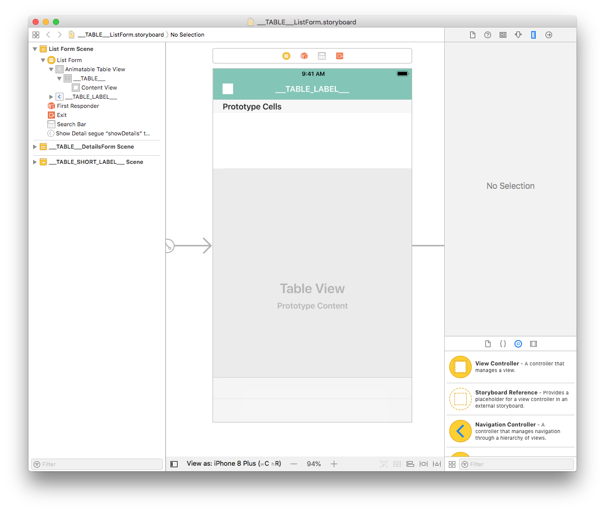

Está vazio, então vamos adicionar conteúdo!

## Adicione uma "Image View"

A partir da **Object library**(biblioteca de objetos), arraste e solte uma  **Image View** (vista de imagem) em uma célula. Pode pesquisar uma "Image View" na barra de pesquisas na parte inferior da biblioteca de Objetos

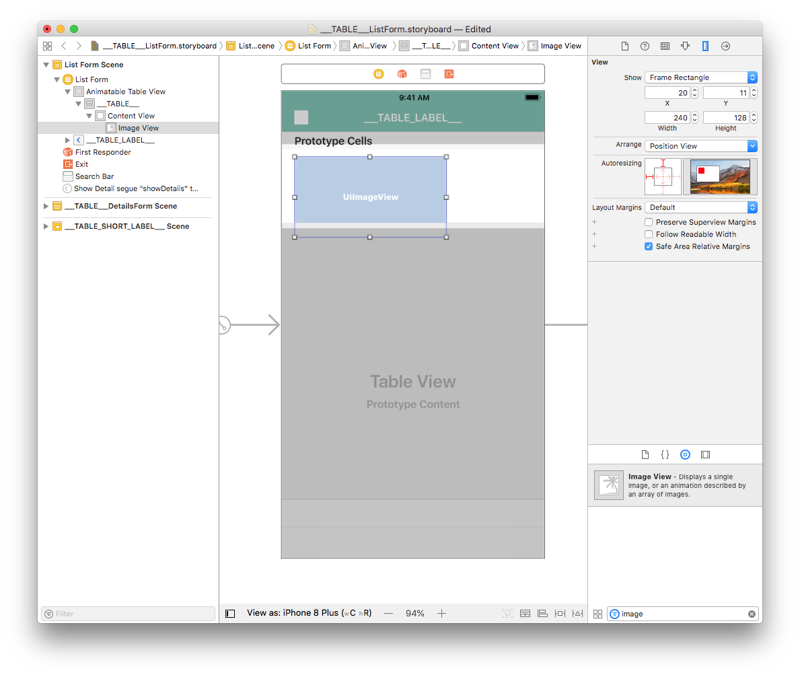

A partir do **Size inspector panel** (do lado direito da janela Interface Builder), defina a largura da Imagem View para 110 e a Altura para 110. Depois defina o valor X como 8 e o valor Y para 3.

Agora, adicione uma restrição (Leading: 8) clicando no botão **Add New Constraints** (na parte inferior da janela Interface Builder). Adicione as restrições de largura e altura, como mostrado:

Clique no botão **Align** (na parte inferior do Interface Builder) e marque a opção "Vertically in Container".

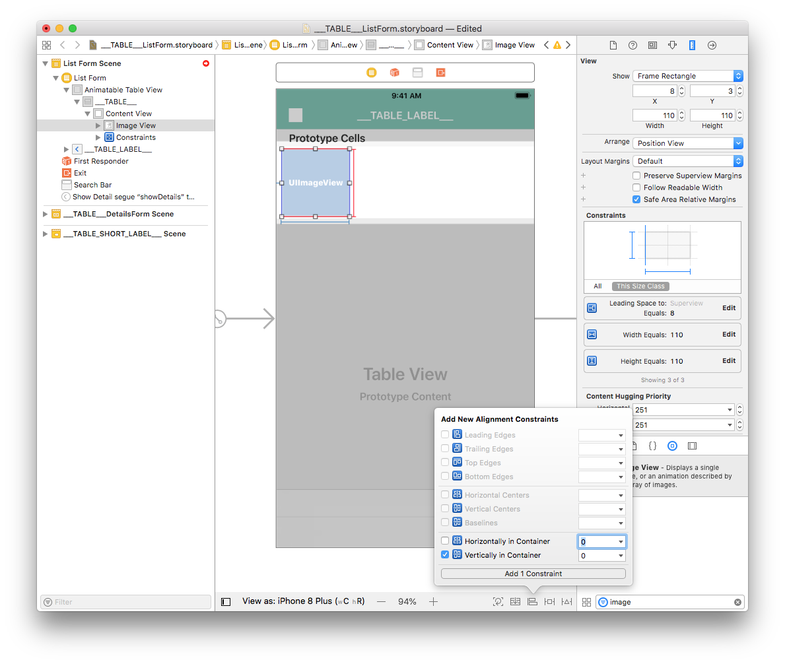

Sua Image View agora está bem posicionada.

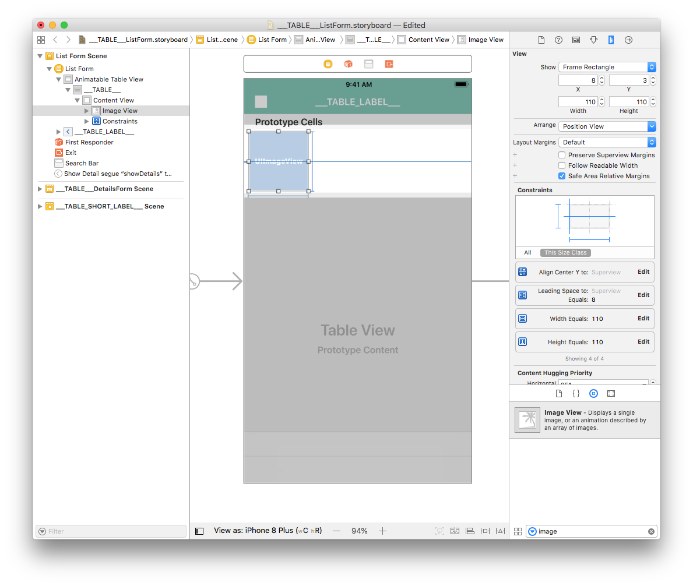

Agora vamos trabalhar nas etiquetas de células.

## Adicione etiquetas de título e subtítulo

Comecemos por **agregar uma vista**. Pesquise por "View" na **Biblioteca de objetos** e arraste a Vista ao cell container.

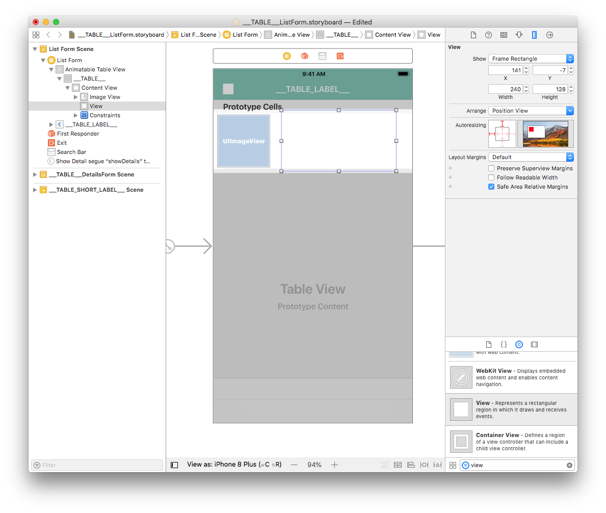

A partir do painel**Size inspector** (no lado direito do Interface Builder), estabeleça o valor da Largura para 277 e altura para 94. Estabeleça X para 126 e Y para 10.

Na  Image View, adicione quatro restrições clicando no botão **Add New Constraints** (Trailing: 11, Leading: 8, Top: 11 e Bottom: 10.67) para posicioná-la corretamente como mostrado abaixo:

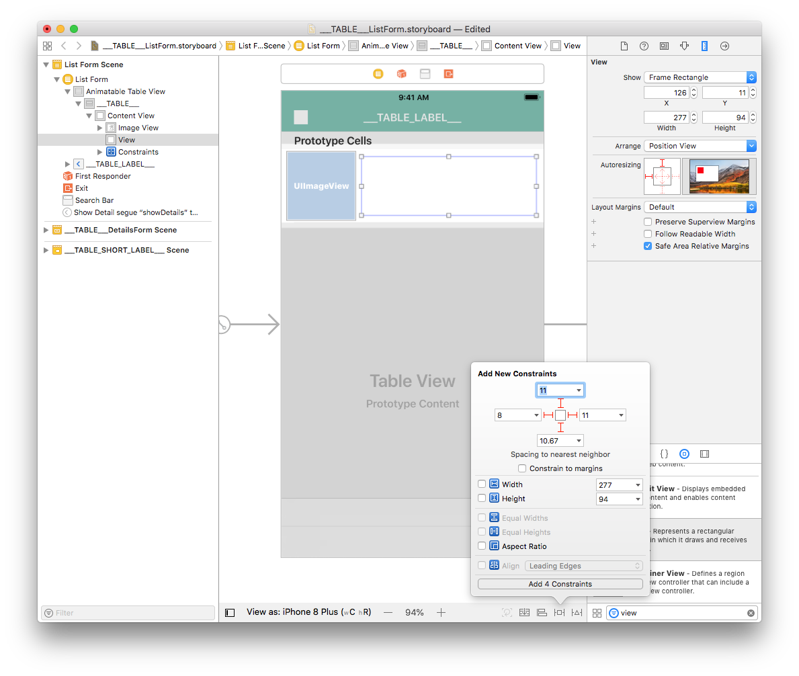

Arraste e solte uma etiqueta na Vista que acaba de agregar desde a Biblioteca de Objetos.

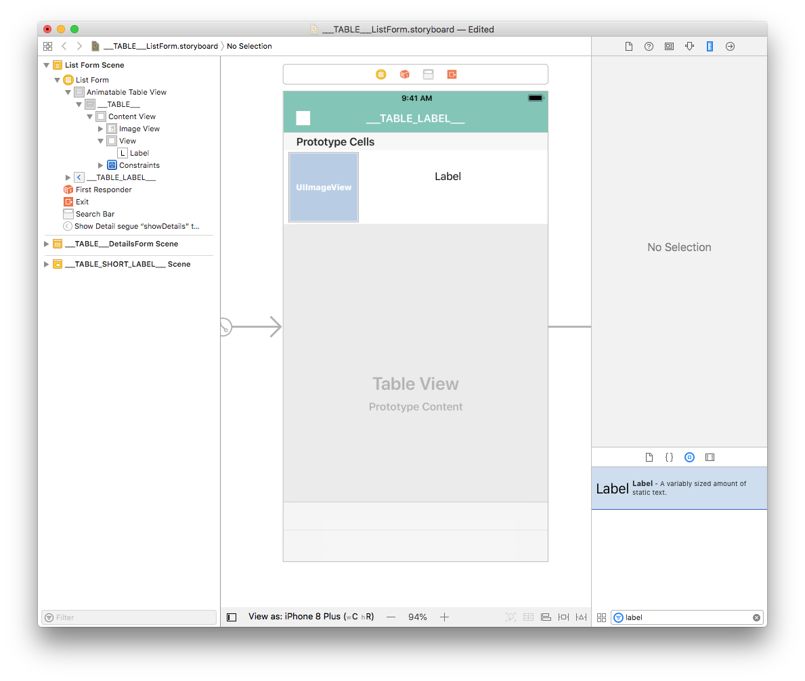

Desde o painel **Size inspector**, defina o valor de largura de etiqueta para 269 e a Largura em 32. Depois estabeleça o valor de X para 8 e Y para 8

**Duplique a etiqueta** e no painel **Size inspector**, defina o valor X para 8 e o valor Y para 48.

Selecion ambas as etiquetas e adicione quatro restrições clicando no botão **Add New Constraints** (Trailing: 0, Leading: 8, Top: 8, e Bottom: Multiple) como mostrado:

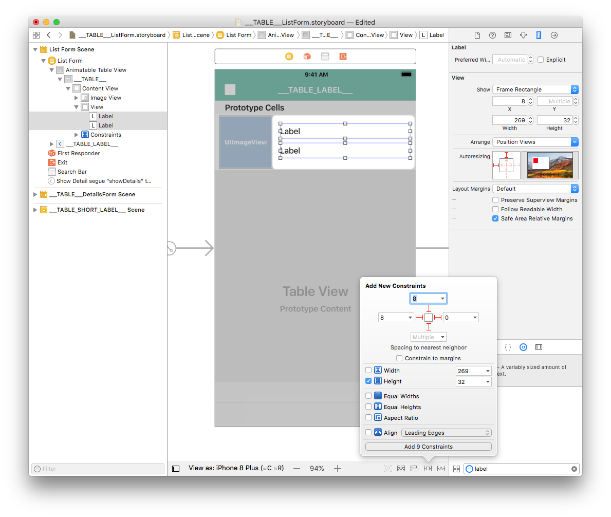

Com a etiqueta selecionada, dê um duplo-clique em **Height constraint** para começar a edição.

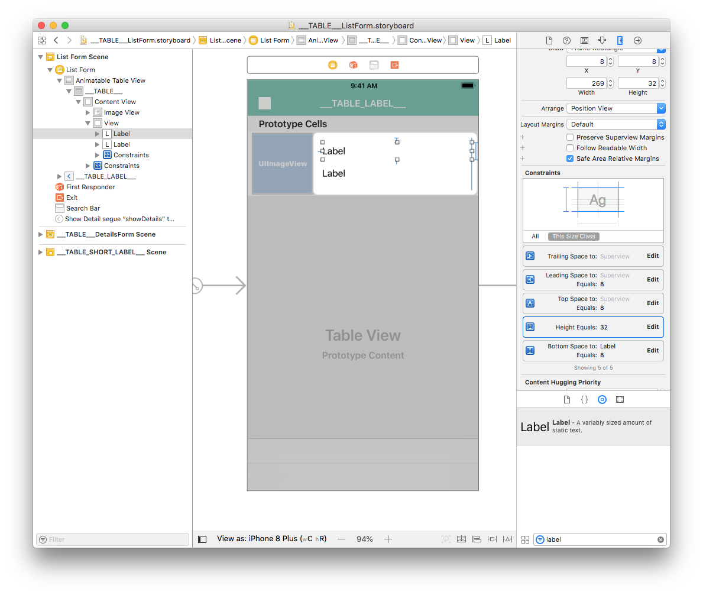

Mude a relação de  Equal para **Greater Than or Equal** para que tenha uma altura variável (para manejar etiquetas multilinhas).

Repita o processo para a segunda etiqueta.

## Label customization

Desde o Inspetor de atributos (do lado direito da janela Interface Builder), é possível personalizar as cores de fonte de sua etiqueta. Vamos fazer a segunda etiqueta com a cor **Dark Grey Color** :

Também pode selecionar a cor dominante para seu app:

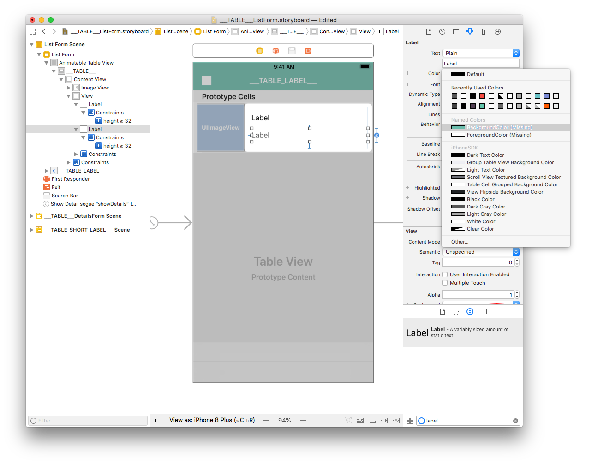

Do inspetor de atributos, também pode personalizar a fonte. Seleccione as duas etiquetas e selecione Font > Custom > **Helvetica Neue**:

Para completar a personalização, selecione ambas as etiquetas e **ingresse o valor 0 em Lines** na janela do Inspetor. Isso permite que o número de linhas seja ilimitado.

:::nota

O storyboard é otimizado para ter uma **altura de célula variável** dependendo dos conteúdos de cada célula.

:::

## Como entrar os dados em suas células

### Image View

Selecione sua Image View e vá para **Identity inspector** > User Defined Runtime Attributes. Clique no ** botão+** para adicionar uma linha.

* **Key Path**: comece com bindTo para ativar a união do componente. Introduza `bindTo.record.___FIELD_1___`

* **Type**: siempre `String`

* **Value**: nome do atributo. Introduza `___FIELD_1_BINDING_TYPE___`

### Etiquetas

Selecione a primeira etiqueta e adicione uma linha na área "Defined Runtime Attributes":

* **Key Path**: `bindTo.record.___FIELD_2___`

* **Type**: siempre `String`

* **Valor**: `___FIELD_2_BINDING_TYPE___`

Selecione a segunda etiqueta e agregue uma linha na área "Defined Runtime Attributes":

* **Key Path**: `bindTo.record.___FIELD_3___`

* **Type**: siempre `String`

* **Valor**: `___FIELD_3_BINDING_TYPE___`

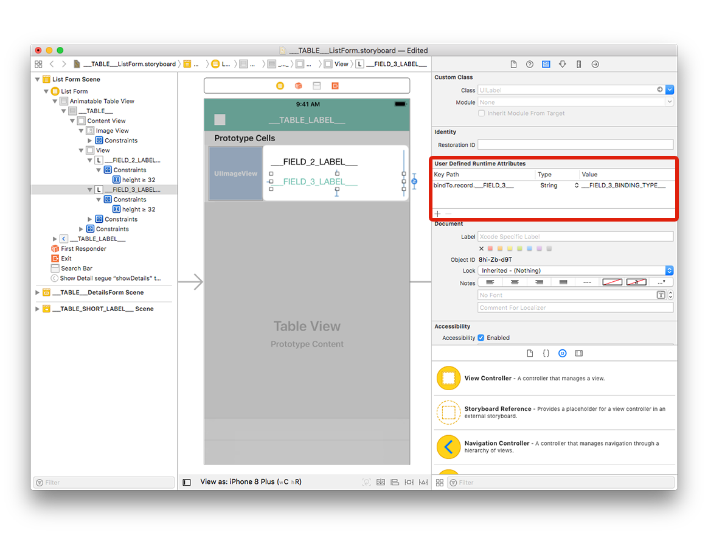

Pode mudar as **etiquetas de storyboard** para ter uma melhor visibilidade:

* Dê duplo clique na primeira etiqueta para entrar `___FIELD_2_LABEL___`
* Dê duplo clique na segunda etiqueta para editar e digitar `___FIELD_3_LABEL___`

Vá ao editor de projeto, selecione seu modelo de formulário lista na seção Formulários, depois clique em Criar e Executar

Este é o resultado do simulador:

## Personalize seu app

O último passo é agregar uma borda arredondada para a Image View para ter um melhor design

Selecione seu Image View e adicione as duas linhas abaixo noa área User Defined Runtime Attributes:

* **Key Path**: `cornerRadius`

* **Type**: `Number`

* **Value**: `12`

e

* **Key Path**: `layer.masksToBounds`

* **Type**: `Boolean`

* **Value**: selecione a caixa de opção

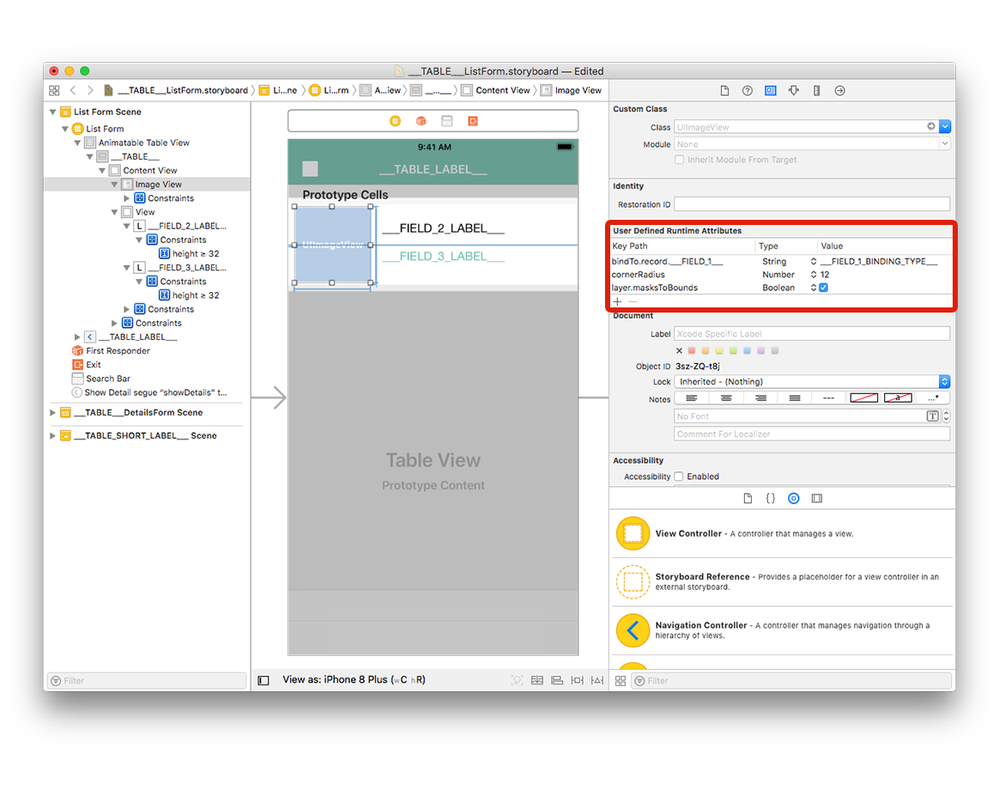

Agora pode construir seu projeto no editor de projetos!

## Where to go from here?

Neste tutorial cobrimos o básico da criação de modelos de formulário lista com iOS. Você já pode criar seus próprios modelos simples usando os recursos do Starter Project. Também pode ver como construir  [modelos de formulário detalhados](../creating-detail-forms/detail-form-template.md).

Download the completed template list folder:

<a className="button button--primary"
href="https://github.com/4d-go-mobile/tutorial-CustomListForm/archive/53ac1d5f506aa4ca2a8d78760ef799044c5c8bdc.zip">Download</a>

