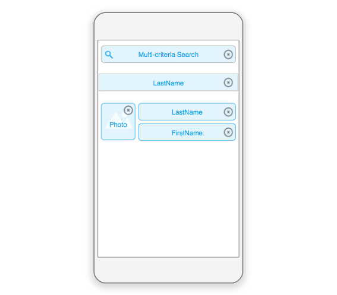
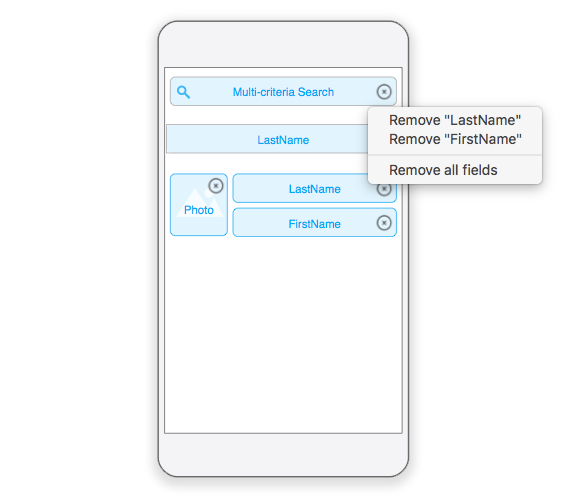

Esta seção mostra como ativar [a pesquisa multicritério](../../project-definition/forms#multi-criteria-search) eu seus modelos.

:::info

A pesquisa multicritério é ativada como padrão em todos os modelos gerados pelo editor móvel.

:::

## Template svg file

Para ativar esta propriedade em seus próprios modelos, precisa modificar as linhas abaixo em seu arquivo template.svg de

```xml
<rect id="search" class="droppable field optional" x="14" y="0" width="238" height="30" stroke-dasharray="5,2" ios:type="0,1,2,4,8,9,11,25,35" ios:bind="searchableField"/>

```

para:

```xml
<rect id="search" class="droppable field optional multi-criteria" x="14" y="0" width="238" height="30" stroke-dasharray="5,2" ios:type="0,1,2,4,8,9,11,25,35" ios:bind="searchableField"/>

```

E pronto! A classe é a única coisa que precisa modificar para a pesquisa multicritério ficar ativa.

## Editor de Projeto

A seguir, pode ir para o editor de projeto e soltar vários campos na área de pesquisa de formulário lista.



Clique no botão de eliminar campo de pesquisa para modificar a lista de campos associados.

Um menu vai aparecer que permite que **remova campos especificos** ou **remova todos os campos**, dependendo de que critérios deseja basear sua pesquisa.



Parabéns! Agora pode basear suas pesquisas em múltiplos campos em seu app móvel!
