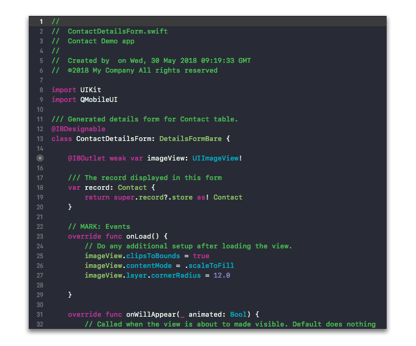
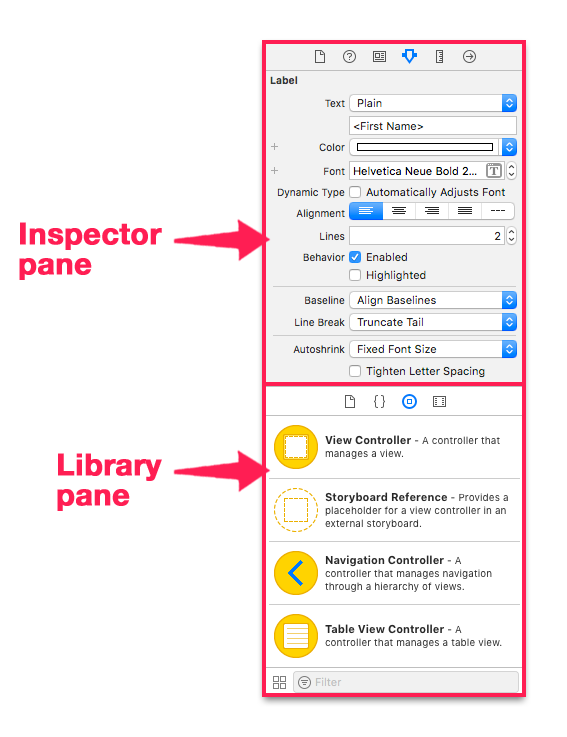
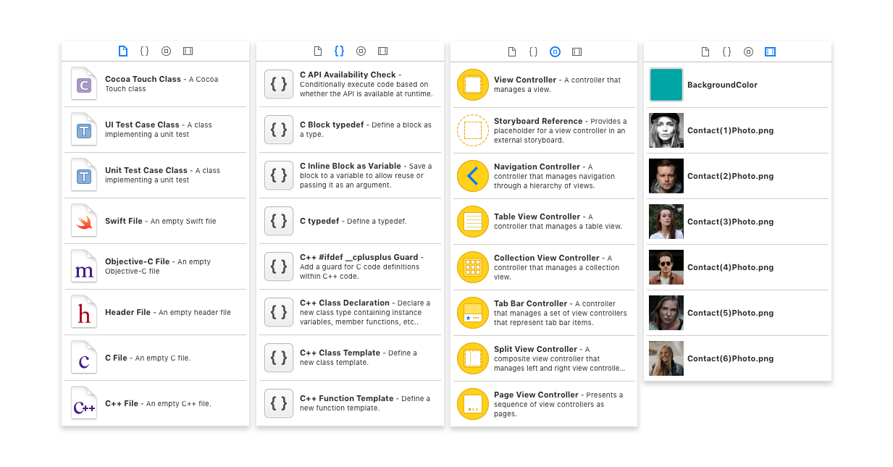
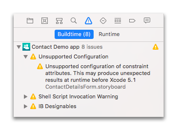

> **OBJETIVOS**
> 
> Garantir uma compreensão básica do funcionamento de Xcode.

Xcode mostra as diferentes áreas que vamos revisar:

## Barra de ferramentas

* Os botões **Run** e **Stop** esetão à esquerda da barra de ferramentas. O botão **Run** permite criar, executar e lançar sua aplicação no simulador iOS selecionado.

* O menu dropdown ao lado do botão **Stop** indica os elementos que quiser executar e qual simulador se está utilizando.

* No lado direito da barra de ferramentas, você encontrará botões para alterar a exibição.

## Área do editor

Aqui é onde ocorre a codificação quando selecionar um arquivo Swift. Quando selecionar um arquivo Storyboard, a vista muda e aparece a Interface Builder.

## Área de interface Builder

Esta é uma interface gráfica que lhe permite criar um arquivo Storyboard ou XIB. Todas as suas cenas são acessíveis no lado esquerdo.

## Área Utilidade

A área de funcionalidades de Xcode tem dois painéis: o painel Inspector e o painel Library (biblioteca)

### Painel Inspetor

Dentro da seção Propriedades, há seis diferentes abas do Inspector, como mostrado na ilustração a seguir:

Da esquerda para a direita, estas abas são:

* **File inspector (inspetor de arquivo)**: para ver e administrar os metadados de um arquivo, tais como o nome, o tipo e a rota de arquivo.

* **Quick Help (ajuda rápida)**: para ver detalhes sobre o que foi selecionado em um editor.

* **Identity inspector (inspetor de identidade)**: para a visualização dos metadados do objeto tais como a classe de um objeto, o tempo de execução de seus atributos, da etiqueta.

* **Attributes inspector (inspetor de atributos)**: para configurar os atributos específicos do objeto da interface selecionado. Por exemplo, alguns atributos de campo de texto incluem o alinhamento de texto e cor, tipo de borda e capacidade de edição.

* **Size inspector (inspetor de dimensões)**: para especificar as características tais como o tamanho e a posição de um objeto.

* **Connection inspector (inspetor de conexões)**: para ver os "outlets" de um objeto, estabelecer novas conexões e apagar as conexões existentes.

### Painel Biblioteca

Dentro da seção Propriedades, Library tem quatro diferentes abas, como mostrado na ilustração abaixo:

Da esquerda para a direita, estas abas são:

* **arquivo modelos**: estes modelos são para os tipos comuns de arquivos listados como opções no menu Novo Arquivo.

* **Código snippets**: Estas são peças curtas de código-fonte para usar em seu aplicativo. Para usar um, arraste-o diretamente em seu arquivo de código fonte.

* **Objetos**: esta biblioteca contém os tipos de objetos de interface que você usaria para fazer sua interface de usuário. Para adicionar um para a vista, arraste-o diretamente no storyboard no editor Interface Builder.

* **Arquivos de Mídia**: Esta biblioteca contém todos os seus gráficos, ícones e arquivos de som. Para usar um, arraste-o diretamente para seu storyboard no editor Interface Builder.

## Área Debug

Esta área exibe o output e o estado de várias variáveis quando estiverem rodando seu app.

## Área navegação

Várias abas são incluídas aqui, as mais importantes são:

* **Aba Navegação**: Enumera e oferece acesso a todos os arquivos necessários para seu aplicativo funcionar propriamente.

* **Aba de navegação Search**: Permite pesquisar todos os arquivos no projeto.

* **Aba de navegação Issue**: Exibe todos os erros em um projeto iOS.

    - Erros em vermelho são problemas críticos que precisam ser corrigidos para construir sua aplicação.
    - Erros em amarelo são avisos sobre problemas que têm potencial de causar problemas mas não bloqueiam a compilação da aplicação.

Pode clicar nos erros e avisos para visualizá-los no projeto.

A seguir, vamos nos focalizar nos arquivos incluídos em seu app 4D for iOS da aba de navegação Projeto.
