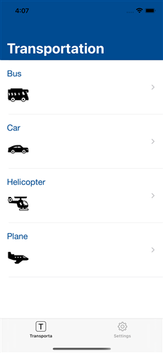
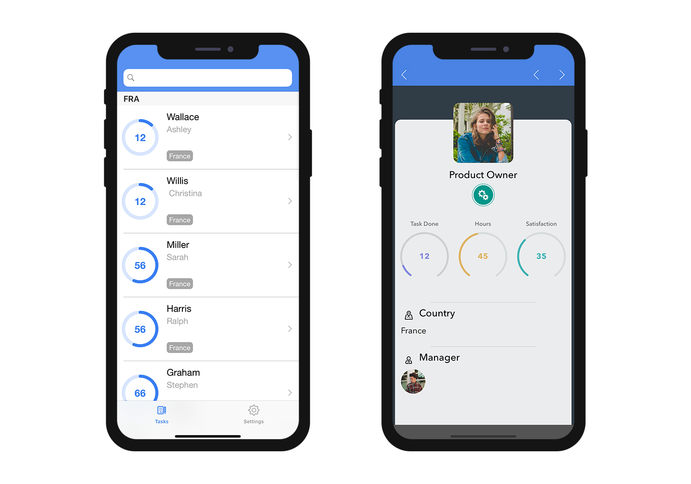

> **OBJETIVOS**
> 
> Criar seus primeiros formatos de dados.

> **PRÉ-REQUISITOS**
> 
> Click `[here](prerequisites.html)` to see what you'll need to get started!

Neste tutorial, vamos guiá-lo através da criação de vários exemplos de formatador.

## Download the Starter project

To begin, download the **Starter project**, which includes:

* Pastas**integerToImage_Images** e **textToImage_Images** que contêm imagens (para usar mais tarde para formatadores que incluem imagens)
* Um arquivo de **Task Management.4dbase** (com um projeto de app móvel pronto para usar)

<div className="center-button">
<a className="button button--primary"
href="https://github.com/4d-go-mobile/tutorial-CustomDataFormatter/archive/66d7eea49bc3353f73dbf784ee06283b3a332d0b.zip">Starter project</a>
</div>

Agora você já está pronto para criar seus primeiros formatadores!

## Crie a pasta formatadores

Primeiro, crie uma pasta *Task Management.4dbase/Resources/Mobile/formatters *.


## Formatadores de inteiros

### Número inteiro para string

* Crie uma pasta ** integerToString **na pasta formatadores, que você acabou de criar.
* Em seguida, crie um arquivo **manifest.json ** na pasta **integerToString**.


Vamos olhar o conteúdo do arquivo de**manifest.json **:

```json
{
   "name": "integerToString",

   "type": ["integer"],

   "binding": "localizedText",

   "choiceList": {"0":"UX designer","1":"Developer","2":"QA","3":"Product Owner"}
}
```

1. **nome**: o nome do formatador
2. **tipo**: o tipo de formatador 4D você deseja usar
3. **binding**: pode ser **texto localizado** para strings de caracteres ou **imageNamed** para imagens
4. **choiceList**: valores mapeados

### Inteiro para imagem

* Crie uma pasta ** integerToString **na pasta  **formatadores **, que você acabou de criar.

* Em seguida, crie um arquivo de**manifest.json ** na pasta **integerToImage**.


* Em seguida, crie uma pasta** Imagens** na pasta **IntegerToImage**. Pode adicionar as imagens de **IntegerToImage_Images ** em StarterProject.zip para a nova pasta.


Vamos olhar o conteúdo do arquivo de**manifest.json **:


```json
{
    "name": "integerToImage",

   "type": ["integer"],

   "binding": "imageNamed",

   "choiceList": {"0":"todo.png","1":"inprogress.png","2":"pending.png","3":"done.png"},

   "assets": {
      "size": {
         "width": 40, "height": 40
      }
    }
}
```
1. **nome**: o nome do formatador
2. **tipo**: o tipo de formatador 4D você deseja usar
3. **binding**: pode ser **texto localizado** para strings de caracteres ou **imageNamed** para imagens
4. **choiceList**: valores mapeados
5. **assets**: ajusta o tamanho do display (largura e altura)

## Formatadores de Texto

### Texto para string

* Crie uma pasta ** textToString **na pasta formatadores, que você acabou de criar.

* Crie um arquivo de **manifest.json ** na pasta **textToString**.


Vamos olhar o conteúdo do arquivo de**manifest.json **:

```json
{
    "name": "textToString",

   "type": ["text"],

   "binding": "localizedText",

   "choiceList": {"FRA":"France","MAR":"Morocco","USA":"United States","AUS":"Australia"}
}
```

1. **nome**: o nome do formatador
2. **tipo**: o tipo de formatador 4D você deseja usar
3. **binding**: pode ser **texto localizado** para strings de caracteres ou **imageNamed** para imagens
4. **choiceList**: valores mapeados

### Texto para Imagem

* Crie uma pasta ** textToImage **na pasta formatadores, que você acabou de criar.

* Crie um arquivo de**manifest.json ** na pasta **textToImage**.


* Em seguida, crie um arquivo de** Imagens** na pasta **textToImage**. Pode adicionar as imagens de **textToImage_Images ** em StarterProject.zip para a nova pasta.


Vamos olhar o conteúdo do arquivo de**manifest.json **:

```json
{
    "name": "textToImage",

   "type": ["integer"],

   "binding": "imageNamed",

   "choiceList": ["image1.png","image2.png","image3.png"],

   "assets": {
  "size": {
   "width": 40, "height": 40
        }
    }
}

```

## Dark mode support

Whether your device is in dark or light mode, whether you're working on iOS or Android, you can easily use the custom data formatters containing images. The pictures will be adapted depending on the phone's color mode.

### Tintable color

To optimize the color contrast of your black and white images on your app depending on the color mode (light or dark), you can set the images as follows, with the `"tintable": true` code line:

```json
{
   "name": "textToImage",
   "type": ["text"],
   "binding": "imageNamed",
   "choiceList": {"car":"car.png","plane":"plane.png","bus":"bus.png"},
   "assets": {
     "size": 54, 
     "tintable": true
     }
}
```
Here is the result in light and dark modes:

| Light mode                          |             Dark mode              |
| ----------------------------------- |:----------------------------------:|
|  |  |


### Optimized color pictures

To optimize the color pictures displayed on your app and adapt them to your color mode, you need to have two pictures: one for the light mode, and one for the dark mode suffixed with `_dark`, as follows:


```json
{
   "name": "textToImage",
   "type": ["text"],
   "binding": "imageNamed",
   "choiceList": {"car":"car.png","plane":"plane.png","bus":"bus.png"},
   "assets": {
     "size": 54
   }
}
```
Here is the result in light mode and in dark mode:

| Light mode                             |               Dark mode               |
| -------------------------------------- |:-------------------------------------:|
|  |  |

## Open mobile project

Open the Task Management.4dbase with 4D and go to File > open > Mobile Project... to open the **Tasks**

Next, go to the **Labels & Icons section** in the project editor. All of your formatters are available for the different field types you  previously defined in the different formatter manifest.json files:

* Selecione o formatador de**integerToString ** para o **campo Job**
* Selecione o formatador de** textToString** para o **campo Country**
* Selecione o formatador ** integerToImage** para o **Task Status**
* Selecione o formatador ** textToImage** para o **Manager**


## Build your 4D for iOS app

Build your 4D of iOS app and you'll see that your data formatter is well applied depending on the credit limit.



Download the completed formatter template folder:

<div className="center-button">
<a className="button button--primary"
href="https://github.com/4d-go-mobile/tutorial-CustomDataFormatter/releases/latest/download/tutorial-CustomDataFormatter.zip">Download</a>
</div>
