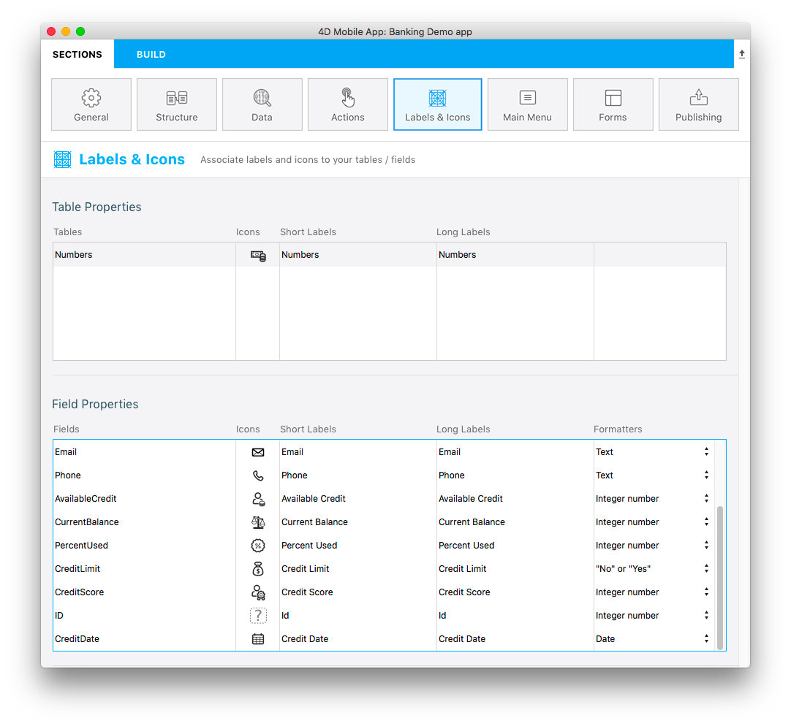

> **OBJETIVOS**
> 
> Use built-in formatters.

In this tutorial, we'll show you how to apply built-in [formatters](../../project-definition/labels-and-icons.md#formatters) to your fields.

## Baixe o Starter Project

Vamos começar baixando o Projeto Starter:

<a className="button button--primary"
href="https://github.com/4d-go-mobile/tutorial-DataFormatter/releases/latest/download/tutorial-DataFormatter.zip">Baixar</a>

## Abrir projeto móvel

Go to **Labels & Icons** in Sections, you'll see that a Formats column is available in the Field Properties area:

From here, you can select specific formats depending on your needs. You can choose between [multiple built-in formats](../../project-definition/labels-and-icons.md#selecting-a-formatter).

Vamos definir o campo Crédito Disponível como uma Moeda:

Vamos fazer o mesmo processo para todos os outros campos:

* Estableça o formato **Currency $** para o campo Current Balance
* Estableça o formato **Porcentagem** para o campo Percent Used
* Estabeleça Credit Limit como **Sim ou Não**
* Defina o formato **data curta** para ol campo Credit Date

## Criar e Executar: Crie seu projeto

Aqui está o resultado final em sua app iOS com um formulário de lista de tarefas e um formulário detalhado selecionados.

Tudo pronto! Your fields are well formatted according to its defined type in **Labels & Icons**.