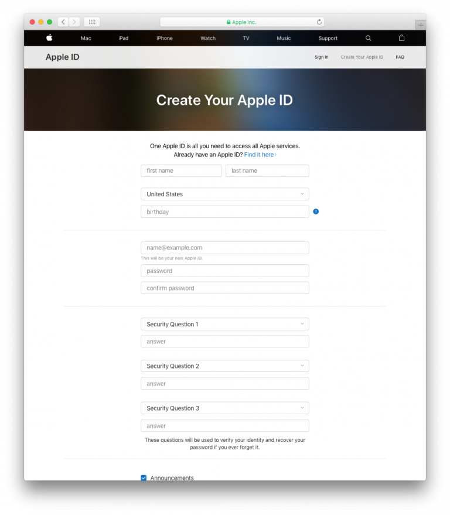

> **OBJETIVOS**
> 
> Escolha o programa Apple Developer apropriado.

Deve ter uma conta de desenvolvedor Apple válida para **distribuir una aplicação iOS**. Apple oferece dois programas para desenvolvedores:

* **[Apple Developer Program](https://developer.apple.com/programs/)** **for organization** or **for individual** ($99/year) - Allows you to distribute app(s) **on the App Store**.
* **[Apple Developer Enterprise Program](https://developer.apple.com/programs/enterprise/)** ($299/year) - Provides resources ONLY for developing and distributing **proprietary, in-house apps** to employees

For **test purposes** you can use a **Free Apple Developer Program** (*Sign in with Apple ID*, see below).

Aqui há um gráfico que compara os diferentes níveis de adesão de desenvolvedor:

:::info

To enroll in any **Apple Developer Program**, your Apple ID must be associated with an email address using your organization’s domain name.

:::

:::info Free Apple Developer account

If you want to join the Apple Developer Program for free, you only need to create a free Apple ID and sign in with it. Therefore, follow only Steps 1 and 2, then launch Xcode > Preferences > Accounts, Add your Apple ID and sign in! :::

## PASSO 1. Crie sua Apple ID

If you already have an Apple ID, go to [Step 2](#step-2-request-a-d-u-n-s-number).

Vá para  [a página de criação de Apple ID](https://appleid.apple.com/).

* Complete o formulário e perguntas de segurança.
* Vai receber um código de verificação por email.
* Entre o código de verificação para validar a criação de sua conta.

## PASSO 2. Solicite um número D-U-N-S

:::info

This step is not necessary for the **Apple Developer Program as an individual**.

:::

* If you already have a D-U-N-S Number, go to [Step 3](#step-3-register).

Solicite um número D-U-N-S [aquí](https://developer.apple.com/enroll/duns-lookup/#/search)

* Complete o formulário.
* Clique em **Continue**.
* Verifique seu e-mail para obter o número D-U-N-S.

## PASSO 3. Register

For **Apple Developer Enterprise Program** and **Apple Developer as an organisation**, you can register as a developer [here](https://developer.apple.com/programs/enterprise/enroll/).

For **Apple Developer as an individual**, you can register as a developer [here](https://developer.apple.com/account/).

Then, read and accept the *Apple Developer Agreement* and **Submit**.

## PASSO 4. Join

:::info

This step is not necessary for the **Apple Developer Enterprise Program**.

:::

For **Apple Developer Program as an Organisation**, you can sign up for the Apple Developer Program [here](https://developer.apple.com/enroll/enterprise/).

For **Apple Developer Program as an Individual**, click on **Join the Apple Developer Program** at the bottom of the page.

## PASSO 5. Enroll

* Clique no botão **Start your Enrollment**.
* From the Entity Type dropdown list, select:
    - **Company / Organization** (for Apple Developer Enterprise Program and Apple Developer Program as an Organisation).
    - **Individuals / Sole Proprietor / Single Person Business** (for Apple Developer Program as an individual).

* Complete the form and Click on **Continue**.

## PASSO 6. Verificação Apple

:::info

This step is  only necessary for the **Apple Developer Enterprise Program**.

:::

* Apple tem um processo de verificação interno que geralmente demora até seis dias úteis. Quando Apple receber a solicitação de inscrição, eles vão verificar se o desenvolvedor tem autoridade para vincular a organização com os acordos legais do Apple Developer Program.
* Apple geralmente verifica se o contato principal existe e se realmente solicitou o registro no Apple Developer Enterprise Program.
* Depois receberá outro email convidando para que complete o processo de inscrição.

## PASSO 7. Complete sua inscrição

* Quando sua solicitação de inscrição tiver sido aceita pode realizar o pagamento.

* Quando tiver completado sua compra, receberá um email confirmando sua inscrição no programa.

Parabéns! You are now ready to deploy and publish your applications!
