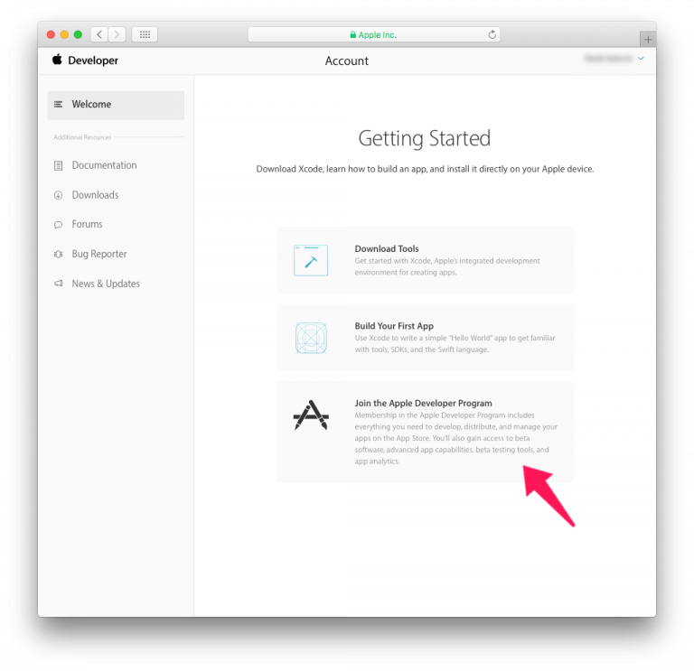
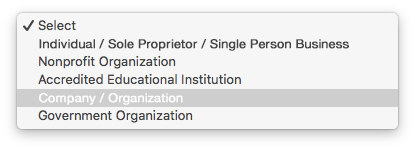

> **OBJETIVOS**
> 
> Escolha o programa Apple Developer apropriado.

Deve ter uma conta de desenvolvedor Apple válida para **distribuir una aplicação iOS**. Apple oferece dois programas para desenvolvedores:

* **[Apple Developer Program](https://developer.apple.com/programs/)** **for organization** or **for individual** – $99/year
* **[Apple Enterprise Developer Program](https://developer.apple.com/programs/enterprise/)** – $299/year

A principal diferença entre os dois programas é:

* **Apple Developer Program (para as empresas ou para particulares)**: lhe permite distributir aplicações**na App Store**.

* **Apple Developer Enterprise Program**: oferece recursos UNICAMENTE para desenvolver e distribuir **aplicações internas patentadas** a empregados.

For **test purposes** you can use a Free Apple Developer Program.

Aqui há um gráfico que compara os diferentes níveis de adesão de desenvolvedor:

:::info

To enroll in any **Apple Developer Program**, your Apple ID must be associated with an email address using your organization’s domain name.

:::

:::info Free Apple Developer account

If you want to join the Apple Developer Program for free, you can create a free Apple ID and use it to access a limited set of developer-oriented privileges. Therefore, follow only Steps 1 and 2, then launch Xcode > Preferences > Accounts, Add your Apple ID and sign in ! :::

## PASSO 1. Identificador Apple

Se ainda não tiver uma Apple ID vá para [Passo 2](#step-2-create-your-apple-id).

Se já tiver uma Apple ID, vá para [Passo 3](#step-3-d-u-n-s-number).

## PASSO 2. Crie sua Apple ID

Vá para  [a página de criação de Apple ID](https://appleid.apple.com/).

* Complete o formulário e perguntas de segurança.
* Vai receber um código de verificação por email.
* Entre o código de verificação para validar a criação de sua conta.

* Quando tiver sua Apple ID pode continuar para o Passo 3.

## PASSO 3. Número D-U-N-S

:::info

This step is not included for the **Apple Developer Program as an individual**.

:::

* Se não tiver um número D-U-N-S, vá para  [Passo 4](#step-4-request-a-d-u-n-s-number).
* Se já tiver um número D-U-N-S, vá para  [Passo 5](#step-5-register-as-a-developer).

## PASSO 4. Solicite um número D-U-N-S

:::info

This step is not included for the **Apple Developer Program as an individual**.

:::

Solicite um número D-U-N-S [aquí](https://developer.apple.com/enroll/duns-lookup/#/search)

* Complete o formulário.
* Clique em **Continue**.
* Verifique seu e-mail para obter o número D-U-N-S.

## PASSO 5. Register

### Apple Developer Entreprise and Apple Developer as an organisation

Pode se registrar como desenvolvedor [aqui](https://developer.apple.com/programs/enterprise/enroll/).

* Clique no botão **Start your Enrollment**.
* Leia e Aceite o Contrato de Desenvolvedor de Licença "Apple Developer Agreement".
* Clique **Submit**.

### Apple Developer as an individual

* Você pode se registrar como um desenvolvedor [aqui](https://developer.apple.com/account/).

* Leia e Aceite o Contrato de Desenvolvedor de Licença "Apple Developer Agreement".
* Clique **Submit**.

## PASSO 6. Join

:::info

This step is not included for the **Apple Developer Enterprise Program**.

:::

### Apple Developer Program as an Organisation

* Pode se inscrever no Apple Developer Program [aqui](https://developer.apple.com/enroll/enterprise/).

### the Apple Developer Program as an Individual

* Clique em **Join the Apple Developer Program** na parte inferior da página.

## PASSO 7. Enroll

### Apple Developer Program as an Organisation

* Clique no botão **Start your Enrollment**.
* Selecione **Company / Organization** na lista suspensa "Entity Type".
* Clique em **Continue**.

* Complete o formulário.
* Clique em **Continue**.

* Apple tem um processo de verificação interno que geralmente demora até seis dias úteis. Quando Apple receber a solicitação de inscrição, eles vão verificar se o desenvolvedor tem autoridade para vincular a organização com os acordos legais do Apple Developer Program.
* Apple geralmente verifica se o contato principal existe e se realmente solicitou o registro no Apple Developer Enterprise Program.
* Depois receberá outro email convidando para que complete o processo de inscrição.

### Apple Developer Program para particulares

* Clique no botão **Start your Enrollment**.
* Selecione **Individuals / Sole Proprietor / Single Person Business** na lista suspensa "Entity Type".
* Clique em **Continue**.

* Complete o formulário
* Leia e Aceite o Contrato de Desenvolvedor de Licença "Apple Developer Program License Agreement".
* Clique em **Continue**.

### Apple Developer Enterprise Program

* Pode se inscrever no Programa Apple Developer Enterprise [aqui](https://developer.apple.com/enroll/enterprise/).
* Clique no botão **Start your Enrollment**.
* Selecione **Company / Organization** na lista suspensa "Entity Type".
* Clique em **Continue**.

* Complete o formulário.
* Clique em **Continue**.

## PASSO 8. Verificação Apple

:::info

This step is  included only for the **Apple Developer Enterprise Program**.

:::

* Apple tem um processo de verificação interno que geralmente demora até seis dias úteis. Quando Apple receber a solicitação de inscrição, eles vão verificar se o desenvolvedor tem autoridade para vincular a organização com os acordos legais do Apple Developer Program.
* Apple geralmente verifica se o contato principal existe e se realmente solicitou o registro no Apple Developer Enterprise Program.
* Depois receberá outro email convidando para que complete o processo de inscrição.

## PASSO 9. Complete sua inscrição

* Quando sua solicitação de inscrição tiver sido aceita pode realizar o pagamento.

* Quando tiver completado sua compra, receberá um email confirmando sua inscrição no programa.

Parabéns! You are now ready to deploy and publish your applications!

