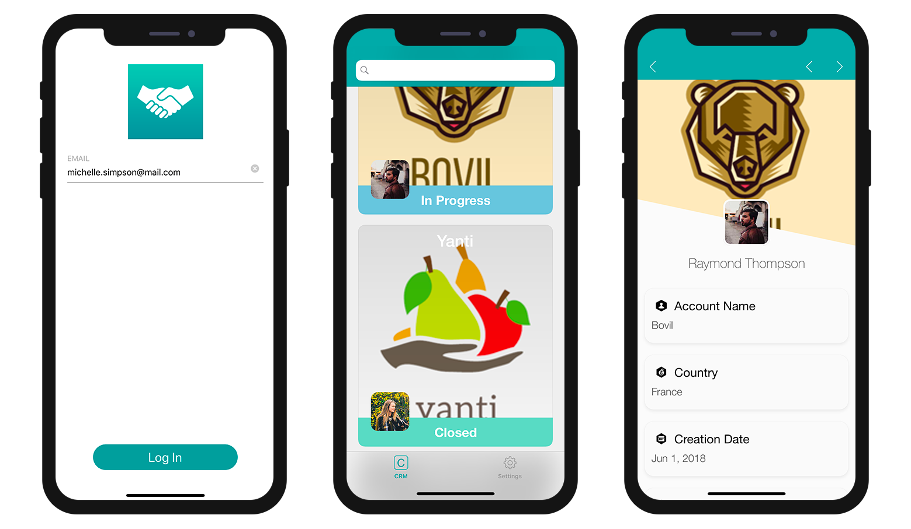
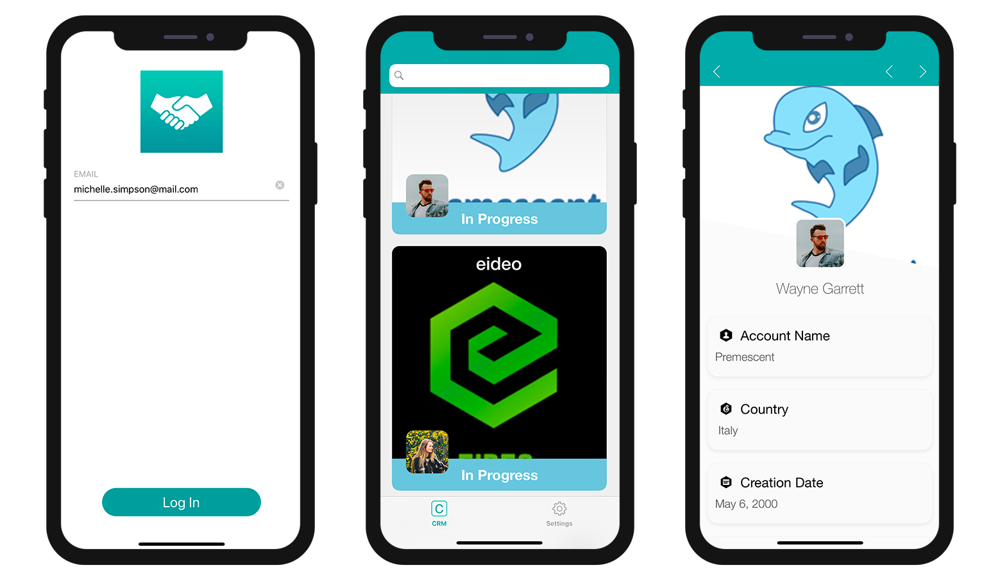

For the moment, if you build the Starter project app and enter "michelle.simpson@mail.com" as the login email (one of the account managers), you'll see **all manager contracts and statuses** (*Closed* and *In Progress*).

Como falamos anteriormente, queremos que os administradores de contas acessem a seus contratos *Em Progresso* iniciando a sessão em seu aplicativo móvel com seu correio eletrônico. Para fazer isso:

* Vá para a seção **Dados**
* Dê clique direito no campo **Filtro de pesquisa** para fazer com que apareçam os botões **Campos, Comparadores e Operadores**.
* Clique no botão **Campos** e selecione **Estado**.
* Clique no botão **Comparadores** e selecione **Igual a**.
* Como quer mostrar os contratos*abertos*, ingresse **Em progresso**
* Lembre de validar sua pesquisa clicando no botão **Validar** do contrário não poderá criar sua aplicação.

Deve obter este resultado:

> **NOTE**
> 
> * Um ícone **filter** é exibido à direita de cada tabela quando um filtro básico é aplicado.
> * Para esses tipos de filtros de pesquisa, pode escolher incorporar os dados no app ou carregar os dados depois do login, marcando a checkbox **Embed data into the built application** .
> * O tamanho será calculado na primeira compilação para poder visualizar o **tamanho de seus dados**.

Se construir seu app e digitar "michelle.simpson@mail.com" como o email de login, verá que todos os contratos *Em Progresso* serão exibidos no Simulator!

Não é bem o que esperávamos! O que queremos agora é que para cada conta de administrador, possamos visualizar apenas seus próprios contratos *Em Progresso* , então vamos completar nossa pesquisa!

