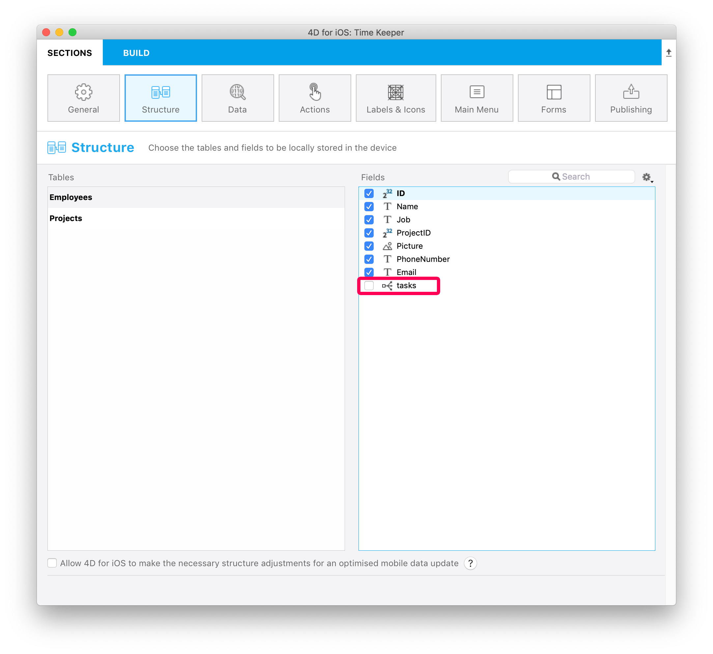

This tutorial will show you how easy it can be to include One to Many relations in your mobile project.

Let's get started by downloading the Starter project:

<a className="button button--primary"
href="https://github.com/4d-go-mobile/tutorial-OneToManyRelations/archive/c006015afeb0e134d872152f53b8cd5e4dcb59bb.zip">Starter project</a>

Neste tutorial, vamos construir um **Task app** colorido usando 4D for iOS.

Mas primeiro, vamos olhar a estrutura de nosso banco de dados:

Como pode ver, há um link  One to Many chamado **tasks** que vamos usar em nosso iOS app para exibir as tasks/tarefas(**to Many**).dos funcionários'(**One**)

Agora vá direto para o menu Open > Mobile project... selecione *Time Keeper* e vá para a seção  **Structure**.

## Structure section

Pode ver a **relação de tasks/tarefas** que vimos antes... Publique!

Agora isso vai operar como qualquer outro campo pelo resto do processo de criação do app.

:::tip

On mouse over, a tip displays the table name originating the relation.

:::

## Labels & Icons section

The One to Many relation is now available in the **Labels and Icons** section.

It is important to know that including a One to Many relation will create a button into the genrated iOS app.

So, in the Labels & Icons section you will define:

* um botão Etiqueta
* um botão ícone
* a title that will be displayed in the destination view (to indicate where you come from for example).

## Forms section

* Vá para a seção Formulários e solte a relação *tasks* no formulário detalhado Employee Task.

## Build and Run

1. Do formulário Employee List, clique em um empregado.
2. Isso vai abrir o formulário detalhado employee/empregados, onde você verá um novo botão **Relation** !
3. Clique no botão Relation para exibir as tarefas dos funcionários

Well done! You've successfully included One to Many relations in your mobile project.

Baixe o projeto terminado:

<a className="button button--primary"
href="https://github.com/4d-go-mobile/tutorial-OneToManyRelations/releases/latest/download/tutorial-OneToManyRelations.zip">Download</a>

